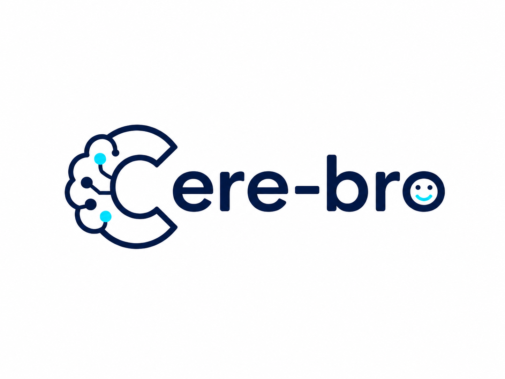

<p align="center" style="margin: 8px 0">
  
</p>

<p align="center"><strong>The cognitive bro you always needed — reads the papers, tracks the industry, connects the dots, and briefs you every morning like a research partner who never sleeps.</strong></p>

<p align="center">
  <a href="https://bayesiansapien.github.io/cere-bro/">Live site</a> ·
  <a href="https://bayesiansapien.github.io/cere-bro/atlas">Atlas</a> ·
  <a href="https://bayesiansapien.github.io/cere-bro/browse">Wiki Pages</a>
</p>

---

## What it is

cere-bro reads papers, blog posts, newsletters, and RSS feeds every morning and synthesizes them into a structured knowledge base. It writes wiki pages, updates concept pages, and produces a daily digest — all without manual intervention.

The live site updates automatically on every push via GitHub Actions.

---

## How it works

```
raw/          ← farmers drop source files here daily
wiki/         ← Claude writes and maintains everything here
site/         ← Astro site, deployed to GitHub Pages
connectors/   ← Python scripts that pull from sources
```

### Farmers pull from sources

| Source | What it pulls |
|--------|--------------|
| HuggingFace Daily Papers | Latest ML paper digests |
| RSS feeds | Blogs, newsletters (Lilian Weng, Karpathy, SemiAnalysis, TLDR AI, The Decoder, etc.) |
| Gmail starred emails | AI Breakfast, Ken Huang, Pragmatic Engineer, and others via OAuth |

Farmers run on a schedule and write files into `raw/`. Claude then ingests them.

### Claude synthesizes the knowledge base

For every new source, Claude:

1. Reads the raw file
2. Writes a **source summary page** in the relevant topic directory (`wiki/<topic>/YYYY-MM-DD-slug.md`)
3. Updates the relevant **concept pages** (`wiki/<topic>/<concept>.md`) with new findings, confirmations, or contradictions
4. Writes or updates the **daily digest** (`wiki/daily-digest/YYYY-MM/YYYY-MM-DD.md`)
5. Updates `wiki/index.md` and appends to `wiki/log.md`
6. Pushes everything to the repo

### The site builds itself

The Astro site reads `wiki/` at build time, parses every markdown file, and generates:

- **Today** — the latest daily digest with sidebar of recent additions
- **Atlas** — topic heatmaps, cumulative growth charts, momentum strips (what's heating up / cooling)
- **Wiki Pages** — tabbed index of every wiki page, grouped by topic

GitHub Actions rebuilds and deploys the site on every push to `main`.

---

## Wiki structure

```
wiki/
├── ai-routing/              # LLM routing, multimodal routing, agent trajectory routing
├── inference-efficiency/    # KV cache, compression, quantization, distillation, GPU opt
├── hardware/                # GPU architecture, Hopper, Blackwell, memory hierarchy
├── llms-foundation-models/  # General LLM papers, new architectures
├── agents-tool-use/         # Agentic reasoning, memory, tool use
├── multimodal/              # Vision-language, audio-video generation
├── ai-industry/             # Company news, funding, policy, regulation
├── daily-digest/
│   └── YYYY-MM/
│       └── YYYY-MM-DD.md   # One newsletter per day
├── index.md                 # Catalog of every wiki page
└── log.md                   # Append-only ingest timeline
```

---

## Running it locally

**1. Pull today's sources**

```bash
python connectors/gmail/farmer.py       # starred Gmail emails
python connectors/rss/farmer.py         # RSS feeds
python connectors/huggingface/farmer.py # HF Daily Papers
```

**2. Open Claude Code and run the digest skill**

```bash
claude
/digest
```

**3. Preview the site**

```bash
cd site
npm install
npm run dev
```

---

## Automated daily run

A macOS LaunchAgent fires at 9am, runs all farmers, then invokes Claude to write the digest and push. The site deploys automatically from the push.

---

## Starting your own

See [`cere-bro-starter/`](./cere-bro-starter/) — a self-contained folder you can copy and set up with your own topics, tiers, and sources. Run `/bootstrap` in Claude Code to configure it, then `/automate` to wire up the daily pipeline.
