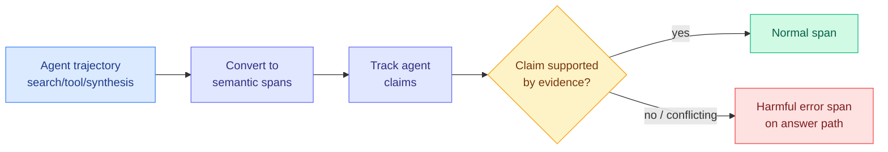

# Where Do Deep-Research Agents Go Wrong? Span-Level Error Localization (DRIFT / TELBench)

**Source:** HuggingFace Daily Papers
**arxiv:** [2606.02060](https://arxiv.org/abs/2606.02060)
**Date:** 2026-06-04
**Raw:** [raw/huggingface/2026-06-04-where-do-deep-research-agents-go-wrong-span-level-error-loca.md](../../raw/huggingface/2026-06-04-where-do-deep-research-agents-go-wrong-span-level-error-loca.md)
**Tier:** 2 (agent reliability, evaluation)

## TL;DR

Deep-research agents solve tasks over long trajectories of search, tool use, evidence inspection, and synthesis. Final-answer evaluation tells you *whether* an agent succeeded, not *which part* of the trajectory made the answer unreliable. This paper studies span-level error localization. The authors collect 2,790 real trajectories, convert logs into semantic spans, and annotate harmful error spans via LLM-assisted expert review, yielding TELBench (1,000 instances). They propose DRIFT, a claim-centric auditing framework that tracks agent claims, checks their support in trajectory evidence, and flags spans with unsupported or conflicting claims — improving span-level localization and first-error accuracy by up to 30 points.

## Diagram

## Key findings

1. **Process-level reliability, not just outcome.** TELBench asks the agent-trajectory question that final-answer evals cannot: among normal exploration, failed searches, tentative hypotheses, and harmless noise, *which span* actually corrupted the answer.
2. **Claim-centric auditing (DRIFT).** Instead of scoring spans directly, DRIFT tracks the claims the agent makes, checks each against trajectory evidence, and marks spans where unsupported or conflicting claims propagate into the answer path.
3. **Up to +30 points** on span-level error localization and first-error accuracy across model families and auditing frameworks.
4. Built from **2,790 real trajectories** spanning two agent frameworks, three backbones, three benchmarks.

## Relation to prior wiki state

DRIFT is the deep-research-agent instance of the wiki's recurring **span-level / process-level evaluation** thread. It is the agent-trajectory analogue of Harmful Continuation (06-03, which localized the *harmful span* inside a CoT) — both move from "was the output right" to "which span made it wrong." It also sharpens the [agent-benchmarks concept page](agent-benchmarks.md) line that final-answer accuracy is an incomplete reliability signal, a theme the wiki has flagged repeatedly (benchmark accuracy not predicting deployment robustness).

The claim-support-checking mechanism is a verification idea: it is verifier-style auditing applied to a free-form agent trajectory rather than to a math answer. That connects it to the broader RLVR/verifier line, but on the evaluation side rather than the training side.

## Why it matters

As deep-research agents ship into products (the entire "agentic search" category), debugging them means knowing *where* they went wrong, not just *that* they did. A claim-centric auditor that localizes the first harmful span is the kind of tooling that turns an opaque long trajectory into something a developer or a monitoring system can act on. It is also a candidate training signal: localized error spans are denser supervision than a single final-answer reward.

## Gaps

Localization quality depends on LLM-assisted annotation, which inherits the annotator's blind spots. The claim-support check assumes claims are extractable and evidence is in-trajectory; agents that reason implicitly or rely on parametric knowledge may evade it.

## Links

- [Paper](https://arxiv.org/abs/2606.02060)
- Related: [Harmful Continuation 2026-06-03](../llms-foundation-models/2026-06-03-harmful-continuation-long-cot-sft.md), [agent benchmarks](agent-benchmarks.md)
- Concept: [agent benchmarks](agent-benchmarks.md), [tool calling](tool-calling.md)
