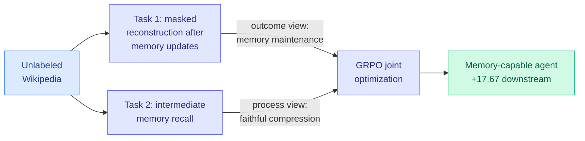

# MemTrain: Self-Supervised Context Memory Training

**Source:** HuggingFace Daily Papers
**arxiv:** [2606.03197](https://arxiv.org/abs/2606.03197)
**Date:** 2026-06-04
**Raw:** [raw/huggingface/2026-06-04-memtrain-self-supervised-context-memory-training.md](../../raw/huggingface/2026-06-04-memtrain-self-supervised-context-memory-training.md)
**Tier:** 2 (agent memory)

## TL;DR

Long-horizon LLM agents need memory to carry information across many interaction rounds. Existing memory agents are trained end-to-end with RL on downstream tasks, but high-quality annotated memory-intensive problems are costly and not diverse. MemTrain skips the annotation: it trains memory ability self-supervised on unlabeled Wikipedia using two coupled proxy tasks, jointly optimized with GRPO. It improves downstream memory-intensive reasoning by up to 17.67 points over direct task-specific post-training.

## Diagram

## Key findings

1. **Two coupled self-supervised proxies.** (1) End-to-end masked reconstruction: recover masked entities after several rounds of memory updates, training memory *maintenance* from the final outcome. (2) Intermediate memory recall: reconstruct masked history from intermediate memory states, training faithful *compression* and completeness throughout the interaction.
2. **No task annotation needed** — the proxies run on raw Wikipedia, sidestepping the cost and low diversity of annotated memory problems.
3. **Up to +17.67 points** on long-text QA and search-based QA over direct task-specific post-training, across different base models.

## Relation to prior wiki state

MemTrain extends the [agent-memory concept page](agent-memory.md) thread with a pretraining-style answer: rather than learning memory behaviors only from scarce downstream tasks, manufacture a self-supervised curriculum. The two-proxy design (outcome-side maintenance + process-side faithful compression) is a memory-specific echo of the broader "supervise both the end and the intermediate steps" pattern.

It pairs naturally with today's **Echo-Infinity (a learnable evolving memory that compresses any-length history at constant cost for infinite video generation)** — both replace handcrafted memory curation (fixed KV schedules, heuristic compression) with a *learned* memory mechanism. MemTrain learns the agent's textual memory policy; Echo-Infinity learns the generative model's visual memory state. Same shift: from hand-tuned eviction/compression rules to end-to-end learned memory. See [Echo-Infinity summary](../vision-audio-video/2026-06-04-echo-infinity.md).

The faithful-compression objective also rhymes with the KV-cache compression literature ([kv-cache concept](../inference-efficiency/kv-cache.md)): MemTrain's "reconstruct history from intermediate memory states" is a learned, lossy compression check, the agent-level analogue of asking whether an evicted KV cache still supports the answer.

## Why it matters

Agent memory has been bottlenecked by data: you cannot easily collect enough diverse memory-intensive tasks to RL-train against. A self-supervised recipe on Wikipedia removes that bottleneck and transfers across models, which is exactly what a general capability needs.

## Gaps

Wikipedia masked-entity recovery is a clean but narrow proxy; whether it transfers to messy multi-tool agent trajectories (where memory must hold tool outputs, errors, and plans, not just entities) is the open question.

## Links

- [Paper](https://arxiv.org/abs/2606.03197)
- Related: [Echo-Infinity 2026-06-04](../vision-audio-video/2026-06-04-echo-infinity.md)
- Concept: [agent memory](agent-memory.md), [KV cache](../inference-efficiency/kv-cache.md)
