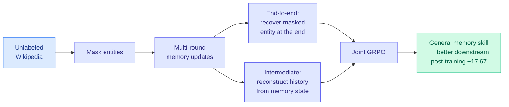

# MemTrain: Self-Supervised Context Memory Training

**Date:** 2026-06-04
**Source:** HuggingFace Daily Papers
**arXiv:** [2606.03197](https://arxiv.org/abs/2606.03197)

## TL;DR

Long-horizon LLM agents need memory: the ability to preserve and reuse information accumulated across many turns. The usual way to build it is end-to-end reinforcement learning on downstream tasks, but that needs annotated memory-intensive problems, which are expensive to collect and rarely diverse enough to teach general memory behavior. MemTrain drops the annotation requirement. It trains memory as a *self-supervised* skill on unlabeled Wikipedia using two coupled proxy tasks: (1) a masked-reconstruction objective, where the model must recover masked entities after several rounds of memory updates, rewarding memory maintenance from the final outcome; and (2) an intermediate-recall objective, where the model reconstructs masked historical information from its intermediate memory states, rewarding faithful compression throughout the interaction. Both are optimized jointly with GRPO. As a general pre-step before task-specific post-training, MemTrain lifts downstream memory-intensive reasoning by up to 17.67 points on long-text and search-based QA.

## Key findings

1. **Memory as a self-supervised skill.** Two proxy objectives over unlabeled text replace annotated memory-task data: masked reconstruction after memory updates (outcome view) and intermediate recall from memory states (process view). The process objective explicitly rewards faithful compression and completeness, not just the final answer.
2. **A general pre-step, not a task solver.** MemTrain is positioned before downstream post-training: it builds generic memory behavior first, so the later task-specific RL has a stronger starting point. Gains of up to 17.67 points over direct task-specific post-training.
3. **Joint GRPO over both objectives.** The two proxy tasks are optimized together, coupling end-to-end maintenance with step-wise faithfulness.

## Relation to prior wiki state

MemTrain attacks the exact bottleneck the [agent-memory page](agent-memory.md) flagged from the 05-15 cluster: memory systems are data-starved and the construction side needs cheap cold-start recipes. [Preping](2026-05-15-agent-memory-cluster-stale-preping-evolvemem.md) (05-15) answered with proposer-guided *synthetic practice* at 2-3x lower deployment cost; MemTrain answers differently, with *self-supervised proxy tasks on unlabeled corpora*, removing the annotated-data requirement entirely. Both reject the "collect annotated memory tasks then RL" default, from opposite directions: synthesize the practice (Preping) versus mine free text for proxy supervision (MemTrain).

Its two-objective design also maps onto the page's storage-vs-faithfulness axis. The intermediate-recall objective is a direct supervision signal for "faithful compression and completeness," which is exactly the property [STALE](2026-05-15-agent-memory-cluster-stale-preping-evolvemem.md)'s 55.2% ceiling and MemLens's sub-30% multi-session ceiling showed current systems lack. Where those benchmarks measured the failure, MemTrain proposes a training signal aimed at it. The masked-entity-recovery setup is the agent-memory analogue of the masked-language-modeling objective that built encoders, lifted up to the multi-round memory-update loop.

## Research angle

1. **Does the proxy skill transfer to interactive agents?** MemTrain trains on Wikipedia reconstruction; the claim is it generalizes to long-text and search QA. Whether the skill survives the jump to genuinely interactive, tool-using agent trajectories (where memory must hold actions and observations, not just text spans) is the open generalization test.
2. **Process vs outcome supervision split.** The intermediate-recall objective is the novel part; an ablation isolating how much of the 17.67-point gain comes from the process objective versus the end-to-end one would tell us whether faithful-compression supervision is the real lever.
3. **Self-supervised memory meets learned eviction.** MemTrain trains a model to maintain memory; [EvolveMem](2026-05-15-agent-memory-cluster-stale-preping-evolvemem.md) (05-15) co-evolves the retrieval configuration. Combining a self-supervised memory-maintenance skill with a co-evolved retrieval policy is the untried full-stack memory recipe.

## Links

- [Paper (arXiv)](https://arxiv.org/abs/2606.03197)
- [HuggingFace page](https://huggingface.co/papers/2606.03197)
- Raw: [raw/huggingface/2026-06-04-memtrain-self-supervised-context-memory-training.md](../../raw/huggingface/2026-06-04-memtrain-self-supervised-context-memory-training.md)
- Concept page: [Agent Memory](agent-memory.md)
- Related: [Agent-memory cluster 05-15](2026-05-15-agent-memory-cluster-stale-preping-evolvemem.md)
