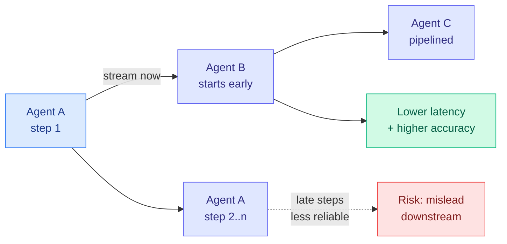

# StreamMA: Streaming Communication in Multi-Agent Reasoning

**Date:** 2026-06-04
**Source:** HuggingFace Daily Papers
**arXiv:** [2606.05158](https://arxiv.org/abs/2606.05158)

## TL;DR

Multi-agent reasoning systems usually work "generate-then-transfer": agent A finishes its whole reasoning chain, hands the final result to agent B, which then starts. End-to-end latency therefore grows linearly with pipeline depth. StreamMA streams each reasoning step to downstream agents the moment it is generated, so adjacent agents run in parallel like a CPU pipeline. The surprise is that pipelining also improves *accuracy*, not just speed. Reasoning quality is non-uniform: early steps are more reliable than later ones, so letting a downstream agent work from the reliable early steps prevents error-prone late steps from misleading it. The paper gives the first closed-form joint analysis of stream, serial, and single protocols, deriving the effectiveness ordering, a speedup upper bound, and a cost ratio. Across eight benchmarks (math, science, code), two frontier models (Claude Opus 4.6, GPT-5.4), and three topologies (chain, tree, graph), StreamMA beats both baselines by +7.3 points on average and +22.4 on HMMT 2026. It also surfaces a "step-level scaling law": adding per-agent reasoning steps improves both effectiveness and efficiency, a new scaling axis orthogonal to agent count.

## Key findings

1. **Pipelining reasoning steps cuts depth-linear latency.** Streaming each step downstream as it lands pipelines adjacent agents instead of serializing them, breaking the latency-scales-with-depth penalty of generate-then-transfer.
2. **Early steps are more reliable, so streaming also raises accuracy.** Because multi-step reasoning quality is non-uniform, working from reliable early steps prevents error-prone late steps from contaminating downstream agents. +7.3 pp average, +22.4 pp on HMMT 2026 (Claude Opus 4.6-high).
3. **A step-level scaling law.** Increasing per-agent steps consistently improves both effectiveness and efficiency, a scaling dimension orthogonal to and composable with agent-count scaling. The closed-form analysis ranks stream > serial > single and bounds the speedup.

## Relation to prior wiki state

StreamMA refines the [multi-agent systems page](multi-agent-systems.md)'s current verdict. The 06-02 cluster (MACU, OpenWebRL, "When Does Multi-Agent RL Improve LLM Workflows?") concluded that multi-agent structure is a reliable *inference-time* win when you orchestrate over independently strong agents, but joint training is brittle. StreamMA is squarely an inference-time win and strengthens that conclusion: it changes the *communication protocol* (one of the page's named axes) rather than retraining anyone, and gets both latency and accuracy for free. It is the latency-and-reliability complement to [MACU](2026-06-02-multi-agent-computer-use.md) (06-02), which restructured *what* gets dispatched (a dynamically revised DAG of subtasks); StreamMA restructures *when* partial results flow between fixed agents.

The "early steps more reliable than late steps" finding rhymes with the wiki's reasoning-efficiency results that most of a long chain is low-value: [PUMA](../inference-efficiency/2026-05-19-puma-semantic-preserving-early-exit-reasoning.md) (05-19, semantic-preserving early exit) and the broader "stop-path" pruning line found that late reasoning tokens often add little. StreamMA turns that observation into a multi-agent communication rule: forward the reliable early steps, do not wait for the noisy tail. It also connects to [AsyncTool](2026-05-29-asynctool-asynchronous-function-calling.md) (05-29, asynchronous function calling): both attack the serial-latency assumption baked into agent pipelines, one for tool calls, one for inter-agent reasoning transfer.

## Research angle

1. **The step-level scaling law is the headline for routing.** If per-agent step count is a clean, composable scaling axis, then a controller could trade steps-per-agent against agent-count under a latency budget, which is a routing problem the [llm-routing](../ai-routing/llm-routing.md) thread should pick up.
2. **When does streaming hurt?** Streaming early steps assumes early-step reliability; on tasks where the answer only crystallizes late (long proofs, multi-hop synthesis), forwarding early steps could propagate a wrong frame. The failure boundary is unmapped.
3. **Closed-form analysis invites a learned protocol.** The paper proves stream > serial > single in general; a per-task learned choice of how many steps to buffer before streaming is the obvious adaptive extension.

## Links

- [Paper (arXiv)](https://arxiv.org/abs/2606.05158)
- [HuggingFace page](https://huggingface.co/papers/2606.05158)
- Raw: [raw/huggingface/2026-06-04-streaming-communication-in-multi-agent-reasoning.md](../../raw/huggingface/2026-06-04-streaming-communication-in-multi-agent-reasoning.md)
- Concept page: [Multi-Agent Systems](multi-agent-systems.md)
- Related: [MACU 06-02](2026-06-02-multi-agent-computer-use.md) · [AsyncTool 05-29](2026-05-29-asynctool-asynchronous-function-calling.md) · [PUMA 05-19](../inference-efficiency/2026-05-19-puma-semantic-preserving-early-exit-reasoning.md)
