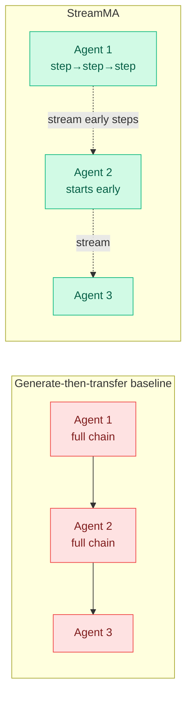

# StreamMA: Streaming Communication in Multi-Agent Reasoning

**Source:** HuggingFace Daily Papers
**arxiv:** [2606.05158](https://arxiv.org/abs/2606.05158)
**Date:** 2026-06-04
**Raw:** [raw/huggingface/2026-06-04-streaming-communication-in-multi-agent-reasoning.md](../../raw/huggingface/2026-06-04-streaming-communication-in-multi-agent-reasoning.md)
**Tier:** 2 (multi-agent systems; intersects efficiency)

## TL;DR

Multi-agent reasoning systems use a "generate-then-transfer" pattern: each agent finishes its whole reasoning chain, then hands it to the next. That makes end-to-end latency scale linearly with pipeline depth. StreamMA streams each reasoning step to downstream agents as soon as it is produced, pipelining adjacent agents. The surprise: streaming also improves *accuracy*, because early reasoning steps are more reliable than late ones, so downstream agents working off the reliable early steps avoid being misled by error-prone late steps. It also finds a new "step-level scaling law."

## Diagram

## Key findings

1. **Streaming pipelines adjacent agents,** breaking the linear latency-with-depth scaling of generate-then-transfer.
2. **Accuracy improves, not just latency.** Multi-step reasoning quality is non-uniform: early steps are more reliable. Feeding downstream agents the reliable early steps prevents error-prone late steps from misleading them. StreamMA gives the first closed-form joint analysis of stream vs serial vs single protocols, deriving the effectiveness ordering, speedup bound, and cost ratio.
3. **Step-level scaling law.** Increasing per-agent reasoning steps consistently improves both effectiveness and efficiency — a new scaling dimension orthogonal to and composable with agent-count scaling.
4. **+7.3pp average, +22.4pp max (HMMT 2026)** across eight benchmarks, two frontier models (Claude Opus 4.6, GPT-5.4), three topologies (chain, tree, graph).

## Relation to prior wiki state

StreamMA's most interesting claim is the counterintuitive one: **partial early information beats complete late information.** This is the multi-agent cousin of two recurring wiki findings. First, it echoes PUMA (05-19) and the over-thinking literature — late reasoning steps are not just expensive, they are actively *less reliable*, so stopping or truncating can help. Second, the "step-level scaling law" adds a new axis to the [multi-agent systems](multi-agent-systems.md) scaling story, which until now scaled mostly by agent count and topology.

It also composes with this week's reasoning-efficiency papers from the other direction: **ThoughtFold (06-04) folds redundant reasoning out of a single chain; StreamMA exploits the reliability gradient *across* a chain** to start downstream work before the chain finishes. Both treat the reasoning trace as non-uniform in value over its length.

## Why it matters

Production multi-agent systems (orchestrator + specialists) pay the depth-latency tax on every request. A protocol that pipelines them *and* improves accuracy is rare — usually latency and quality trade off. If the step-level scaling law holds, it gives system builders a third knob (steps-per-agent) alongside agent count and topology.

## Gaps

Demonstrated on math/science/code reasoning with two frontier models; whether the early-steps-more-reliable property holds for open-ended or tool-heavy agent tasks (where early steps might be exploratory and unreliable) is untested. The closed-form analysis assumes a reliability ordering that may not generalize.

## Links

- [Paper](https://arxiv.org/abs/2606.05158)
- Related: [ThoughtFold 2026-06-04](../llms-foundation-models/2026-06-04-thoughtfold-folding-reasoning-chains.md), [multi-agent systems](multi-agent-systems.md)
- Concept: [multi-agent systems](multi-agent-systems.md)
