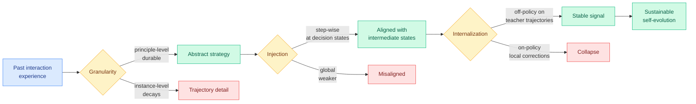

# Rethinking Continual Experience Internalization for Self-Evolving LLM Agents

**TL;DR.** Experience internalization converts a self-evolving agent's past interactions into reusable parametric capability (via context distillation: an experience-aware teacher supervises an experience-free student). Prior work studied only single-iteration transfer. This paper runs it iteratively and finds the thing nobody checked: instead of compounding improvement, existing methods suffer **progressive capability collapse**. It then dissects the failure along three axes and yields a stable recipe: use **principle-level** experience (not instance-level), inject it **step-wise** at decision states (not globally), and internalize **off-policy** on high-quality teacher trajectories (not on-policy). This is the keystone of a six-paper self-evolving-agents cluster on HuggingFace today.

**Source:** HuggingFace Daily Papers (upvotes: 15 — second-highest today)
**arxiv:** [2606.04703](https://arxiv.org/abs/2606.04703)
**Raw:** [raw/huggingface/2026-06-05-rethinking-continual-experience-internalization-for-self-evo.md](../../raw/huggingface/2026-06-05-rethinking-continual-experience-internalization-for-self-evo.md)

## Key points

- **The collapse.** Under multi-iteration experience learning, existing single-iteration methods degrade rather than compound. Each round of internalizing ambiguous, instance-specific experience erodes capability instead of adding to it.
- **Granularity.** Principle-level experience (abstracted transferable strategy) is durable; instance-level experience (trajectory-specific detail) decays because it overfits to the episode that produced it.
- **Injection pattern.** Step-wise injection (aligning experience with intermediate decision states) significantly beats global injection, and the gap is critical for long-horizon tool use where the right action depends on the current state.
- **Internalization regime.** Off-policy context-distillation on high-quality teacher trajectories is a substantially more stable training signal than on-policy context-distillation, which is inherently limited by local corrections on student-induced flawed states.

## How this relates to prior wiki knowledge

This paper is the meta-analysis the self-evolving-skills literature needed. The wiki has tracked that literature for two months: [Ctx2Skill](2026-05-05-ctx2skill-self-evolving-skills.md) (self-evolving skills), [SkillEvolBench](2026-05-26-skillevolbench-episodic-to-procedural-skills.md) (episodic→procedural), [MUSE-AutoSkill](2026-05-27-muse-autoskill-skill-lifecycle.md), [Pando](2026-05-30-pando-online-skill-distillation.md) (online skill distillation), [Skill0.5](2026-05-30-skill05-joint-skill-internalization.md) (joint internalization), and [From Raw Experience to Skill Consumption](2026-05-25-from-raw-experience-to-skill-consumption.md). All of them assumed internalization compounds; this paper shows that without the right granularity/injection/regime it collapses, and tells you why.

Two of its three findings collide productively with today's distillation keystone, [OPRD](../inference-efficiency/2026-06-05-oprd-on-policy-representation-distillation.md). OPRD is firmly on-policy (it distills representations on student rollouts); this paper says on-policy context-distillation is the *unstable* regime for experience internalization because the student keeps correcting its own flawed states. The reconciliation likely hinges on what is being matched: OPRD matches dense hidden states (low variance), whereas on-policy context-distillation matches token corrections on student-induced errors (high variance, compounding). The step-wise-injection finding also echoes [MemTrain](2026-06-04-memtrain-self-supervised-context-memory.md) (06-04), whose intermediate-recall objective rewarded faithful compression *throughout* the interaction rather than only at the outcome.

**The cluster (six self-evolving-agent papers today):** this paper (the diagnosis), [MLEvolve](2026-06-05-mlevolve-self-evolving-ml-discovery.md) (self-evolving ML algorithm discovery with retrospective memory, beats AlphaEvolve on math optimization), [EvoDS](2026-06-05-evods-self-evolving-data-science-agent.md) (autonomous skill acquisition + learned context compression, +28.9% on data-science benchmarks), [SePO](2026-06-05-sepo-self-evolving-prompt-agent.md) (self-referential prompt optimization), DataCOPE (unsupervised verifier-guided skill discovery, +32.3% on reasoning-style analysis), and [MMPO](2026-06-05-mmpo-metacognitive-memory-policy-optimization.md) (belief-entropy-supervised memory). Six papers, one frame: self-evolution only works if the experience signal is abstracted, state-aligned, and stably internalized.

## Gaps

- The recipe is validated on the paper's own task suite; no head-to-head against the named cluster systems (MLEvolve, EvoDS) under the multi-iteration collapse test.
- "Off-policy beats on-policy" is shown for context-distillation of text trajectories; whether it holds for representation-level internalization (OPRD's regime) or for RL-based skill acquisition (EvoDS's regime) is the obvious next test.

## Related pages
- [agent-memory.md](agent-memory.md)
- [../inference-efficiency/knowledge-distillation.md](../inference-efficiency/knowledge-distillation.md)
- [../inference-efficiency/2026-06-05-oprd-on-policy-representation-distillation.md](../inference-efficiency/2026-06-05-oprd-on-policy-representation-distillation.md)
