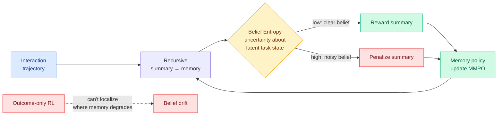

# MMPO: Meta-Cognitive Memory Policy Optimization for Long-Horizon LLM Agents

**TL;DR.** Memory-augmented agents recursively summarize their interaction history into compact memory. Trained with outcome-based RL, those memory policies cannot localize *where* memory quality degrades, so ambiguous summaries progressively discard task-relevant information and inject semantic noise, the agent's belief about the latent task state drifts, and long-horizon reasoning derails. MMPO argues memory optimization should target the **clarity of the belief** a summary induces, not just trajectory success. It introduces **Belief Entropy**, a self-supervised proxy for how uncertain the model remains about the latent task state given its current memory, and uses it to penalize summaries that raise epistemic uncertainty. The fine-grained, memory-specific signal beats outcome-only methods and holds 97.1% performance at 1.75M-token contexts.

**Source:** HuggingFace Daily Papers (upvotes: 3)
**arxiv:** [2605.30159](https://arxiv.org/abs/2605.30159)
**Raw:** [raw/huggingface/2026-06-05-meta-cognitive-memory-policy-optimization-for-long-horizon-l.md](../../raw/huggingface/2026-06-05-meta-cognitive-memory-policy-optimization-for-long-horizon-l.md)

## Key points

- **The diagnosis.** Outcome-based RL gives one reward at the end of a long trajectory, so it cannot say which intermediate summary caused the failure. Bad summaries accumulate silently until belief deviation derails the run.
- **Belief Entropy.** A self-supervised proxy that probes how uncertain the model is about the latent task state given only its current memory. Low entropy = the memory induces a clear belief; high entropy = the summary introduced noise.
- **MMPO.** Replaces sparse outcome reward with dense, memory-specific supervision: explicitly penalize summaries that induce high epistemic uncertainty.
- **Result.** Outperforms existing methods on diverse long-horizon tasks and maintains 97.1% performance even at 1.75M-token contexts.

## How this relates to prior wiki knowledge

MMPO sits directly in the [agent-memory](agent-memory.md) thread and pairs with yesterday's [MemTrain (06-04)](2026-06-04-memtrain-self-supervised-context-memory.md). MemTrain built a memory *skill* self-supervised on Wikipedia via an intermediate-recall objective rewarding faithful compression throughout the interaction; MMPO adds the *control* signal: a per-summary penalty when the compression muddies the agent's belief. MemTrain answers "how do I acquire memory capability cheaply"; MMPO answers "how do I keep memory from degrading over a long run." Both reject the outcome-only training that the wiki has repeatedly flagged as too coarse, the same critique [DRIFT/TELBench (06-04)](2026-06-04-drift-telbench-span-error-localization.md) made of final-answer evals (they can't localize which trajectory span failed). Belief Entropy is the memory-side analogue of span-level error localization.

It also belongs to today's self-evolving-agents cluster keyed by [Continual Experience Internalization](2026-06-05-continual-experience-internalization.md), and reinforces that paper's step-wise-injection finding: supervision aligned with intermediate states beats global outcome supervision for long-horizon work.

## Gaps

- Belief Entropy is a self-supervised proxy; whether low belief entropy reliably tracks *correct* belief (rather than confident-but-wrong belief, the sycophancy failure mode) is not established in the abstract.
- 97.1% retention at 1.75M tokens is strong, but the baseline degradation curve and the task mix at that length determine how meaningful the number is.

## Research angle

A dense, self-supervised "is my memory still clear" signal is exactly the kind of per-step reward that could be plugged into the long-horizon RL recipes the wiki tracks. The open question is whether Belief Entropy can be repurposed as a *runtime* trigger, not just a training reward: if the agent can measure that a summary spiked its belief entropy, it could re-summarize or retrieve before drift compounds, turning a training signal into an inference-time self-correction loop.

## Related pages
- [agent-memory.md](agent-memory.md)
- [2026-06-04-memtrain-self-supervised-context-memory.md](2026-06-04-memtrain-self-supervised-context-memory.md)
- [2026-06-05-continual-experience-internalization.md](2026-06-05-continual-experience-internalization.md)
