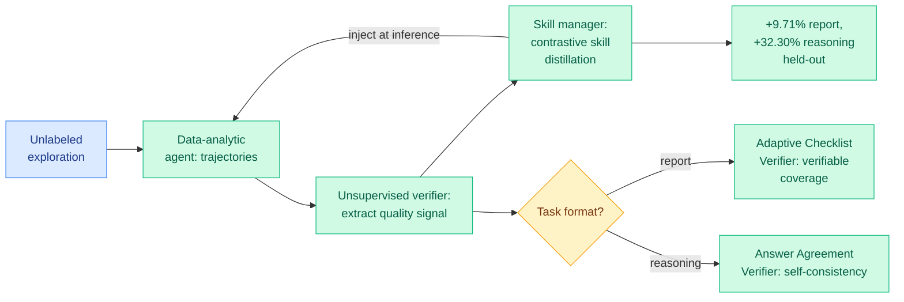

# DataCOPE: Unsupervised Skill Discovery for Agentic Data Analysis

**TL;DR.** Data-analysis agents improve cheaply if you can inject reusable procedural "skills" at inference time (no weight updates). The hard part is *discovering* good skills, because supervision is expensive and "success" looks different for a report than for a numeric answer. DataCOPE discovers skills from **unlabeled exploration alone**: it derives verifier signals from the agent's own trajectories and uses them to contrastively distill skills. It improves held-out performance by **+9.71%** on report-style analysis and **+32.30%** on reasoning-style analysis, averaged across four model settings.

**Source:** HuggingFace Daily Papers · arxiv [2606.06416](https://arxiv.org/abs/2606.06416)

## What it is

DataCOPE is an unsupervised, verifier-guided skill-discovery loop for data-analysis agents. Three components cycle: a Data-Analytic Agent generates exploration trajectories, an Unsupervised Verifier extracts a quality/agreement signal from those trajectories (no labels), and a Skill Manager performs contrastive skill distillation, turning high-quality trajectories into reusable procedural knowledge that is injected back at inference time. The verifier is instantiated two ways depending on task format: an **Adaptive Checklist Verifier** that derives task-specific criteria and scores reports by verifiable coverage (for open-ended report analysis), and an **Answer Agreement Verifier** that groups trajectories by answer agreement and uses self-consistency (for reasoning analysis with checkable answers).

## What problem it solves

Inference-time skill augmentation is attractive because it needs no parameter updates, but discovering *which* skills help is blocked by the cost of supervision and by the fact that data-analysis success criteria vary by format. DataCOPE removes the supervision requirement by manufacturing the signal from the agent's own exploration.

## Core novelty

Deriving verifier signals from unlabeled exploration trajectories and using them to contrastively distill skills, with a format-adaptive verifier (coverage-based for reports, agreement-based for reasoning) so the same framework handles both open-ended and checkable analysis.

## How it relates to prior wiki knowledge

DataCOPE extends yesterday's **self-evolving-agents cluster**, which the wiki named as a four-of-a-kind: [MLEvolve](2026-06-05-mlevolve-self-evolving-ml-discovery.md) (cross-branch memory for ML-algorithm discovery), [EvoDS](2026-06-05-evods-self-evolving-data-science-agent.md) (autonomous skill acquisition + learned context compression for data science), [Continual Experience Internalization](2026-06-05-continual-experience-internalization.md) (the stable multi-round recipe), and [MMPO](2026-06-05-mmpo-metacognitive-memory-policy-optimization.md) (Belief Entropy for clean recursive memory). DataCOPE is squarely in the EvoDS lineage (data-analysis agents that acquire reusable skills) but its distinguishing move is doing it **unsupervised**, deriving the reward from trajectory agreement/coverage rather than from outcome labels or RL. That connects it to the verifier-from-self-consistency idea and to [agent-memory.md](agent-memory.md)'s skill-library thread. The pattern is now five papers deep: the 2026 agent frontier is *agents that manufacture their own training signal*.

## Gaps

The unsupervised verifier is the whole game, and self-consistency / coverage signals are gameable: an agent confidently consistent in a wrong analysis gets reinforced, and checklist coverage can reward thoroughness over correctness. The abstract does not report how often the verifier's preferred trajectory is actually the correct one. Gains are on two benchmark families (Deep Data Research, DABStep); transfer to messier real analytical workflows is untested.

## Industrial implication

For analytics copilots, a loop that bootstraps a reusable skill library from unlabeled usage is a cheap path to compounding improvement without a labeling budget. The risk is the same as all self-supervised agent loops: without a ground-truth check, the agent can get more *consistent* without getting more *correct*. Pair with a periodic labeled audit.

## Related pages

- [2026-06-05-evods-self-evolving-data-science-agent.md](2026-06-05-evods-self-evolving-data-science-agent.md)
- [2026-06-05-continual-experience-internalization.md](2026-06-05-continual-experience-internalization.md)
- [agent-memory.md](agent-memory.md)

Raw source: `raw/huggingface/2026-06-06-unsupervised-skill-discovery-for-agentic-data-analysis.md`
