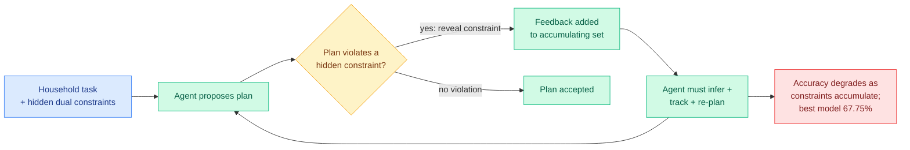

# AdaPlanBench: Adaptive Planning under Progressively Revealed Constraints

**Source:** HuggingFace Daily Papers · [arXiv 2606.05622](https://arxiv.org/abs/2606.05622)
**Raw:** [raw/huggingface/2026-06-07-adaplanbench-evaluating-adaptive-planning-in-large-language.md](../../raw/huggingface/2026-06-07-adaplanbench-evaluating-adaptive-planning-in-large-language.md)
**Authors:** Jiayu Liu, Cheng Qian, Zhenhailong Wang, Heng Ji et al. (UIUC)

## TL;DR

Real planning rarely comes with all constraints stated upfront. AdaPlanBench is a dynamic, interactive benchmark that tests whether an LLM agent can plan and re-plan when both **world constraints** (tool availability, resource limits) and **user constraints** (preferences, dislikes) are revealed only when a proposed plan violates them. Built on 307 household tasks with a scalable dual-constraint construction pipeline, the agent interacts multi-turn, gets told a hidden constraint only after it trips one, and must infer and track accumulating constraints while revising. Ten leading LLMs top out at 67.75%, performance degrades as constraints pile up, user constraints are harder than world constraints, and failures trace to weak physical grounding.

## Key points

- **Progressive disclosure is the hard part.** Prior planning benchmarks assume constraints are fully specified upfront, or test world-side OR user-side constraints in isolation. AdaPlanBench combines both, withholds them, and reveals them only on violation, forcing genuine inference-and-revision rather than one-shot planning.
- **User constraints break agents harder than world constraints.** The best of ten LLMs reaches 67.75%; accuracy falls as constraints accumulate; preference/dislike constraints are the larger failure source, and failures often stem from weak physical grounding.

## How this relates to prior wiki knowledge

- **Another stateful-trajectory eval, not a single-turn one.** AdaPlanBench belongs to the wiki's growing family of benchmarks that grade the *trajectory*, not the turn: [SABER](../responsible-ai/2026-06-06-saber-operational-safety-coding-agents.md) (06-06, final workspace state), [AgentLens](2026-05-14-agentlens-lucky-pass-swe-eval.md) (05-14, "lucky pass" trajectories), and the agent-eval-crisis cluster. The shared message: agents that look fine per-response fail across an interaction.
- **Re-planning under feedback is routed recovery.** The infer-then-revise loop is the planning-side cousin of [RePoT/Adaptive RePoT](2026-05-31-repot-recoverable-program-of-thought.md) (recover from a verified checkpoint, route between repair and retry). AdaPlanBench shows the underlying skill — tracking accumulating constraints — is still weak (sub-68%), which sets a ceiling on how well any recovery router can do.
- **Physical grounding as the recurring bottleneck.** That failures trace to weak physical grounding connects to the embodied-planning weakness the wiki sees across world-action models (cf. [Flash-WAM](../inference-efficiency/2026-06-07-flash-wam-modality-aware-distillation.md)'s 40% real-sim gap).

## Research angle

The benchmark's value is the violation-triggered disclosure protocol — it operationalizes "constraints you learn by failing." Open questions: whether RL on this kind of feedback (rather than supervised planning) closes the user-constraint gap, and whether memory mechanisms (the agent-memory thread: [MMPO](2026-06-05-mmpo-metacognitive-memory-policy-optimization.md), MemTrain) help track accumulating constraints across many turns. A 67.75% ceiling on household tasks is a clear "not deployable yet" signal for open-ended assistant planning.

→ Concept page: [agent-benchmarks](agent-benchmarks.md)
