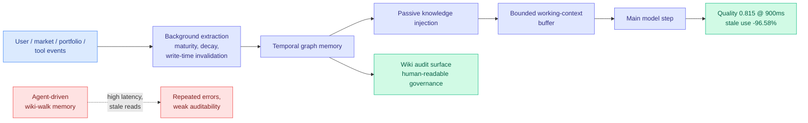

# InKH: Interaction-Native Knowledge Harness for Financial LLM Agents

**Source:** HuggingFace Daily Papers · [arXiv 2606.01886](https://arxiv.org/abs/2606.01886)
**Raw:** [raw/huggingface/2026-06-07-absorbing-complexity-an-interaction-native-knowledge-harness.md](../../raw/huggingface/2026-06-07-absorbing-complexity-an-interaction-native-knowledge-harness.md)

## TL;DR

Financial AI agents fail because they make the *user* carry the complexity: the user restates goals, risk preferences, portfolio context, and shifting market assumptions while the agent answers and forgets. InKH (interaction-native knowledge harness) absorbs that complexity into the system. It converts user, market, portfolio, and tool events into structured operational knowledge, then uses passive knowledge injection to assemble a bounded working-context buffer before each model step, a temporal graph memory for low-latency retrieval, a wiki audit surface for human-readable governance, and background extraction with maturity, decay, and write-time invalidation. On a controlled synthetic benchmark (24 seeds, 80 episodes/round, 6 baselines, 46,080 evaluations), InKH reaches mean task quality 0.815 at 900ms latency — versus agent-driven wiki-walk memory, 82.95% less latency, 82.29% less token cost, 96.58% less stale-knowledge use, +0.108 quality, +0.461 traceability.

## Key points

- **Write-time invalidation is the load-bearing piece.** The big stale-memory reduction (96.58%) comes from invalidating knowledge at write time rather than hoping retrieval filters it later. Compared against a temporal-graph system *without* invalidation, InKH still improves quality by 0.050 and cuts stale use by the same margin at comparable cost — so invalidation, not the graph alone, drives the gain.
- **Passive injection vs agent-driven retrieval.** Assembling a bounded context buffer *before* the model step (passive) beats letting the agent walk a wiki to fetch memory (active) on latency (82.95% lower) and token cost (82.29% lower) — the cost of agentic retrieval is the thing being removed.
- **Architecture validated, not live trading.** The benchmark is a controlled synthetic environment; the paper is explicit that it validates architecture-level behavior, not market performance.

## How this relates to prior wiki knowledge

- **Stale memory is the recurring failure mode.** This directly addresses the diagnosis from the [agent-memory](agent-memory.md) cluster (05-15: STALE capped frontier models at 55.2% on implicit-conflict detection over long contexts) — stale, un-invalidated memory is what breaks long-running agents. InKH's write-time invalidation is a concrete mechanism for the "memory must be adaptive infrastructure, not a frozen RAG database" thesis.
- **Belief-clarity and faithful-compression cousins.** Where [MMPO](2026-06-05-mmpo-metacognitive-memory-policy-optimization.md) (06-05) penalizes summaries that muddy belief and [MemTrain](2026-06-04-memtrain-self-supervised-context-memory.md) (06-04) rewards faithful compression, InKH attacks the same staleness problem at the systems layer (invalidation + decay + maturity) rather than the training-objective layer. The two approaches are complementary: train memory to compress faithfully, then engineer the store to expire correctly.
- **The auditability angle.** A human-readable wiki audit surface for governance is the finance-specific version of the traceability the responsible-ai page keeps asking for in high-stakes deployments.

## Research angle

The interesting claim is that the win comes from *systems engineering* (invalidation, decay, bounded buffers) rather than a better model or training objective — a reminder that a large fraction of agent-memory quality is plumbing. Open: whether write-time invalidation generalizes outside the synthetic benchmark to noisy real market streams where "what is stale" is itself uncertain, and how the bounded buffer trades off against recall on rare-but-critical historical context.

→ Concept page: [agent-memory](agent-memory.md)
