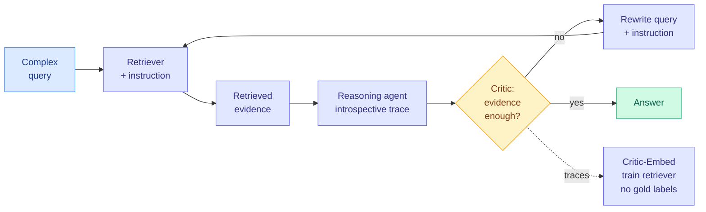

# Critic-R: Improving Agentic Search using Instruction-tuned Retrievers with Natural Language Introspective Feedback

**Source:** HuggingFace Daily Papers
**arxiv:** [2606.00590](https://arxiv.org/abs/2606.00590)
**Date:** 2026-06-08
**Raw:** [raw file](../../raw/huggingface/2026-06-08-critic-r-improving-agentic-search-using-instruction-tuned-re.md)
**Tier:** 2

## TL;DR

Critic-R improves agentic search, where an LLM agent repeatedly queries a retrieval model to answer a complex question, by closing the feedback loop between the reasoning agent and the retriever during both inference and training. The hard part of optimizing retrievers for agentic search is that it usually needs heavy co-training or gold relevance annotations, which are expensive. Critic-R sidesteps this with a critic model that reads the agent's introspective reasoning trace after it consumes retrieved evidence, then judges whether the retrieved context actually supports the next reasoning step. It has two mechanisms: Critic-R-Zero, an inference-time loop that iteratively rewrites the query and the retrieval instruction when evidence is insufficient, and Critic-Embed, which optimizes the retrieval model using successful and failed refinement trajectories as automatic supervision, with no manual relevance labels. On four multi-hop QA benchmarks (HotpotQA, 2WikiMultihopQA, MuSiQue, Bamboogle) it improves both retrieval quality and downstream answer accuracy.

## Key points

- Critic model evaluates the agent's introspective reasoning trace to decide if retrieved context supports the next reasoning step.
- Critic-R-Zero: inference-time loop that iteratively rewrites both the query and the retrieval instruction when evidence falls short.
- Critic-Embed: trains the retriever from successful and failed refinement trajectories as automatic supervision, removing the need for gold relevance annotations.
- Evaluated on HotpotQA, 2WikiMultihopQA, MuSiQue, and Bamboogle.
- Reports improvements in both retrieval quality and downstream answer accuracy.

## Relation to prior wiki state

This extends the retriever-optimization thread that [cohyde-cotrain-rewriter-encoder-tool-retrieval](2026-05-31-cohyde-cotrain-rewriter-encoder-tool-retrieval.md) opened, where a rewriter and an encoder were co-trained for tool retrieval. Critic-R reaches a similar place but pays a lower training cost: instead of co-training, it harvests successful and failed refinement trajectories as free supervision. It also relates to [bright-pro-rtriever-reasoning-retrieval](2026-05-07-bright-pro-rtriever-reasoning-retrieval.md) on reasoning-intensive retrieval, and the mechanics of agent-issued queries are part of [tool-calling.md](tool-calling.md). There is a direct industry parallel in today's digest: Perplexity's "Search as Code," where the agent writes its own search routines and cuts token cost up to 85%. Critic-R is the research-side version of the same instinct: let the agent shape its own retrieval instructions rather than fixing the query interface in advance.

## Why it matters

The annotation bottleneck is the real obstacle to better agentic search, and Critic-R's claim is that you do not need gold relevance labels at all if you treat the agent's own refinement trajectories as the training signal. If that holds beyond multi-hop QA, it is a cheap, self-improving retriever-tuning recipe that any RAG stack can adopt. The Perplexity parallel matters because it shows industry already believes agent-shaped retrieval beats fixed query pipelines, and Critic-R supplies the missing training procedure to make that retrieval model actually get better over time rather than just being prompted more cleverly.

## Gaps

The benchmarks are all multi-hop factoid QA, so it is unclear whether the critic's "is this evidence sufficient" judgment transfers to open-ended or long-form tasks where sufficiency is not crisply defined. The abstract also does not report the inference-time cost of the Critic-R-Zero rewrite loop, which matters for production latency.

## Links

- Paper: https://arxiv.org/abs/2606.00590
- Raw: [raw file](../../raw/huggingface/2026-06-08-critic-r-improving-agentic-search-using-instruction-tuned-re.md)
