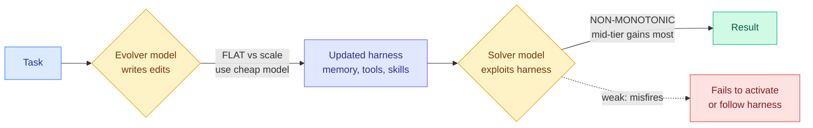

# Disentangling Agent Self-Evolution: Does a Stronger Model Make a Better Self-Evolving Agent?

**Source:** DAIR.AI Top AI Papers of the Week (LinkedIn / Gmail starred)
**arxiv:** (not captured)
**Date:** 2026-06-08
**Raw:** [raw source](../../raw/gmail/2026-06-08-starred.md)
**Tier:** 2

## TL;DR

This paper asks a simple question with an uncomfortable answer: if an agent rewrites its own harness, the scaffold of tools, prompts, memory, and skills, does using a stronger model make it a better self-evolving agent? The answer is no, because "self-evolution" is really two separate abilities that scale very differently. The paper splits the loop into harness-updating, where an evolver model writes the edits, and harness-benefit, where a solver model actually exploits those edits on the task. Updating turns out to be flat across model tiers: the quality of harness edits barely depends on model strength, and updates written by a small Qwen3.5-9B yield gains comparable to those from Claude Opus 4.6, so paying for a frontier model on the evolver side buys almost nothing. Benefit is non-monotonic: the ability to use a better harness follows a curve where weak models gain little, mid-tier models benefit most, and the strongest models benefit less because they already solve the task without the scaffold. The practical lever that falls out is clean: put a cheap model on the evolver and spend your capability budget on the solver, because system design, not raw model scale, does most of the work in agent self-improvement.

## Key points

- Separates self-evolution into two distinct abilities: harness-updating (an evolver model writes edits to memory, tools, prompts, skills) and harness-benefit (a solver model actually exploits those edits).
- Updating is flat across model tiers: harness-edit quality barely depends on model strength. A Qwen3.5-9B evolver gives gains comparable to a Claude Opus 4.6 evolver.
- Benefit is non-monotonic: weak solvers gain little, mid-tier solvers benefit most, strongest solvers benefit less because they already solve the task without the scaffold.
- Failure modes for weak solvers: they fail to activate the relevant harness component or follow its instructions inconsistently.
- Practical lever: put a cheap model on the evolver and spend the capability budget on the solver. System design beats raw model scale for self-improvement.

## Relation to prior wiki state

This is the meta-counterweight to today's whole self-evolution batch. Where [SIA (06-08)](2026-06-08-sia-self-improving-harness-weights.md) and [HarnessForge (06-08)](2026-06-08-harnessforge-harness-policy-coevolution.md) co-evolve harness and weights/policy, and [Socratic-SWE (06-08)](2026-06-08-socratic-swe-trace-derived-skills.md) and [OpenSkill (06-08)](2026-06-08-openskill-open-world-self-evolution.md) build skills and verifiers, this paper steps back and asks where model capability actually pays off in such loops. Its answer, on the solver and only in the mid-tier band, sharpens how all four should be read. It connects directly to [Scaling the Harness (05-27)](2026-05-27-scaling-the-harness.md), the position paper arguing the harness is the next bottleneck, by giving an empirical reason: harness quality is decoupled from evolver model strength, so scaling the harness is a system-design problem, not a model-scale problem. The cheap-evolver, expensive-solver split is effectively a routing insight, route the editing role to a small cheap model and the solving role to a stronger one, which lands squarely in the territory of [LLM routing](../ai-routing/llm-routing.md). It belongs in the [self-evolving-agents](../agentic-systems/self-evolving-agents.md) cluster as its cost-allocation guide.

## Why it matters

This is the most useful finding of the day for anyone actually deploying a self-evolving agent, because it kills the lazy default of throwing the best model at every role. If harness-edit quality is flat across tiers, the entire evolver budget is waste at frontier prices, and the non-monotonic benefit curve means even the solver should not always be the biggest model available. It reframes agent self-improvement as a model-routing and system-design exercise, not a scale exercise.

## Gaps

The summary is from a DAIR.AI roundup with no captured arxiv id, so the exact benchmarks, the width of the mid-tier benefit band, and whether the flat-updating result survives at frontier-versus-frontier comparisons are not verifiable from this source.

## Links

- Source: DAIR.AI Top AI Papers of the Week (LinkedIn / Gmail starred)
- Raw: [raw source](../../raw/gmail/2026-06-08-starred.md)
