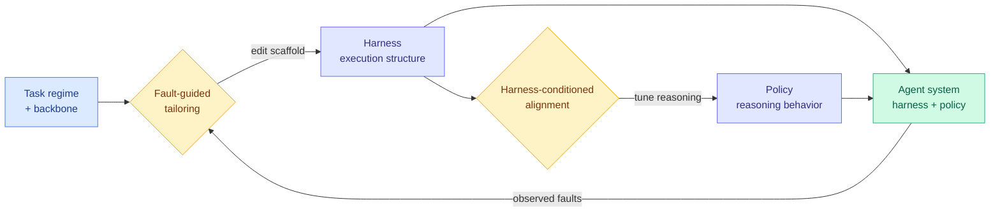

# HarnessForge: Joint Harness and Policy Evolution for Adaptive Agent Systems

**Source:** HuggingFace Daily Papers
**arxiv:** [2606.01779](https://arxiv.org/abs/2606.01779)
**Date:** 2026-06-08
**Raw:** [raw source](../../raw/huggingface/2026-06-08-harnessforge-joint-harness-and-policy-evolution-for-adaptive.md)
**Tier:** 2

## TL;DR

HarnessForge attacks a problem that fixed agent systems handle badly: real tasks come from heterogeneous regimes that each need a different execution style, so one frozen scaffold underperforms. HarnessForge is a meta-adaptive framework that models an agent system as a harness-policy pair, where the harness is the execution structure (tools, control flow, retry logic) and the policy is the reasoning behavior the model uses inside it. It evolves both together through harness-policy co-evolution, using fault-guided harness tailoring, which edits the scaffold in response to observed failures, and harness-conditioned policy alignment, which then tunes the reasoning to fit the new scaffold. Across five benchmarks from diverse domains it improved both Qwen3-4B and Qwen3-8B backbones and beat harness-only and policy-only baselines by up to 12.0% over the strongest baseline, with favorable rollout-efficiency tradeoffs. Its core conclusion is that co-evolving the two is what works, and that executable compatibility between the harness and the reasoning policy is essential.

## Key points

- Formulates an agent system as a harness-policy pair, separating execution structure (harness) from reasoning behavior (policy).
- Co-evolution proceeds in two coupled steps: fault-guided harness tailoring edits the scaffold based on failures, then harness-conditioned policy alignment tunes the reasoning to match.
- Improves both Qwen3-4B and Qwen3-8B backbones across five benchmarks from diverse domains, beating harness-only and policy-only baselines by up to 12.0% over the strongest baseline.
- Reports favorable rollout-efficiency tradeoffs, not just accuracy gains.
- Central conclusion: executable compatibility between harness and reasoning policy is essential. Evolving one without the other leaves performance on the table.
- Code released at https://github.com/mingju-c/HarnessForge.

## Relation to prior wiki state

HarnessForge is the closest sibling to today's [SIA (06-08)](2026-06-08-sia-self-improving-harness-weights.md). Both reject the harness-only versus weights-only split and evolve two coupled levers at once. The difference is where the second lever lives. SIA's second lever is model weights updated by RL, while HarnessForge's second lever is the reasoning policy, aligned to fit the scaffold without necessarily retraining the base. That makes HarnessForge a lighter-weight cousin and explains its rollout-efficiency framing. Both extend [Scaling the Harness (05-27)](2026-05-27-scaling-the-harness.md), the position paper that named the harness as the next bottleneck, by showing the harness cannot be tuned in isolation. The fault-guided tailoring step echoes the failure-driven adaptation in [Code as Agent Harness (05-23)](2026-05-23-code-as-agent-harness.md). It belongs in the [self-evolving-agents](../agentic-systems/self-evolving-agents.md) cluster.

## Why it matters

The sharp claim here is executable compatibility: a better scaffold the model cannot actually drive is worthless, and a smarter reasoning policy with the wrong tools around it is equally stuck. That reframes self-evolution as a matching problem rather than an optimization of two independent knobs. If this holds, agent frameworks that let users swap harness and policy independently are building on a false assumption.

## Gaps

The abstract caps gains at 12.0% on Qwen3 backbones up to 8B and does not show whether co-evolution still helps at frontier scale or whether the harness-policy coupling survives a backbone swap mid-evolution.

## Links

- Paper: https://arxiv.org/abs/2606.01779
- Code: https://github.com/mingju-c/HarnessForge
- Raw: [raw source](../../raw/huggingface/2026-06-08-harnessforge-joint-harness-and-policy-evolution-for-adaptive.md)
