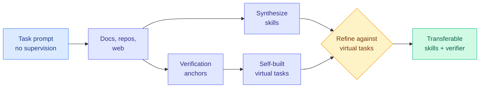

# OpenSkill: Open-World Self-Evolution for LLM Agents

**Source:** HuggingFace Daily Papers
**arxiv:** [2606.06741](https://arxiv.org/abs/2606.06741)
**Date:** 2026-06-08
**Raw:** [raw source](../../raw/huggingface/2026-06-08-openskill-open-world-self-evolution-for-llm-agents.md)
**Tier:** 2

## TL;DR

Self-evolving agents need to keep adapting after deployment, but almost every existing method quietly assumes a usable learning loop already exists, meaning curated skills, successful trajectories to imitate, or a verifier that can score attempts. Real open-world deployments often provide none of that, only a task prompt. OpenSkill studies this harder setting, open-world self-evolution, where the agent must build BOTH its skills AND its own verification signals from scratch using open-world resources but with no supervision tied to the target task. It pulls grounded knowledge and verification anchors, factual reference points it can later check against, from documentation, code repositories, and the web, then synthesizes these into transferable skills. It refines those skills against self-built virtual tasks that are grounded in the anchors rather than in any target answer. Across three benchmarks and two target agents, OpenSkill reaches the best automated pass rate while honoring the no-supervision constraint, its skills transfer across models without model-specific adaptation, and its self-built verifier aligns with ground-truth outcomes despite never seeing them.

## Key points

- Defines open-world self-evolution: the agent gets only a task prompt and must build both skills AND its own verification signals from scratch, with no target-task supervision.
- Acquires grounded knowledge and verification anchors from documentation, repositories, and the web, then synthesizes them into transferable skills.
- Refines skills against self-built virtual tasks grounded in the anchors rather than against target answers, sidestepping the missing verifier problem.
- Achieves the best automated pass rate across three benchmarks and two target agents while satisfying the no-supervision constraint.
- Skills transfer across models with no model-specific adaptation, and the self-built verifier aligns with ground-truth outcomes despite never accessing them.

## Relation to prior wiki state

OpenSkill removes an assumption the rest of the self-evolution cluster takes for granted. [Socratic-SWE (06-08)](2026-06-08-socratic-swe-trace-derived-skills.md) needs solving traces and execution-based validation, [SEPO (06-05)](2026-06-05-sepo-self-evolving-prompt-agent.md), [EvoDS (06-05)](2026-06-05-evods-self-evolving-data-science-agent.md), and [MLEvolve (06-05)](2026-06-05-mlevolve-self-evolving-ml-discovery.md) all assume a reward or verifier, and [ctx2skill (05-05)](2026-05-05-ctx2skill-self-evolving-skills.md) starts from curated context. OpenSkill says none of those may exist in a real deployment and builds the verifier itself. That makes it the most demanding setting in the [self-evolving-agents](../agentic-systems/self-evolving-agents.md) cluster and a direct answer to the open question raised in [Scaling the Harness (05-27)](2026-05-27-scaling-the-harness.md), the position paper that named verification and feedback as load-bearing harness components, about what happens when those components are absent. Its cross-model skill transfer also echoes the transferability theme from [EvoEnv (05-15)](2026-05-15-evoenv-self-evolving-rl-via-environment-synthesis.md).

## Why it matters

The self-built verifier that aligns with ground truth it never saw is the result to watch. If an agent can manufacture its own reliable check from anchors scraped off documentation and the web, the verifier-availability assumption that gates most post-deployment learning collapses, and continual adaptation becomes possible in settings where it was previously impossible. That is a bigger deal than the pass-rate number.

## Gaps

The abstract claims the self-built verifier aligns with ground truth but does not quantify how often it is wrong or what happens when the open-world anchors are themselves stale, incomplete, or contradictory.

## Links

- Paper: https://arxiv.org/abs/2606.06741
- Raw: [raw source](../../raw/huggingface/2026-06-08-openskill-open-world-self-evolution-for-llm-agents.md)
