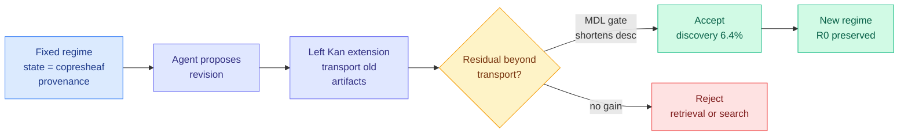

# Self-Revising Discovery Systems: A Category-Theoretic Account of Agentic Scientific Discovery

**Source:** Twitter curated retweet (@omarsar0 / DAIR.AI), also DAIR.AI Top Papers of the Week
**arxiv:** [2606.01444](https://arxiv.org/abs/2606.01444)
**Date:** 2026-06-08
**Raw:** [raw file](../../raw/twitter/2026-06-08-afternoon.md)
**Tier:** 2

## TL;DR

This paper argues that real scientific discovery is not just generating answers but revising the representational regime itself, meaning the set of types that define what counts as evidence, artifacts, operations, and verifiers. It builds a category-theoretic account of agentic discovery for materials science. Within a fixed regime, the system state is a copresheaf (a structured assignment of data to typed slots) and provenance is the category of elements (a formal record of where every artifact came from). Discovery is then defined as a verified regime transition: old artifacts are preserved and carried over via a left Kan extension (a canonical way to transport structure into a new, richer type system), then compared with the new state to isolate the residual content that genuinely goes beyond what could be transported automatically. That separation cleanly distinguishes retrieval, search, and discovery without relying on any subjective notion of novelty. Two instantiations are given: Builder/Breaker, a protein-mechanics world model revised under a Minimum Description Length gate (MDL, accept a change only if it shortens the total description of the data plus model), and CategoryScienceClaw, a proof-carrying knowledge-computation graph of typed skills, artifacts, gates, and stress tests. In one run, description-length gates kept the system honest: 388 proposals yielded just 25 accepted revisions, a strict 6.4% rate.

## Key points

- Reframes discovery as revision of the representational regime, not answer generation within a fixed regime.
- Category-theoretic core: state as a copresheaf, provenance as the category of elements, discovery as a verified regime transition.
- Old artifacts are transported by a left Kan extension, then compared to the new state to isolate residual content beyond functorial transport.
- DAIR.AI framing of three clean buckets: Retrieval (look up what you already have), Search (recombine tools you already own), Discovery (invent a concept not in your toolkit). Most agents stop at the first two.
- Two instantiations: Builder/Breaker (protein-mechanics world model under an MDL gate) and CategoryScienceClaw (proof-carrying knowledge-computation graph of typed skills, gates, stress tests).
- Description-length gates enforce strictness: 388 proposals yielded only 25 accepted revisions (6.4%).

## Relation to prior wiki state

This lands directly in the self-evolving and autonomous-discovery cluster. [autoscientists-self-organizing-teams](2026-05-28-autoscientists-self-organizing-teams.md) and [scientistone-chain-of-evidence](2026-05-28-scientistone-chain-of-evidence.md) built AI-scientist pipelines that generate and verify hypotheses, and the self-evolving line runs through [mlevolve-self-evolving-ml-discovery](2026-06-05-mlevolve-self-evolving-ml-discovery.md) and [evods-self-evolving-data-science-agent](2026-06-05-evods-self-evolving-data-science-agent.md). What this paper adds is a formal criterion for what makes a change a discovery rather than a recombination: the residual content beyond a left Kan extension, gated by description length. That is a sharper definition than the "subjective novelty" most of those systems rely on. The skeptical counterpart is worth holding alongside it: Kurate cs.AI #6 this week, "AI scientists produce results without reasoning scientifically" (ai_rating 8.5), argues current AI-scientist systems output findings without genuine scientific reasoning. The 6.4% acceptance rate here is the optimistic reading of that same worry, a built-in honesty gate that throws out the 93.6% of proposals that do not actually extend the regime.

## Why it matters

The retrieval / search / discovery trichotomy is the most useful conceptual contribution, because it gives a non-handwavy answer to the question everyone in the AI-scientist space keeps dodging: what would it even mean for an agent to discover something new rather than recombine what it has. Grounding "discovery" in residual content beyond a Kan extension, and policing it with a description-length gate, is a genuine attempt to make novelty objective rather than vibes. Whether the category theory is necessary machinery or elegant overkill is fair to debate, but the MDL honesty gate and its brutal 6.4% acceptance rate are exactly the kind of discipline that the Kurate skeptics are demanding the field adopt.

## Gaps

The two instantiations are narrow (protein mechanics and a typed-skill graph), so it is unproven that the regime-transition formalism scales to messier sciences where types are not cleanly definable. The 6.4% acceptance figure comes from a single run, with no evidence yet on whether the gate is well-calibrated or merely conservative.

## Links

- Paper: https://arxiv.org/abs/2606.01444
- Raw: [raw file](../../raw/twitter/2026-06-08-afternoon.md)
