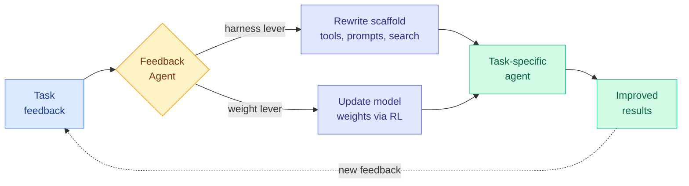

# SIA: Self-Improving AI with Harness & Weight Updates

**Source:** HuggingFace Daily Papers
**arxiv:** [2605.27276](https://arxiv.org/abs/2605.27276)
**Date:** 2026-06-08
**Raw:** [raw source](../../raw/huggingface/2026-06-08-sia-self-improving-ai-with-harness-weight-updates.md)
**Tier:** 2 (Tier 1 intersection: one domain is GPU kernel optimization)

## TL;DR

SIA (Self-Improving AI) argues that the humans who build and tune AI agents are the real bottleneck, and it tries to remove them from the loop. Prior self-improvement work splits into two camps that never talk to each other. The harness-update school has a meta-agent rewrite the scaffold, meaning the tools, prompts, retry logic, and search procedure, while the model weights stay frozen. The test-time-training school keeps the harness fixed and uses a hand-written reinforcement learning pipeline (training by trial and reward on task feedback) to update the model's weights. SIA runs a single self-improving loop where one language-model agent, called the Feedback-Agent, updates BOTH the harness AND the weights of a task-specific agent. Tested on three very different domains, Chinese legal charge classification, low-level GPU kernel optimization, and single-cell RNA denoising, combining both levers beat scaffold iteration alone every time, with a 56.6% gain on LawBench, a 91.9% runtime reduction on GPU kernels, and a 502% improvement on denoising over the initial baseline.

## Key points

- SIA unifies two previously disjoint research lines: harness-update (meta-agent rewrites scaffold, weights frozen) and test-time-training (RL updates weights, harness frozen).
- A single language-model agent, the Feedback-Agent, drives both levers in one loop on a task-specific agent.
- Combining both levers beats scaffold iteration alone on all three domains: 56.6% gain on LawBench (legal charge classification), 91.9% runtime reduction on GPU kernels, 502% improvement on single-cell RNA denoising over the initial baseline.
- The paper's framing of the division of labor: harness updates make the model agentic, shaping how it searches and acts; weight updates build domain intuition no prompt can instil.
- Validated across three contrasting domains rather than a single benchmark family, which is a stronger generality claim than most self-evolution papers.

## Relation to prior wiki state

This is the first wiki page that puts harness updates and weight updates on equal footing inside one loop. The position paper [Scaling the Harness (05-27)](2026-05-27-scaling-the-harness.md), which argued the agent harness is the next bottleneck and decomposed it into six components, treated the harness as the thing to scale. SIA agrees the harness matters but says scaffold iteration alone is not enough. You also need weight updates to build domain intuition. That directly extends the harness-as-bottleneck thesis with an empirical claim: both levers together beat either alone. It sits in the [self-evolving-agents](../agentic-systems/self-evolving-agents.md) cluster alongside [Code as Agent Harness (05-23)](2026-05-23-code-as-agent-harness.md) and [SkillOpt (05-25)](2026-05-25-skillopt-executive-optimizer-agent-skills.md), both of which evolve the scaffold side only. The GPU-kernel domain connects this to Tier 1 efficiency work, since a 91.9% runtime reduction on kernels is a concrete inference-efficiency result reached by self-improvement rather than hand-tuning.

## Why it matters

The interesting move here is refusing to pick a side. Most of the field has implicitly assumed you either edit the scaffold or you train the weights, and SIA's three-domain sweep is the cleanest evidence so far that the two are complementary, not substitutes. If the result holds, the next generation of agent systems will run both loops at once by default, and the question shifts from which lever to use toward how to schedule them.

## Gaps

The abstract reports gains over an initial baseline but does not show how the two levers interact over many rounds, whether weight drift destabilizes the harness, or how the approach scales beyond three hand-picked domains.

## Links

- Paper: https://arxiv.org/abs/2605.27276
- Raw: [raw source](../../raw/huggingface/2026-06-08-sia-self-improving-ai-with-harness-weight-updates.md)
