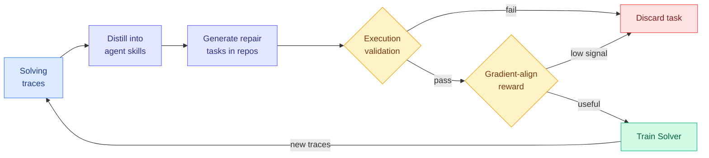

# Socratic-SWE: Self-Evolving Coding Agents via Trace-Derived Agent Skills

**Source:** HuggingFace Daily Papers
**arxiv:** [2606.07412](https://arxiv.org/abs/2606.07412)
**Date:** 2026-06-08
**Raw:** [raw source](../../raw/huggingface/2026-06-08-socratic-swe-self-evolving-coding-agents-via-trace-derived-a.md)
**Tier:** 2

## TL;DR

Software-engineering (SWE) agents are bottlenecked by the supply of high-quality SWE tasks to train on, and existing synthetic-data methods generate tasks with fixed mutation or bug-injection recipes that ignore where the agent itself is weak. Socratic-SWE is a closed-loop self-evolution framework that turns the agent's own historical solving traces, the step-by-step records of how it attacked past problems, into training signal. It distills those traces into structured agent skills, compact summaries of recurring failures and the repair patterns that worked, then uses the skills to generate targeted repair tasks inside real repositories. Each candidate task is checked by execution-based validation (does the generated fix actually pass tests) and scored with a solver-gradient alignment reward, so only tasks that are both verifiable and useful for improving the Solver are kept. Because the updated Solver produces fresh traces, the curriculum adapts round after round. Across SWE-bench Verified, SWE-bench Lite, SWE-bench Pro, and Terminal-Bench 2.0 it consistently beats self-evolving baselines under the same compute budget, reaching 50.40% on SWE-bench Verified after three iterations.

## Key points

- Reuses the agent's own historical solving traces as the source of training signal, instead of fixed mutation or bug-injection synthetic data that ignores the agent's weaknesses.
- Distills traces into structured agent skills that summarize recurring failures and effective repair patterns, then uses them to generate targeted repair tasks in real repositories.
- Two filters keep the curriculum clean: execution-based validation ensures tasks are verifiable, and a solver-gradient alignment reward ensures retained tasks actually help the Solver.
- The loop is self-adapting: an updated Solver produces new traces, which reshape the next round's curriculum to the current weaknesses.
- Reaches 50.40% on SWE-bench Verified after three iterations and consistently beats self-evolving baselines under the same compute budget across SWE-bench Verified, Lite, Pro, and Terminal-Bench 2.0.

## Relation to prior wiki state

Socratic-SWE sits at the intersection of two prior wiki threads: trace-to-skill distillation and self-evolving coding curricula. The skill-distillation move directly extends [ctx2skill (05-05)](2026-05-05-ctx2skill-self-evolving-skills.md), which turned context into self-evolving skills, and [SkillOpt (05-25)](2026-05-25-skillopt-executive-optimizer-agent-skills.md), which optimized agent skills with an executive layer. Where those pages generated or curated skills, Socratic-SWE closes the loop by feeding skills back into task generation targeted at the agent's own weaknesses. On the coding side it is the SWE-specific analog of the general self-evolution loops in [EvoDS (06-05)](2026-06-05-evods-self-evolving-data-science-agent.md), [MLEvolve (06-05)](2026-06-05-mlevolve-self-evolving-ml-discovery.md), and [SEPO (06-05)](2026-06-05-sepo-self-evolving-prompt-agent.md), and its environment-synthesis flavor connects to [EvoEnv (05-15)](2026-05-15-evoenv-self-evolving-rl-via-environment-synthesis.md), which synthesized RL environments rather than repair tasks. It belongs in the [self-evolving-agents](../agentic-systems/self-evolving-agents.md) cluster.

## Why it matters

The clever part is the solver-gradient alignment reward. Most curriculum-generation work measures task difficulty or diversity, but Socratic-SWE measures whether a task actually moves the Solver's gradient in a useful direction, which is the right objective and a sharper filter. If trace-derived, weakness-targeted curricula keep beating fixed synthetic-data pipelines at equal compute, the bug-injection approach to SWE training data is on its way out.

## Gaps

The abstract reports three iterations and does not show whether gains continue past that point or whether the curriculum eventually overfits to the Solver's measured weaknesses and stops generalizing to held-out repositories.

## Links

- Paper: https://arxiv.org/abs/2606.07412
- Raw: [raw source](../../raw/huggingface/2026-06-08-socratic-swe-self-evolving-coding-agents-via-trace-derived-a.md)
