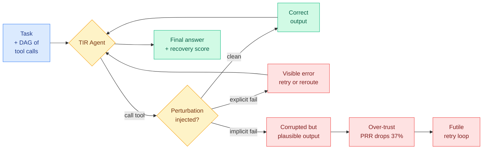

# When Tools Fail: Benchmarking Dynamic Replanning and Anomaly Recovery in LLM Agents (ToolMaze)

**Source:** HuggingFace Daily Papers
**arxiv:** [2606.05806](https://arxiv.org/abs/2606.05806)
**Date:** 2026-06-08
**Raw:** [raw file](../../raw/huggingface/2026-06-08-when-tools-fail-benchmarking-dynamic-replanning-and-anomaly.md)
**Tier:** 2

## TL;DR

ToolMaze is a benchmark for Tool-Integrated Reasoning (TIR, where an LLM agent calls external tools mid-reasoning) that deliberately breaks the tools. Existing benchmarks score agents only on idealized "happy paths" where every tool returns clean output, which hides how agents behave when a tool fails. ToolMaze adds two axes: DAG-based topological complexity (how tangled the dependency graph of tool calls is), and a 2x2 taxonomy of tool perturbations split by explicit vs implicit and transient vs permanent failures. The sharpest performance drops come from implicit semantic failures, where a tool returns plausible-looking but corrupted output, because agents over-trust it. The Perturbation Recovery Rate (PRR), the fraction of runs that recover after a fault, falls by roughly 37% in these scenarios, and complex topologies trap agents in futile trial-and-error loops. Most striking, fault-tolerance improves with model scale 3.66x slower than basic task execution, marking dynamic replanning as a distinct bottleneck that scaling and prompting alone do not fix.

## Key points

- Two-dimensional design: DAG topological complexity crossed with a 2x2 perturbation taxonomy (explicit/implicit by transient/permanent).
- Perturbations degrade nearly all models tested, with the sharpest drops under implicit semantic failures where corrupted output still looks valid.
- Perturbation Recovery Rate (PRR) plummets about 37% in implicit-failure scenarios, driven by systemic over-trust in corrupted tool outputs.
- Complex topologies trap agents in futile trial-and-error loops rather than triggering genuine replanning.
- Agentic fault-tolerance improves with model scale 3.66x slower than basic task execution, so scaling does not close the gap.
- Code released at https://github.com/Zhudongsheng75/ToolMaze.

## Relation to prior wiki state

This sits squarely on the "evaluate the interaction, not the turn" thread. [adaplanbench-adaptive-planning](2026-06-06-adaplanbench-adaptive-planning.md) argued that adaptive planning under shifting conditions is what separates strong agents, and ToolMaze gives that thesis a concrete failure mode: agents do not replan when a tool silently corrupts its output, they keep trusting it. It extends [agent-benchmarks.md](agent-benchmarks.md) by adding a robustness axis on top of capability, and it tests the exact tool-call mechanics catalogued in [tool-calling.md](tool-calling.md), now under fault injection rather than clean returns. It also complements [akbe-knowledge-boundary-tool-use](2026-05-27-akbe-knowledge-boundary-tool-use.md), which probed when agents know to call a tool at all. ToolMaze probes the next step: whether the agent knows when a tool it called has betrayed it. The finding that recovery scales 3.66x slower than execution echoes the broader pattern that capability and reliability are not the same curve.

## Why it matters

This is the cleanest evidence yet that dynamic replanning is a separate capability axis from raw task-solving, and that the field has been measuring the wrong thing by scoring happy paths. The 3.66x scaling gap is the load-bearing number: if recovery improves that much slower than execution, then bigger models will keep getting more capable and proportionally more brittle when their tools lie to them. For anyone shipping agentic systems against real APIs that throttle, return stale caches, or hallucinate fields, ToolMaze names the production failure mode directly, and the implicit-failure result is a warning that the dangerous case is not the tool that errors loudly but the one that returns confident garbage.

## Gaps

The benchmark measures recovery rate but the abstract does not show whether targeted training on perturbed trajectories closes the 3.66x scaling gap, so it diagnoses the bottleneck without testing a fix. It also leaves open whether implicit-failure over-trust is a calibration problem solvable by verifier models or a deeper planning deficit.

## Links

- Paper: https://arxiv.org/abs/2606.05806
- Raw: [raw file](../../raw/huggingface/2026-06-08-when-tools-fail-benchmarking-dynamic-replanning-and-anomaly.md)
