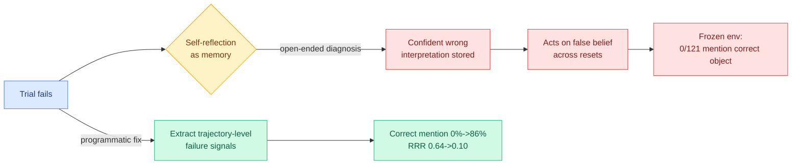

# Honest Lying: Memory Confabulation in Reflexive Agents

**TL;DR.** Reflexion-style agents use self-generated reflections as memory, assuming an agent can accurately diagnose its own failures. This paper shows that assumption fails systematically. Across ALFWorld and HumanEval, agents store **confident but incorrect interpretations of the task and keep acting on them across trials**, even though the environment resets to the correct task each time. The authors name this **memory confabulation** and introduce the **Reflection Repetition Rate (RRR)**, a log-based metric for repeated reliance on wrong reflective content. They find **16 "frozen" ALFWorld environments** where **0 of 121 reflections mention the correct target object**, plus 4 analogous HumanEval cases. The fix: replace open-ended self-diagnosis with **programmatic extraction of trajectory-level failure signals**, raising correct-object mention from **0% to 86%**, cutting RRR from **0.64 to 0.10**, and solving **3 of 16 frozen environments**.

## Key points

- **Reflective memory can reinforce false beliefs rather than correct them.** A confident misreading of the task gets written to memory and re-used every trial, a self-locking failure the environment reset cannot break.
- **RRR is a cheap, log-based detector** of this loop, surfacing the frozen environments quantitatively (0/121 correct mentions).
- **Programmatic failure extraction beats open-ended self-diagnosis.** Replacing "ask the model what went wrong" with structured trajectory signals is the mitigation, 0%→86% correct-object mention.

## How it relates to prior wiki knowledge

- **The cold-water companion to the self-evolution optimism.** The [self-evolving-agents](self-evolving-agents.md) cluster (SIA, Socratic-SWE, 06-08) assumes agents can mine their own traces for useful signal; [Self-Revising Discovery Systems](2026-06-08-self-revising-discovery-systems.md) (06-08) already asked whether self-improvement is real or confident remixing. Honest Lying is the concrete failure: self-reflection without a verification gate confabulates. Both argue the same thing, that introspective signal needs an external check.
- **Sharpens [ToolMaze](2026-06-08-toolmaze-dynamic-replanning.md)** (06-08, agents over-trust corrupted tool output): there the bad input was external; here the agent over-trusts its *own* memory. Same over-trust pathology, internal source.
- Feeds [agent-memory](agent-memory.md) and the responsible-ai thread on faithful self-report.

## Gaps

- Demonstrated on ALFWorld/HumanEval with clear ground-truth tasks; in open-ended domains there may be no "correct target object" to anchor RRR.
- The programmatic fix needs a way to extract trajectory-level failure signals, which assumes the environment exposes them; not all production agent loops do.

**Source:** HuggingFace Daily Papers · [Paper](https://arxiv.org/abs/2605.29463) · raw: `raw/huggingface/2026-06-09-honest-lying-understanding-memory-confabulation-in-reflexive.md`

**Related:** [agent-memory.md](agent-memory.md) · [self-evolving-agents.md](self-evolving-agents.md) · [2026-06-08-toolmaze-dynamic-replanning.md](2026-06-08-toolmaze-dynamic-replanning.md)
