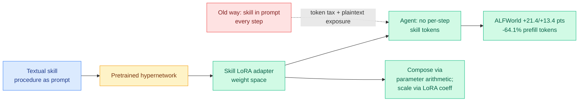

# LatentSkill: In-Context Textual Skills → In-Weight Latent Skills

**TL;DR.** Agent systems encode reusable procedures as **textual skills** injected into the prompt every step. That costs context tokens at every turn and exposes the skill as plaintext. LatentSkill converts a textual skill into a **plug-and-play LoRA adapter via a pretrained hypernetwork**, storing the skill in *weight space* rather than *context space*. It keeps the modularity of text skills (load, scale, compose) while removing the per-step token tax. On ALFWorld it improves success by **21.4 / 13.4 points** (seen / unseen) with **64.1% fewer prefill tokens**; on Search-QA it adds **3.0 EM** with **72.2% lower skill-token overhead**. Generated skill LoRAs form a structured semantic geometry, are controllable via the LoRA scaling coefficient, and compose through parameter-space arithmetic.

## Key points

- **Weight-space skills remove the per-step token tax** that in-context skill libraries pay, and stop exposing skill content as plaintext.
- **Hypernetwork generates the LoRA** from the textual skill, so authoring stays text-level; deployment is weight-level.
- **Composable and controllable:** skill LoRAs live in a structured geometry, scale with the LoRA coefficient, and combine by parameter arithmetic when components align.

## How it relates to prior wiki knowledge

- **Latest entry in the parametric-internalization line.** [Code2LoRA](../inference-efficiency/2026-06-06-code2lora-hypernetwork-repo-adapters.md) (06-06, hypernetwork generates repo-specific adapters) and [Video2LoRA](../inference-efficiency/2026-06-06-video2lora-parametric-video-internalization.md) (06-06) used hypernetworks to move *context* into weights; LatentSkill does the same for *agent skills*. Same engine (hypernetwork → LoRA), new payload. See [parametric-context-internalization](../inference-efficiency/parametric-context-internalization.md).
- **Efficiency answer to the skill-memory cluster.** The [self-evolving-agents](self-evolving-agents.md) line (Socratic-SWE, OpenSkill, 06-08) and today's Skill-RM / Experience-Makes-Skillful papers all grow skill libraries; LatentSkill makes storing and loading those skills cheap, the missing efficiency layer under the skill-memory wave.

## Gaps

- Tested on ALFWorld and Search-QA; whether hypernetwork-generated LoRAs preserve skill fidelity for long, compositional procedures is untested.
- Parameter-space composition works "when skill components are aligned" — the alignment condition is not characterized, so arbitrary skill mixing may not compose.

**Source:** HuggingFace Daily Papers · [Paper](https://arxiv.org/abs/2606.06087) · raw: `raw/huggingface/2026-06-09-latentskill-from-in-context-textual-skills-to-in-weight-late.md`

**Related:** [self-evolving-agents.md](self-evolving-agents.md) · [agent-memory.md](agent-memory.md) · [../inference-efficiency/parametric-context-internalization.md](../inference-efficiency/parametric-context-internalization.md)
