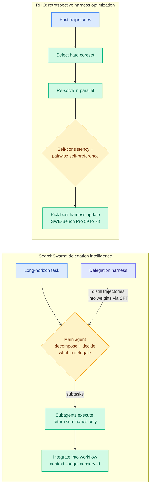

# Agent Self-Improvement: SearchSwarm (delegation) + RHO (harness optimization)

**TL;DR.** Two HuggingFace papers the same day attack how agents get better at long-horizon work without ground-truth labels. **SearchSwarm** (arxiv 2606.09730) teaches *delegation intelligence*: a main agent decomposes a task, decides when and what to hand to subagents, and integrates their summarized results, conserving its own finite context. The trick is a harness that produces high-quality decomposition-and-delegation trajectories, which are then distilled into the weights as supervised fine-tuning data; SearchSwarm-30B-A3B hits 68.1 on BrowseComp and 73.3 on BrowseComp-ZH, best among comparable-scale models. **RHO** (Retrospective Harness Optimization, arxiv 2606.05922) improves the *harness itself* from past trajectories alone: it picks a hard coreset of prior tasks, re-solves them in parallel, and uses the agent's own self-consistency and pairwise self-preference to choose harness updates, lifting SWE-Bench Pro pass rate from 59% to 78% in one round with no external grading.

## What they are

**SearchSwarm** targets deep research, a representative long-horizon agent task whose context demands can grow without bound. The contribution is a recipe for *generating training data* for delegation, which is scarce in natural text: a harness guides the model toward good decomposition and constrains subagents to return results that support the main agent's workflow, so the resulting trajectories encode correct delegation decisions, which are then used as SFT data to internalize the skill in weights. Harness, weights, and data will be released.

**RHO** optimizes the agent's harness (its skills, tools, workflows) without labeled validation data. It selects a diverse coreset of challenging past tasks, re-solves them in parallel, analyzes the rollouts via self-validation and self-consistency, generates candidate harness updates, and selects the best by its own pairwise self-preference. One round takes SWE-Bench Pro from 59% to 78% with no external grader, and the optimized harness measurably changes failure-mode behavior and holds accuracy longer in long sessions.

## Why it matters / relation to prior wiki pages

- **Both extend the "harness wins look like model wins" thesis, from opposite ends.** [Disentangling Agent Self-Evolution](2026-06-08-disentangling-agent-self-evolution.md) (06-08) split self-evolution into harness-*updating* (cheap, flat across model tiers) and harness-*benefit* (non-monotonic). RHO is a concrete harness-updating method that needs no labels; SearchSwarm bakes a harness-discovered skill *back into the weights*, collapsing the harness/model distinction the 06-08 paper drew. Read together with [Code-as-Agent-Harness](2026-05-23-code-as-agent-harness.md) (05-23) and [ctx2skill](2026-05-05-ctx2skill-self-evolving-skills.md), the trajectory is clear: 2026's agent gains are increasingly harness gains, and the frontier is making them *self-supervised*.
- **SearchSwarm is the research mirror of the day's industry signal.** Anthropic shipped nested subagent support in Claude Code (depth=5) and multi-agent orchestration in Managed Agents where Fable delegates to smaller models; Google's Antigravity 2.0 ships parallel `/goal` subagents; Kilo's Agent Manager runs agents in isolated git worktrees. SearchSwarm is the open-weights attempt to learn the *delegation policy* those products implement as scaffolding, which is the harder, more durable version of the same capability.
- **RHO's self-preference is the labels-free echo of the verifier debate.** Improving a 59%-to-78% pass rate with no external grader leans entirely on self-consistency and self-preference, the same self-judging the wiki has flagged as fragile when reward can be gamed (cf. Kurate cs.LG #13 "LLMs Gaming Verifiers: RLVR can Lead to Reward Hacking"). RHO's gains are real but its dependence on the agent's own taste is the thing to stress-test.

## Gaps

SearchSwarm's delegation skill is distilled from harness-generated trajectories, so it inherits whatever decomposition biases the harness had; generalization beyond deep-research-style tasks is unshown. RHO's no-external-grading result is striking but self-preference can entrench an agent's blind spots: a failure mode the agent cannot recognize is a harness update it will never propose, and the 59-to-78 jump is one domain (SWE-Bench Pro) in one round.

## Source

- SearchSwarm: https://arxiv.org/abs/2606.09730 · raw: [raw/huggingface/2026-06-10-searchswarm-towards-delegation-intelligence-in-agentic-llms.md](../../raw/huggingface/2026-06-10-searchswarm-towards-delegation-intelligence-in-agentic-llms.md)
- RHO: https://arxiv.org/abs/2606.05922 · raw: [raw/huggingface/2026-06-10-retrospective-harness-optimization-improving-llm-agents-via.md](../../raw/huggingface/2026-06-10-retrospective-harness-optimization-improving-llm-agents-via.md)
