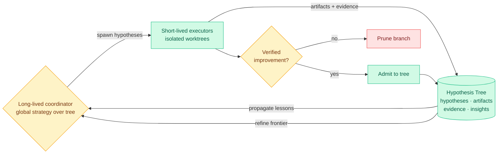

# Arbor: Toward Generalist Autonomous Research via Hypothesis-Tree Refinement

**TL;DR.** Arbor is a framework for an AI agent that runs the full research loop — explore, experiment, abstract — autonomously over long horizons. Its core data structure is a **Hypothesis Tree** that persists across time: nodes link hypotheses, the artifacts produced to test them, the evidence returned, and the distilled lessons. A long-lived **coordinator** manages global strategy over the tree while short-lived **executors** implement and test individual hypotheses in isolated git worktrees. As results return, Arbor updates the tree, propagates reusable lessons to sibling branches, refines the search frontier, and admits only verified improvements. Across six real research tasks (model training, harness engineering, data synthesis) it beats Codex and Claude Code on every task at the same budget, with more than 2.5x their average held-out gain, and hits 86.36% Any-Medal on MLE-Bench Lite with GPT-5.5.

**Source:** HuggingFace Daily Papers · arxiv [2606.11926](https://arxiv.org/abs/2606.11926)

## Key findings

- **Persistent memory as a tree, not a transcript.** The Hypothesis Tree (HTR) keeps the research state structured and durable: every hypothesis carries its artifacts, evidence, and the distilled insight, so a lesson learned on one branch can be propagated to others. This turns autonomous research from a sequence of local attempts into a cumulative process.
- **Coordinator / executor split.** A single long-lived coordinator owns strategy; many short-lived executors run experiments in isolated worktrees and return results. The split keeps the strategic context coherent while parallelizing the expensive execution.
- **Verified-improvement gate.** Only changes that verify as improvements are admitted, which is the guard against the self-reinforcing-confabulation failure mode the wiki has flagged repeatedly.
- **Results.** Best held-out result on all six Autonomous Optimization tasks; >2.5x the average relative held-out gain of Codex and Claude Code under the same interface and budget; 86.36% Any-Medal on MLE-Bench Lite with GPT-5.5.

## How this relates to prior wiki knowledge

Arbor is the newest entry in the wiki's [self-evolving agents](self-evolving-agents.md) thread and it lands the same day as two siblings: [EvoTrainer](../llms-foundation-models/2026-06-11-races-composable-verifiable-environments.md) (co-evolving the policy and the *training harness*) and the [Agentic Environment Engineering survey](2026-06-11-agentic-environment-engineering-survey.md). Read against the load-bearing 06-08 finding from [Disentangling Agent Self-Evolution](2026-06-08-disentangling-agent-self-evolution.md) — that harness-*updating* quality is flat across model tiers while harness-*benefit* peaks for mid-tier solvers — Arbor's coordinator/executor design is exactly the routing insight in disguise: keep the strategic loop coherent, parallelize cheap executors.

Its sharpest contribution against the wiki's prior state of knowledge is the **verified-improvement gate**. The 06-08/06-09 cluster — [Self-Revising Discovery Systems](2026-06-08-self-revising-discovery-systems.md), [Honest Lying](2026-06-09-honest-lying-memory-confabulation.md) (agents store confident-but-wrong interpretations and keep acting on them), [ToolMaze](2026-06-08-toolmaze-dynamic-replanning.md) — all converged on one worry: self-generated signal reinforces false beliefs unless an external verifier gates it. Arbor's "admit only verified improvements" is a direct architectural answer to that worry, and its held-out-gain metric (not in-loop score) is the right way to measure whether the gate works.

**Research angle.** The number to interrogate is the 2.5x held-out gain over Codex/Claude Code "under the same interface." A persistent hypothesis tree is a memory-and-orchestration advantage, not a model advantage, so this is evidence that *the harness, not the model, is where the next agent gains live* — exactly the [Scaling the Harness](2026-05-27-scaling-the-harness.md) (05-27) thesis. Open question: does the tree's lesson-propagation actually transfer correct lessons, or does it also propagate confident-wrong ones faster (the Honest Lying failure, now at branch scale)? The verified-improvement gate protects artifacts but not necessarily *insights*.

→ Raw: [`raw/huggingface/2026-06-11-toward-generalist-autonomous-research-via-hypothesis-tree-re.md`](../../raw/huggingface/2026-06-11-toward-generalist-autonomous-research-via-hypothesis-tree-re.md)
