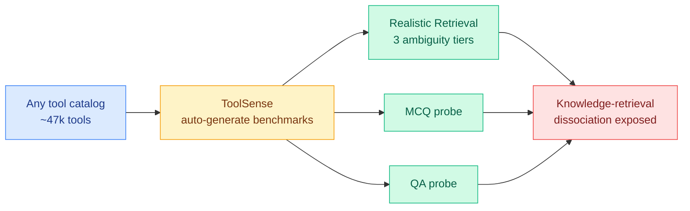

# ToolSense: A Diagnostic Framework for Auditing Parametric Tool Knowledge in LLMs

**TL;DR.** When an agent must pick the right tool from a catalog of tens of thousands, one popular trick is *parametric tool retrieval*: encode each tool as a virtual token in the model's vocabulary and fine-tune the LLM to "retrieve" by generating that token. It scores well on standard ToolBench benchmarks. ToolSense (SAP) shows that score is inflated: the benchmarks use verbose, fully-specified queries and constrained decoding that restricts outputs to valid tokens, neither of which tests whether the model understands its tools. Under realistic, ambiguous queries, several configurations collapse by 50 to 64 points, falling below a plain embedding-retrieval baseline.

## What it is

An open-source diagnostic framework that takes any tool catalog and auto-generates three benchmarks: a Realistic Retrieval Benchmark (RRB) with queries at three ambiguity tiers, an MCQ probing benchmark, and a QA probing benchmark. Applied to ToolBench (~47k tools) across five parametric model training configurations.

## Core finding

A **knowledge-retrieval dissociation**: a model can retrieve a tool correctly while scoring near-random on factual probes about what that tool does. The strong ToolBench numbers come partly from verbose queries and constrained decoding, not genuine tool understanding. Strip those crutches and several configs drop below the embedding-model baseline they were supposed to beat.

## Key results

- On realistic ambiguous queries, several parametric configs collapse 50 to 64 points vs fully-specified ToolBench.
- Some models retrieve well but answer factual tool-probes near randomly: retrieval skill and tool knowledge are decoupled.
- Framework and diagnostic benchmarks open-sourced.

## Gaps

Centered on ToolBench and parametric retrieval specifically; whether embedding-based retrievers have their own hidden failure modes under the same ambiguity tiers is only partly addressed. The diagnostic generators are themselves LLM-powered, so their query realism inherits the generator's blind spots.

## How this relates to prior wiki knowledge

This is a measurement-crisis entry for tool use, parallel to ToolSense's cousins in agent evaluation. It connects to the tool-retrieval thread ([tool-calling.md](tool-calling.md), CoHyDE 05-31, AKBE knowledge-boundary 05-27) and to the broader pattern the wiki keeps flagging: benchmark scores that do not predict deployment behavior (SusVibes 06-12, ToolMaze 06-08). The actionable takeaway for routing: a tool-retrieval router that looks accurate on ToolBench may be guessing, and the gap only shows up on the underspecified queries real users actually send.

**Raw source:** [HuggingFace](https://huggingface.co/papers/2606.12451) · [arXiv 2606.12451](https://arxiv.org/abs/2606.12451) · [code](https://github.com/SAP/toolsense)
