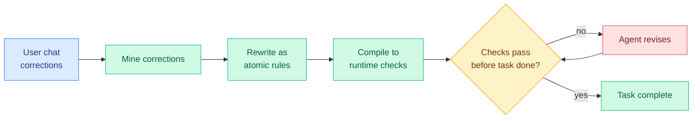

# Getting Better at Working With You: Compiling User Corrections into Runtime Enforcement (TRACE)

**TL;DR.** Coding agents do not reliably get easier to work with over time. A correction you give in one session is often violated in the next, even with a memory system bolted on. The gap is between *preference access* (the agent can recall the rule) and *preference compliance* (the agent actually follows it). TRACE (from the team behind the "tellonce" skill) closes the gap not by remembering harder but by *compiling* corrections into runtime checks that must pass before the agent finishes a task. On out-of-distribution coding tasks it cuts preference violations from 100% to 2%.

## What it is

TRACE (Test-time Rule Acquisition and Compiled Enforcement) is a drop-in skill-layer pipeline for coding-agent runtimes. It mines a user's own chat corrections, rewrites each as an atomic rule, and compiles the rules into runtime checks that gate task completion. Unlike developer-written guardrails, these checks come from the end user's friction.

## Core novelty

Treating preference compliance as an *enforcement* problem rather than a *memory* problem. Memory systems make a preference retrievable; TRACE makes it a hard gate the agent cannot skip. The corrections are turned into executable checks, so "remembered but ignored" becomes impossible by construction.

## Key results

- Baseline: Mem0 memory still leaves 57.5% of applicable preference checks violated.
- On ClawArena coding tasks, TRACE cuts held-out preference violation from 100% to 37.6% in-distribution and from 100% to 2.0% out-of-distribution.
- On MemoryArena-derived tasks, it cuts in-distribution violation from 100% to 60.5% while matching or beating the strongest memory baseline on task pass.
- The big OOD win (2%) suggests compiled checks generalize where recalled rules do not.

## Gaps

The in-distribution MemoryArena result (60.5% still violated) is much weaker than the coding result, so the method's strength depends heavily on whether a preference can be cleanly compiled into a check. Subjective or fuzzy preferences ("be more concise") resist compilation. Evaluated with simulated users in the loop, not real long-term human use.

## How this relates to prior wiki knowledge

This sharpens the agent-memory thread (see [agent-memory.md](agent-memory.md)): the wiki has tracked memory systems (MemForest 05-26, SAM state-adaptive memory 05-27, MemTrain 06-04) on the assumption that better recall means better behavior. TRACE shows recall is not the bottleneck, enforcement is, which is a genuine reframing. It pairs with the same week's kilocode REVIEWS.md launch (repo-specific review standards that adapt to how you respond to PRs) and Cursor's Auto-review (06-11): the industry is independently converging on "compile the user's standards into a gate the agent must pass," the product-side mirror of TRACE.

**Raw source:** [HuggingFace](https://huggingface.co/papers/2606.13174) · [arXiv 2606.13174](https://arxiv.org/abs/2606.13174) · [code](https://github.com/YujunZhou/TRACE_exp)
