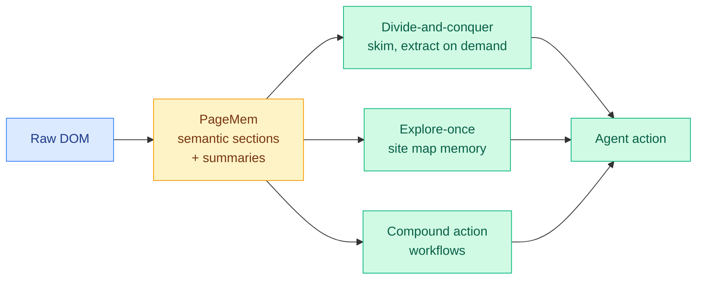

# WebChallenger: A Reliable and Efficient Generalist Web Agent

**TL;DR.** The strongest web agents lean on expensive proprietary reasoning models, which makes them too costly for the repetitive web tasks they would help most with. WebChallenger (ML Collective, longsurf.ai) argues the gap is architectural, not a model-capability gap, and closes most of it with off-the-shelf open-weight models and no fine-tuning. It rebuilds the page representation around a structured "PageMem" and three mechanisms that mirror human cognition: selective attention, a reusable site map, and compound actions. Result: 56.3% on WebArena and 70.9% on WorkArena, approaching frontier proprietary systems at a fraction of the cost.

## What it is

A generalist web-navigation agent. The core is **PageMem**: a structured page representation built deterministically from the DOM that exposes each page as a hierarchy of semantic sections, each with a short summary, rather than dumping the whole accessibility tree or screenshot into the context window.

## Core novelty

Three mechanisms, all operating over PageMem so they generalize across sites with no per-site adapters:
- **Divide-and-conquer observation.** The agent skims section summaries and pulls full detail only from task-relevant regions, mirroring selective attention. This is the lever that keeps the context window from being flooded by irrelevant page tokens.
- **Explore-once memory.** The agent traverses a site once to build a reusable map of pages and element behaviors, mirroring persistent structural memory.
- **Compound action workflows.** Common multi-step interactions collapse into single agent actions, handling partial state changes automatically, mirroring procedural fluency.

## Key results

- 56.3% on WebArena, 48.7% on VisualWebArena, 51.0% on Online-Mind2Web, 70.9% on WorkArena.
- Uses open-weight models off the shelf, no fine-tuning, approaching frontier proprietary systems at far lower inference cost.
- The same PageMem substrate carries all three mechanisms, so the architecture transfers across websites without site-specific code.

## Gaps

"Approaching" frontier is not matching it; the head-to-head gap to the best proprietary agents on the hardest long-horizon tasks is not closed. PageMem is built from the DOM, so heavily canvas-rendered or obfuscated pages (where the DOM is uninformative) are a likely failure mode that the benchmarks may underweight. Cost claims are relative, with no dollar-per-task table.

## How this relates to prior wiki knowledge

This is the web-agent instance of a recurring 2026 theme: capability is bottlenecked by harness design, not model scale. It echoes the Scaling-the-Harness thesis (05-27, that system and environment scaling, not model scaling, is the next bottleneck) and the agentic-environment-engineering survey (06-11). The PageMem-as-memory idea connects to [agent-memory.md](agent-memory.md). The "cheap open model plus good architecture beats expensive frontier model" claim lands in the same week as the price war and the Anthropic Fable 5 suspension: if architecture can substitute for a frontier reasoning model on repetitive web work, it weakens the case for paying frontier rates on those tasks.

**Raw source:** [HuggingFace](https://huggingface.co/papers/2606.10423) · [arXiv 2606.10423](https://arxiv.org/abs/2606.10423) · [code](https://github.com/jayoohwang1/webchallenger)
