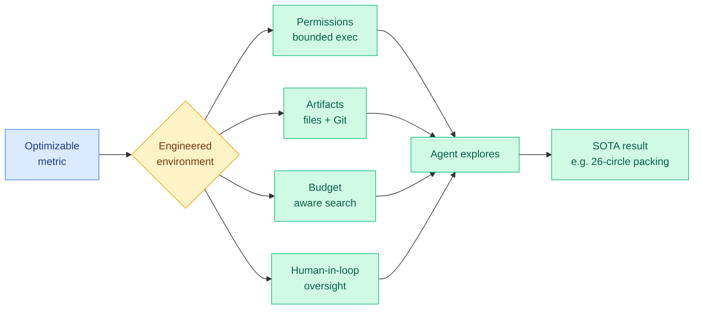

# EurekAgent: Agent Environment Engineering Is All You Need for Autonomous Scientific Discovery

**TL;DR** — As base models get stronger, the bottleneck for an autonomous research agent stops being the workflow you write for it and becomes the world you put it in. EurekAgent names this discipline *environment engineering* and operationalizes it along four axes: permissions (sandboxed execution, isolated evaluation), artifacts (filesystem and Git so agents collaborate and leave a trail), budget (compute/money-aware exploration), and human-in-the-loop hooks (cheap supervision and intervention). The point is to amplify productive behaviors (open-ended exploration, systematic artifact management, inter-agent collaboration) while suppressing harmful ones (reward hacking, high-friction oversight). It sets new state-of-the-art results on math, kernel-engineering, and ML tasks, including a new best 26-circle packing discovered for under $11 in total API cost, and open-sources everything with a call to treat environment design as a core research direction.

## What it is

An agent system for metric-driven autonomous scientific discovery, where the engineering effort is deliberately spent on the environment rather than on the agent's reasoning steps. Given an optimizable metric and an execution environment, the agent proposes, validates, and iterates solutions. EurekAgent engineers four properties of that environment: bounded permissions for safe execution and clean evaluation, Git-based artifact management for collaboration and provenance, explicit budget-awareness, and lightweight human supervision points.

## Why it matters

This is the thesis statement for a pattern the wiki has been circling for a month. If capability is bottlenecked by harness and environment rather than model scale, the moat for an agent product is its sandbox, its budget governor, and its artifact store, not its base model. The under-$11 26-circle-packing result is the kind of concrete, falsifiable claim that makes the argument land: the same agent in a better-engineered world is materially more capable. It is the named principle behind the same-day cluster on adapting to changing environments.

## Key points

- Four engineering axes: permissions, artifacts (Git-based collaboration), budget-awareness, human-in-the-loop.
- New state-of-the-art on a 26-circle packing problem at under $11 total API cost, plus new bests on math, kernel engineering, and ML tasks.
- Budget engineering directly suppresses reward hacking and runaway spend, the failure mode of unconstrained research agents.
- Open-sourced, with an explicit call to make environment engineering a first-class research direction.

## Gaps

The state-of-the-art claims are on optimization-style tasks (packing, kernels) where a clean metric makes success cheap to verify; open-ended discovery without an optimizable number is where environment engineering is hardest and is not shown. The four axes are not ablated against each other, so which one carries the gains is unknown.

## Relation to prior wiki

EurekAgent is the named principle for today's "evolving environment" cluster: [EvoArena/EvoMem](2026-06-14-evoarena-evomem-memory-evolution.md) supplies the empirical floor (agents drop to 39.6% when the world changes), while [Evoflux](2026-06-14-evoflux-inference-time-tool-workflow-evolution.md) and [HarnessBridge](2026-06-14-harnessbridge-learnable-harness-controller.md) are the two run-time repair mechanisms (plan and interface). It is the direct continuation of the Scaling-the-Harness thesis (05-27, that system and environment design is the next bottleneck, not bigger models) and rhymes with WebChallenger (06-13, a cheap open model nearly matching frontier web agents because the gap was architecture). See the [self-evolving-agents](self-evolving-agents.md) and [tool-calling](tool-calling.md) concept pages.

**Source:** HuggingFace Daily Papers · [Paper](https://arxiv.org/abs/2606.13662) · raw: `raw/huggingface/2026-06-14-eurekagent-agent-environment-engineering-is-all-you-need-for.md`
