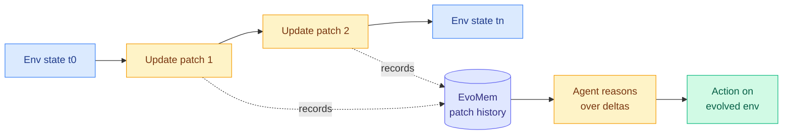

# EvoArena + EvoMem: Tracking Memory Evolution for Robust LLM Agents in Dynamic Environments

**TL;DR** — Almost every agent benchmark assumes the environment holds still. Real deployments do not: tools get updated, software changes, user preferences shift. EvoArena models environment change explicitly, as sequences of progressive updates across terminal, software, and social domains. Current agents are weak here, averaging just 39.6% accuracy. EvoMem, a patch-based memory paradigm that records memory as structured update histories (rather than a flat append-only log), lets the agent reason about *how* the environment changed. It adds 1.5% on EvoArena, 6.1% on GAIA, 4.8% on LoCoMo, and 3.7% on chain-level accuracy where success requires completing a consecutive sequence of evolving subtasks.

## What it is

Two contributions. EvoArena is a benchmark suite that turns environment change into the unit of evaluation: each task is a chain of progressive updates, and the agent must keep its knowledge, skills, and behavior aligned as the world shifts. EvoMem is a memory design that stores *update histories* as structured patches, so the agent can reason about a state as "the previous state plus these deltas" instead of re-reading a monolithic memory blob. Mechanistic analysis shows EvoMem improves evidence capture: it preserves more of the complete evolving-environment state.

## Why it matters

Memory is the load-bearing component for long-horizon agents, and the 39.6% baseline says current agents largely fail when the ground moves under them. The chain-level gain (3.7%) is the result to watch, because chained evolving subtasks are exactly where naive append-only memory degrades — errors in tracking one delta cascade. This is a Tier 2 agentic result with implications for any production agent operating against a live, versioned toolset.

## Key points

- EvoArena models change as progressive update sequences across terminal, software, and social domains.
- Current agents average only 39.6% accuracy on evolving tasks.
- EvoMem (patch-based, structured update histories) gains 1.5% on EvoArena, 6.1% GAIA, 4.8% LoCoMo.
- Chain-level accuracy (consecutive evolving subtasks) improves 3.7% — the hardest setting.

## Relation to prior wiki

Builds directly on the [agent-memory](agent-memory.md) concept page. It shares today's "evolving environment" frame with [Evoflux](2026-06-14-evoflux-inference-time-tool-workflow-evolution.md) (workflow repair under changing tool catalogs) and [EvoBrowseComp](2026-06-14-evobrowsecomp-evolving-search-benchmark.md) (contamination-free benchmark via live-web synthesis). Together these three argue that "assume a static world" is the shared blind spot of the current agent-eval canon. See also [agent-benchmarks](agent-benchmarks.md).

**Source:** HuggingFace Daily Papers · [Paper](https://arxiv.org/abs/2606.13681) · raw: `raw/huggingface/2026-06-14-evoarena-tracking-memory-evolution-for-robust-llm-agents-in.md`
