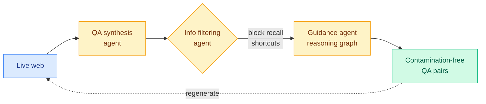

# EvoBrowseComp: Benchmarking Search Agents on Evolving Knowledge

**TL;DR** — Static search benchmarks like BrowseComp have a hidden leak: a model can score well by recalling a fact from its training data instead of actually browsing for it. That makes the benchmark a memorization test masquerading as a retrieval test, and it rots as soon as the questions land in a future training set. EvoBrowseComp synthesizes 400 English and 400 Chinese contamination-free questions via live-web traversal, using a three-agent pipeline, and can be regenerated regularly to stay fresh. The questions are hard and demand broad horizontal search.

## What it is

An evolving benchmark for search agents (LLMs augmented with search tools). A three-agent collaborative framework builds it: (1) a QA synthesis agent retrieves fresh knowledge from the live web and writes QA pairs; (2) an information-filtering agent screens retrieved knowledge by credibility and popularity to block parametric-memory shortcuts (popular facts the model already knows are filtered out); (3) a high-level guidance agent formalizes questions into reasoning graphs to remove logical redundancy. Because synthesis is fully automated, the benchmark can be re-run to prevent contamination and track world-knowledge drift.

## Why it matters

This is part of a wider measurement-crisis theme the wiki has been tracking: benchmark scores increasingly fail to mean what they claim. The clever bit is using *popularity* as a contamination proxy — if a fact is popular enough to be memorized, it cannot test browsing. As a falsifiable artifact, an auto-regenerating benchmark is the right structural answer to test-set leakage, and worth watching as a template other domains could copy.

## Key points

- 400 EN + 400 ZH contamination-free questions synthesized from live-web traversal.
- Three-agent pipeline: QA synthesis, popularity/credibility filtering, reasoning-graph formalization.
- Filtering on popularity blocks parametric-memory recall shortcuts.
- Fully automated synthesis enables regular regeneration to stay contamination-free over time.

## Relation to prior wiki

Shares the "evolving environment" frame with today's [EvoArena/EvoMem](2026-06-14-evoarena-evomem-memory-evolution.md) and [Evoflux](2026-06-14-evoflux-inference-time-tool-workflow-evolution.md). On the measurement side it extends the [agent-benchmarks](agent-benchmarks.md) concept page and rhymes with the contamination-resistance concern behind prior eval work. It complements the FORT-Searcher shortcut-resistant-training-data thread from the same HuggingFace batch.

**Source:** HuggingFace Daily Papers · [Paper](https://arxiv.org/abs/2606.13120) · raw: `raw/huggingface/2026-06-14-evobrowsecomp-benchmarking-search-agents-on-evolving-knowled.md`
