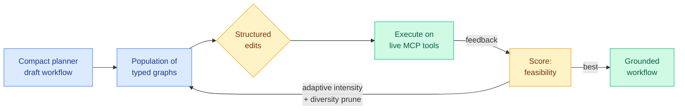

# Evoflux: Inference-Time Evolution of Executable Tool Workflows for Compact Agents

**TL;DR** — Small language models are cheap to deploy as tool agents, but they generate "plausible" tool-use plans that fall apart in practice: wrong tool resolved, schema violated, a downstream step depends on an output the upstream step never produced. Evoflux reframes compact tool use as *workflow repair*. At inference time it runs an evolutionary search over typed workflow graphs, mutating them with structured edits and using real execution feedback as the fitness signal. On held-out MCP-Bench tasks (live servers, 250 tools) it raises execution feasibility from roughly 3% to 17-24% across small planners. Crucially, supervised fine-tuning and SFT+DPO on the same search-mined data match, underperform, or collapse below zero-shot, while ReAct hits higher peaks but at much higher variance and token cost.

## What it is

An inference-time evolutionary search method. It treats an executable tool workflow as a typed graph and evolves a population of candidate graphs through structured edits, execution feedback, adaptive mutation intensity, meta-guided redesign, and diversity pruning. The key claim is that the failure mode of small tool agents — discover tools from a live catalog, satisfy schemas, preserve dependencies across intermediate outputs, ground the final answer in executed evidence — is *not* fixable by small-corpus distillation. A few hundred teacher traces teach the format but not the recovery behavior needed when a plan fails on a changing tool catalog.

## Why it matters

This is the strongest argument yet for execution-grounded search over data-distillation when teacher traces are scarce, and it is squarely in Amit's efficiency interest because the whole point is making *compact* models reliable. The 3% → 17-24% feasibility jump is large, but the more interesting result is the negative one: SFT+DPO on the same mined data can collapse below zero-shot. That is a direct caution to the standard "mine traces, then fine-tune" pipeline.

## Key points

- Compact tool use recast as repair of executable workflow graphs, not one-shot generation.
- Execution feasibility on MCP-Bench rises from ~3% to 17-24% across small planners.
- SFT and SFT+DPO on the same search-mined traces match, underperform, or collapse below zero-shot.
- ReAct reaches higher peaks but with higher variance and token cost; Evoflux is the more reliable option under scarce teacher budgets.

## Relation to prior wiki

Same-day companion to [HarnessBridge](2026-06-14-harnessbridge-learnable-harness-controller.md): both target compact-agent reliability, one via the interface, one via the plan. The "evolve at inference time" idea connects to today's [EvoArena/EvoMem](2026-06-14-evoarena-evomem-memory-evolution.md) and [EvoBrowseComp](2026-06-14-evobrowsecomp-evolving-search-benchmark.md) under one theme: agents that adapt to changing environments rather than assuming a static one. See the [tool-calling](tool-calling.md) and [self-evolving-agents](self-evolving-agents.md) concept pages.

**Source:** HuggingFace Daily Papers · [Paper](https://arxiv.org/abs/2606.12674) · raw: `raw/huggingface/2026-06-14-evoflux-inference-time-evolution-of-executable-tool-workflow.md`
