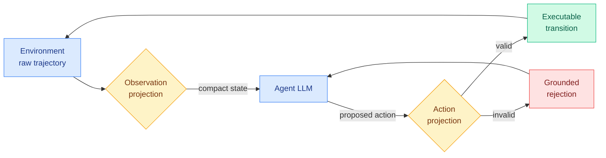

# HarnessBridge: Learnable Bidirectional Controller for LLM Agent Harness

**TL;DR** — The "harness" is the glue code that sits between an agent and its environment: it decides what slice of a raw tool output the model actually sees, and it turns the model's proposed action into something the environment can execute. Today that glue is hand-written and brittle. HarnessBridge replaces it with a small learnable module trained end-to-end. It learns two projections: one that compresses raw trajectories into compact decision-relevant states (observation side), and one that converts proposed actions into executable transitions or grounded rejections (action side). On Terminal-Bench 2.0 and SWE-bench Verified it matches or beats hand-built specialized harnesses while cutting token usage and trajectory length, and it transfers from a small trainer model to larger commercial models.

## What it is

A lightweight plug-in controller that parameterizes the agent-environment interface as a *bidirectional projection*, trained with unified instruction tuning on a harness-supervision dataset. Instead of an engineer deciding "show the model the last 50 lines of stdout and strip ANSI codes," the observation projection learns what to distill from a raw trajectory. Instead of an engineer writing regex to parse the model's action into a shell command, the action projection learns to emit either an executable transition or a trajectory-grounded rejection when the action is malformed.

## Why it matters

The field has spent a year discovering that agent performance is shaped by the harness almost as much as by the model. The CLAUDE.md attention hierarchy puts agentic systems at Tier 2, and this paper has a real Tier 1 efficiency angle: HarnessBridge cuts token usage and trajectory length, which is the cost driver for long-horizon agents. It is the agentic analogue of what the inference-efficiency work has been doing for raw decoding: stop paying for tokens that carry no decision signal.

## Key points

- Two learned projections: observation (raw trajectory → compact state) and action (proposal → executable transition or grounded rejection).
- Trained end-to-end via instruction tuning on harness supervision, not hand-engineered.
- On Terminal-Bench 2.0 and SWE-bench Verified, matches or surpasses specialized harnesses with substantially fewer tokens and shorter trajectories.
- Generalizes from a smaller generator model to larger commercial models, so the controller is reusable across the model it wraps.

## Relation to prior wiki

This extends the agentic-systems thread on where agent capability actually lives. It pairs naturally with [Evoflux](2026-06-14-evoflux-inference-time-tool-workflow-evolution.md) (same day), which attacks the same compact-agent reliability problem from the workflow-repair side rather than the interface side, and with the [tool-calling](tool-calling.md) concept page. The token-reduction result connects to the broader inference-efficiency program in [knowledge-distillation](../inference-efficiency/knowledge-distillation.md) and KV-cache work: all are about removing signal-free tokens from the loop.

**Source:** HuggingFace Daily Papers · [Paper](https://arxiv.org/abs/2606.12882) · raw: `raw/huggingface/2026-06-14-harnessbridge-learnable-bidirectional-controller-for-llm-age.md`
