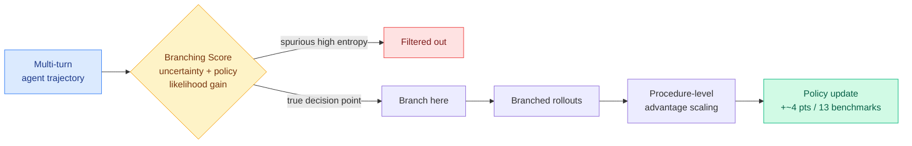

# APPO: Agentic Procedural Policy Optimization

**TL;DR.** Agentic RL trains tool-using LLM agents over multi-turn trajectories, but it usually assigns credit at coarse units: tool-call boundaries or fixed workflow steps. A pilot analysis here shows the decisions that actually matter are spread throughout the generated sequence, not concentrated at tool calls, and that token entropy alone does not reliably flag them. APPO moves branching and credit assignment to fine-grained decision points. It picks where to branch using a **Branching Score** that combines token uncertainty with the policy-induced likelihood gain of the continuations that follow, filtering out spurious high-entropy positions, and it adds **procedure-level advantage scaling** to spread credit better across branched rollouts. Across 13 benchmarks it beats strong agentic-RL baselines by nearly 4 points while keeping tool calls efficient and behavior interpretable.

**Source:** HuggingFace · [Paper](https://arxiv.org/abs/2606.12384) · arxiv 2606.12384

## What it is

A finer-grained credit-assignment scheme for agentic RL. It studies two questions, where to branch (place exploration) and how to assign credit after branching, and answers both at the level of individual decision points in the token sequence rather than at tool-call or workflow boundaries.

## What problem it solves

Coarse credit units make it hard to know *which* intermediate decision drove the final outcome, so the gradient is noisy and exploration is misplaced. The pilot analysis debunks two assumptions: influential decisions are not concentrated at tool calls, and high token entropy is not a reliable proxy for influence (many high-entropy positions are spurious).

## Core novelty

The **Branching Score** combines token uncertainty with the policy-induced likelihood gain of subsequent continuations, so it branches at positions that are both uncertain *and* consequential, filtering the spurious-high-entropy positions that entropy-only methods waste exploration on. **Procedure-level advantage scaling** then distributes credit across the branched rollouts more faithfully than flat trajectory-level advantage.

## Key takeaways

- Influential decision points are distributed throughout the sequence, not at tool-call boundaries.
- Token entropy alone is an unreliable signal for where to branch.
- Branching Score (uncertainty + likelihood gain) targets exploration better.
- ~4-point average gain across 13 benchmarks, with efficient tool use and interpretable behavior.

## Gaps

The Branching Score adds a continuation-evaluation cost (you must score likelihood gains of candidate continuations) that the paper should price against the baseline rollout budget. "Nearly 4 points" averaged over 13 benchmarks can hide high variance; per-benchmark spread matters. Interpretability is claimed but not quantified.

## How it relates to prior wiki knowledge

- Squarely in the [rl-for-llms](../llms-foundation-models/rl-for-llms.md) "the learning signal is sparse and locatable" thread, applied to *agentic* trajectories: TIP (04-16) located signal in tokens, [Temporal Scheduling for RLVR](../llms-foundation-models/2026-06-02-temporal-scheduling-rlvr.md) (06-02) located it in *time*, APPO locates it in *decision points* and explicitly rejects entropy and tool-call boundaries as the locators. The "entropy is not the right proxy" finding is a notable refinement, much prior work used entropy as the default uncertainty signal.
- Complements today's [S2L-PO](../llms-foundation-models/2026-06-15-s2l-po-small-models-explorers-grpo.md) and yesterday's [N-GRPO](../llms-foundation-models/2026-06-14-n-grpo-neighbor-mixing-grpo.md): those improve rollout *diversity*; APPO improves *where to branch and how to credit*. Diversity and placement are the two halves of exploration, and three papers in two days are jointly re-engineering GRPO-style exploration.

## Research angle

The claim that influential decisions are *not* at tool calls is the most actionable finding: it says the standard agentic-RL practice of treating tool boundaries as natural credit units is mislocating the signal. If the Branching Score generalizes, it becomes a drop-in upgrade for any GRPO-style agentic trainer. The deeper question is whether "policy-induced likelihood gain of continuations" is a better universal uncertainty signal than entropy across non-agentic RLVR too, that would be a broad result.

→ Raw: `raw/huggingface/2026-06-15-appo-agentic-procedural-policy-optimization.md`
