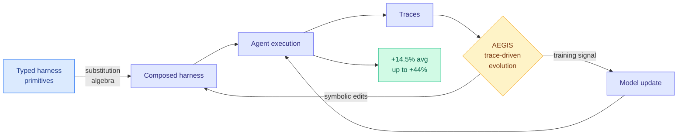

# HarnessX: A Composable, Adaptive, and Evolvable Agent Harness Foundry

**TL;DR.** An agent's "harness" is everything around the model: the prompts, tools, memory, and control flow that decide what it observes, how it reasons, and how it acts. Today these are hand-crafted and frozen, so every new model or task needs bespoke scaffolding, and the execution traces an agent produces are rarely fed back into improving the harness. HarnessX is a foundry that builds harnesses from typed primitives via a substitution algebra, evolves them with AEGIS (a trace-driven multi-agent engine that the authors frame as an "operational mirror" between symbolic edits and reinforcement learning), and closes the loop by turning trajectories into *both* harness updates and model-training signal. Across five benchmarks (ALFWorld, GAIA, WebShop, tau³-Bench, SWE-bench Verified) it adds +14.5% on average (up to +44%), with the largest gains where baselines are weakest.

**Source:** HuggingFace · [Paper](https://arxiv.org/abs/2606.14249) · arxiv 2606.14249

## What it is

A system for manufacturing and continuously improving agent harnesses. Three pieces: a **composition layer** (typed primitives combined by a substitution algebra, so harnesses are assembled rather than written), an **evolution engine** (AEGIS mines execution traces to propose harness edits, with an explicit correspondence between symbolic adaptation and RL updates), and a **harness-model loop** (the same traces drive both scaffold edits and model training signal).

## What problem it solves

Harnesses are hand-built and static. Each new model or task demands new scaffolding, and the rich signal in execution traces is thrown away. HarnessX makes the harness a first-class, automatically-improved artifact, so agent progress can come from the runtime interface, not only from scaling the base model.

## Core novelty

The combination of a *typed compositional substrate* for harnesses (an algebra, not a config file) with a trace-driven evolution engine that unifies symbolic harness edits and RL-style model updates into one loop. The "operational mirror between symbolic adaptation and RL" framing is the distinctive theoretical claim: harness editing and gradient learning are treated as two faces of the same improvement process.

## Key takeaways

- +14.5% average across five benchmarks (ALFWorld, GAIA, WebShop, tau³-Bench, SWE-bench Verified), up to +44%.
- Gains are largest where baselines are lowest, i.e. it helps most on the hardest tasks.
- Closes the harness-model loop: traces become both scaffold edits and training signal.
- Code to be open-sourced in a future release.

## Gaps

Codebase not yet released, so the central claims are unreproduced as of publication. The "operational mirror" between symbolic edits and RL is asserted as a framing; no ablation isolates how much of the gain comes from composition vs AEGIS evolution vs the model-update loop. "Largest gains where baselines are lowest" can also mean it mostly recovers easy points a weak baseline left on the table, the high-baseline headroom is smaller.

## How it relates to prior wiki knowledge

- This is the **third harness-as-learnable-object paper in two days**, after [HarnessBridge](2026-06-14-harnessbridge-learnable-harness-controller.md) (06-14, trains the agent-environment interface as a bidirectional projection that uses fewer tokens than a hand-built harness) and DAIR.AI's **Self-Harness** (this week's DAIR top papers: an agent mines its own model-specific failures into executable harness edits, lifting MiniMax M2.5 from 40.5% to 61.9% on Terminal-Bench-2.0). Three independent groups in one window are saying the same thing: stop hand-writing the scaffold, learn it. The pattern the [self-evolving-agents](self-evolving-agents.md) page has tracked since [Scaling the Harness](2026-05-27-scaling-the-harness.md) (05-27) and [HarnessForge](2026-06-08-harnessforge-harness-policy-coevolution.md) (06-08) has now crossed the ≥3-papers threshold for a declared convergence.
- The harness-model co-update loop is [SIA](2026-06-08-sia-self-improving-harness-weights.md)'s (06-08) "update both levers in one loop" thesis, generalized with a typed composition algebra on the harness side.
- Tempered by [Disentangling Agent Self-Evolution](2026-06-08-disentangling-agent-self-evolution.md) (06-08): harness-*updating* quality is flat across model tiers (a cheap model writes edits as well as a frontier one), while harness-*benefit* is non-monotonic (mid-tier solvers gain most). HarnessX should be read through that lens, its gains likely come from composition + the loop, not from a smarter edit-writer.

## Research angle

The unverified-but-important claim is the symbolic-edit/RL "operational mirror." If genuine, it means a harness edit and a gradient step are interchangeable improvement operators, which would let you spend a fixed improvement budget across scaffold and weights by expected return, a routing decision over *kinds of update*. The composition algebra is the more durable contribution: a typed substitution calculus for harnesses is the missing formal substrate that EvoTrainer/HarnessForge lacked. Watch whether the released code's primitives become a shared vocabulary or stay paper-specific.

→ Raw: `raw/huggingface/2026-06-15-harnessx-a-composable-adaptive-and-evolvable-agent-harness-f.md`
