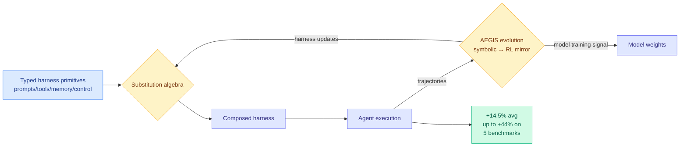

# HarnessX: A Composable, Adaptive, and Evolvable Agent Harness Foundry

**TL;DR.** An agent's performance depends heavily on its *harness*: the prompts, tools, memory, and control flow that mediate how the model observes, reasons, and acts. Today those harnesses are hand-crafted and frozen, so every new model or task needs bespoke scaffolding, and the rich execution traces an agent produces are almost never recycled into improvement. HarnessX is a "foundry" that builds harnesses as composable objects. It assembles typed harness primitives through a substitution algebra, adapts them with AEGIS, a trace-driven multi-agent evolution engine grounded in a formal mirror between symbolic adaptation and reinforcement learning, and closes the loop by turning trajectories into *both* harness updates and model training signal. Across five benchmarks (ALFWorld, GAIA, WebShop, tau^3-Bench, SWE-bench Verified) it averages +14.5% (up to +44.0%), with the biggest gains where baselines are weakest.

**Source:** HuggingFace · [Paper](https://arxiv.org/abs/2606.14249) · arxiv 2606.14249

## What it is

A system for manufacturing agent harnesses instead of writing them by hand. Harness pieces are typed primitives that compose under an algebra; an evolution engine mutates and validates the composition from real execution traces; and the same traces feed model training, so harness and model improve together.

## What problem it solves

Two standing problems. First, harnesses are static and bespoke: each new model/task pairing demands re-scaffolding by hand. Second, the execution traces that reveal where a harness fails are discarded. HarnessX makes the harness a first-class, evolvable artifact and recycles traces into systematic improvement.

## Core novelty

Three coupled mechanisms: (1) a *substitution algebra* over typed primitives so harnesses are composable, not monolithic; (2) AEGIS, a trace-driven multi-agent evolution engine with an explicit "operational mirror" between symbolic harness edits and RL updates, treating prompt/tool edits and gradient steps as two views of the same optimization; (3) closing the harness-model loop so trajectories become *both* harness updates and model training signal. The symbolic-RL mirror is the deepest idea, it gives a principled account of when to fix the scaffold versus when to fix the weights.

## Key takeaways

- Average +14.5% (up to +44.0%) across ALFWorld, GAIA, WebShop, tau^3-Bench, SWE-bench Verified.
- Gains are largest where baselines are lowest, so the harness lever matters most for weak agents.
- Harness edits and RL updates are formally mirrored, not treated as separate engineering and training tracks.
- Argues agent progress is not only model scaling: composing and evolving runtime interfaces is a complementary lever. Code to be open-sourced.

## Gaps

The "operational mirror" between symbolic adaptation and RL is asserted as grounding; how tight that equivalence is (and when it breaks) is the load-bearing claim and needs scrutiny. Five benchmarks, but no cost accounting for the evolution engine itself, which runs a multi-agent search. "Code will be open-sourced in a future release" means results are not yet independently reproducible.

## How it relates to prior wiki knowledge

- This is the latest entry in the [self-evolving-agents](self-evolving-agents.md) concept page's harness-evolution line, which already holds [Scaling the Harness](2026-05-27-scaling-the-harness.md) (05-27, the position paper that named harness components as a design surface and argued system scaling is the next bottleneck), EvoTrainer (06-11, co-evolves policy and training harness), and [HarnessBridge](2026-06-14-harnessbridge-learnable-harness-controller.md) (06-14, a learnable harness controller). HarnessX adds the substitution algebra (composability) and the symbolic-RL mirror (a theory of harness-vs-weight updates).
- The "biggest gains where baselines are lowest" finding empirically restates [Claw-SWE-Bench](2026-06-11-claw-swe-bench-harness-evaluation.md)'s result (06-11, harness choice swings Pass@1 by 27.4pp, nearly as much as the model's 29.4pp): the harness is a first-order performance variable, not a wrapper.
- The trace-to-training-signal loop echoes [Self-Harness](https://arxiv.org/abs/2606.13707) (covered in this week's DAIR newsletter, an LLM that mines its own model-specific failures into harness edits), suggesting "harness self-improvement" is now a crowded subfield, not a one-off.

## Research angle

The symbolic-RL mirror is the falsifiable core: if harness edits and gradient updates really are two views of one optimization, then there should be a *conversion rate* (this prompt edit is worth N gradient steps), and a controller could allocate an improvement budget between scaffold and weights optimally. That would unify the "scale the harness" and "scale the model" camps into a single resource-allocation problem, which is the most consequential thing this paper gestures at.

→ Raw: `raw/huggingface/2026-06-15-harnessx-a-composable-adaptive-and-evolvable-agent-harness-f.md`
