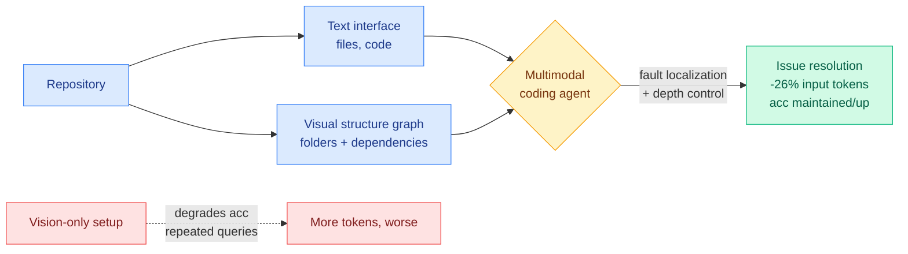

# LLM Agents Can See Code Repositories

**TL;DR.** Coding agents read a repository almost entirely as text, even though human developers orient themselves using *visual* structure: folder trees, dependency graphs, call hierarchies. This paper runs the first systematic study of giving multimodal agents visual representations of a repo. Pure vision-only is worse: agents lack symbolic detail and waste tokens re-querying images. But adding a **visual graph of repository structure as a supplementary modality alongside the normal text interface** cuts input token consumption by up to 26% while keeping or improving issue-resolution accuracy. The visuals help most during fault localization and when the agent controls its own exploration depth. The takeaway is a hybrid text-and-vision design for next-gen coding agents.

**Source:** HuggingFace · [Paper](https://arxiv.org/abs/2606.14061) · arxiv 2606.14061

## What it is

An empirical study of visual repository representations for LLM coding agents on repository-level issue resolution, evaluating four recent multimodal models in three setups: text-only (baseline), vision-only, and text+visual-graph hybrid. The visual graph encodes folder hierarchy and dependency relationships, the structure a human skims to navigate a large codebase.

## What problem it solves

Agents consume repos as flat text, so they spend many tokens reconstructing structure (which file imports which, where a symbol lives) that a single diagram conveys at a glance. The question is whether multimodal models can use a picture of the repo to navigate more cheaply without losing the symbolic precision code work demands.

## Core novelty

The first systematic answer, and a non-obvious one: vision as a *replacement* for text fails (token cost goes up, accuracy down, because images lack the symbolic detail agents need and they re-query repeatedly), but vision as a *supplement* wins (up to 26% fewer input tokens at equal-or-better accuracy). It also localizes *where* visuals help: fault localization and autonomous-depth exploration, not editing.

## Key takeaways

- Vision-only repository representation degrades accuracy and *increases* token cost.
- Text + visual structure graph cuts input tokens up to 26% with accuracy maintained or improved.
- Biggest benefit during fault localization and when the agent controls exploration depth.
- Points to a hybrid text-and-vision interface as the practical design.

## Gaps

"Up to 26%" is a ceiling, not an average; the typical saving and its variance across the four models are the numbers that matter for adoption. Tested on issue-resolution; whether visual structure helps on greenfield generation or large refactors (where there is no fault to localize) is open. The graph must be generated and rendered, a preprocessing cost not accounted against the token savings.

## How it relates to prior wiki knowledge

- This is an **agentic instance of the wiki's token-cost thread**, which dominated 06-14: industry reframed tokens from a score to a cost ([Meta's AI Gateway](../ai-industry/), Nadella's "don't waste frontier models on everyday tasks"), and research supplied the supply side ([HarnessBridge](2026-06-14-harnessbridge-learnable-harness-controller.md) cuts tokens via a learned interface). Visual repo graphs are another token-removal lever: convey structure in one image instead of many file reads.
- Complements the structure-aware coding-agent line: where most work compresses *text* context, this changes the *modality* of the structural context. It pairs conceptually with retrieval/graph-memory ideas like [MRAgent](2026-06-15-mragent-graph-memory-reconstruction.md) (today) in spirit, structure-as-graph beats structure-as-flat-text, but here the graph is rendered for the model's eyes rather than traversed symbolically.

## Research angle

The interesting tension: the agent does *better* with a rendered picture of a graph than with the same graph serialized as text, which says something about how multimodal models encode relational structure, possibly the vision encoder compresses topology more efficiently than the text tokenizer. If that holds, "render structured data as an image" becomes a general token-saving trick beyond code (think database schemas, knowledge graphs, system diagrams). The fault-localization specificity is also a clue: visuals help *search*, not *edit*, which maps onto the explore-then-exploit split in agent design.

→ Raw: `raw/huggingface/2026-06-15-llm-agents-can-see-code-repositories.md`
