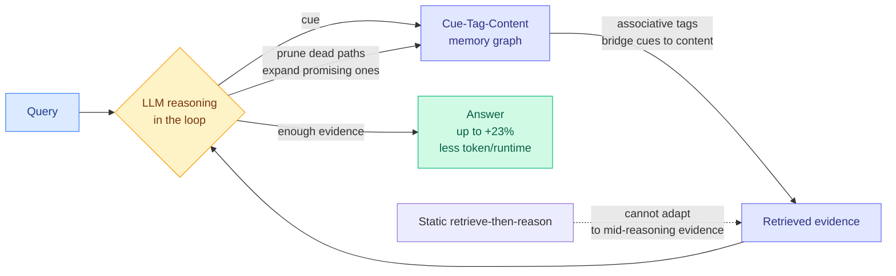

# MRAgent: Memory is Reconstructed, Not Retrieved — Graph Memory for LLM Agents

**TL;DR.** Memory-augmented LLM agents almost all use a static "retrieve-then-reason" pipeline: pull the top-k relevant chunks once, then reason over them. That rigid order means the agent cannot adjust what it pulls based on what it discovers mid-reasoning. MRAgent replaces it with an active-reconstruction loop over an associative memory graph. Memory is stored as a Cue-Tag-Content graph, where associative *tags* act as semantic bridges linking fine-grained cues to memory contents. During inference the agent's own reasoning drives memory access, iteratively exploring and pruning retrieval paths as evidence accumulates, instead of fetching everything upfront. On the long-horizon LoCoMo and LongMemEval benchmarks it beats strong baselines by up to 23% while cutting token and runtime cost, because it stops expanding paths once it has enough.

**Source:** HuggingFace · [Paper](https://arxiv.org/abs/2606.06036) · arxiv 2606.06036

## What it is

A memory framework where retrieval is an active, reasoning-driven process rather than a one-shot lookup. The memory graph has three node types: cues (fine-grained entry points), tags (associative bridges), and contents. The agent walks this graph interactively, letting intermediate reasoning steer which paths to follow and which to drop.

## What problem it solves

The retrieve-then-reason paradigm decides what to fetch *before* it has done any reasoning, so it cannot use evidence discovered mid-inference to refine the query. On long interaction histories this either misses relevant memories or, if it retrieves broadly, drowns the context in irrelevant chunks and blows up cost.

## Core novelty

The Cue-Tag-Content associative graph plus an active reconstruction mechanism that folds LLM reasoning directly into memory traversal. The tags prevent the combinatorial explosion that naive graph expansion would cause: instead of unconstrained neighbor expansion, the agent prunes paths against accumulated evidence. "Reconstructed, not retrieved" is the framing, memory access is a reasoning act, not a database call.

## Key takeaways

- Up to +23% over strong baselines on LoCoMo and LongMemEval (long-horizon memory benchmarks).
- Simultaneously *reduces* token and runtime cost by pruning retrieval paths early.
- Memory is a Cue-Tag-Content graph; tags are the semantic bridges that make associative recall tractable.
- Reasoning is in the retrieval loop, so memory access adapts to evidence found during inference.

## Gaps

Graph construction cost and how the Cue-Tag-Content graph is built/maintained as history grows is not stressed-tested at very large scale. The benchmarks are QA-style long-memory tasks; whether active reconstruction helps in open-ended agentic work (where the "query" is implicit) is open. No analysis of failure when tags are wrong, the associative bridge could mislead reasoning down a confident-but-wrong path.

## How it relates to prior wiki knowledge

- Sits squarely on the [agent-memory](agent-memory.md) concept page. It contrasts with [Latent Memory](../inference-efficiency/2026-06-10-latent-memory-one-token-evidence.md) (06-10, compress evidence into a single latent token): MRAgent keeps memory symbolic and graph-structured but makes *access* dynamic, where Latent Memory compresses the content itself.
- It is the structural cousin of [EvoMem](2026-06-14-evoarena-evomem-memory-evolution.md) (06-14, memory that evolves across episodes): EvoMem evolves *what is stored*; MRAgent makes *how it is read* reasoning-driven. Together they cover the write-side and read-side of adaptive memory.
- The "reconstruction can go confidently wrong" risk connects to [honest-lying memory confabulation](2026-06-09-honest-lying-memory-confabulation.md) (06-09, agents confabulate plausible memories): an active reconstruction loop that prunes on its own evidence is exactly the setting where confabulation could compound, worth flagging.

## Research angle

The cognitive-science framing ("memory is reconstructive") is more than branding: if recall is reasoning, then memory quality and reasoning quality are not separable, and a better reasoner is automatically a better rememberer on the same graph. The open question is whether the active-reconstruction loop can be made *verifiable*, i.e. can the agent know when a reconstructed path is evidence-grounded versus confabulated, which is the safety precondition for trusting graph-memory agents on long horizons.

→ Raw: `raw/huggingface/2026-06-15-memory-is-reconstructed-not-retrieved-graph-memory-for-llm-a.md`
