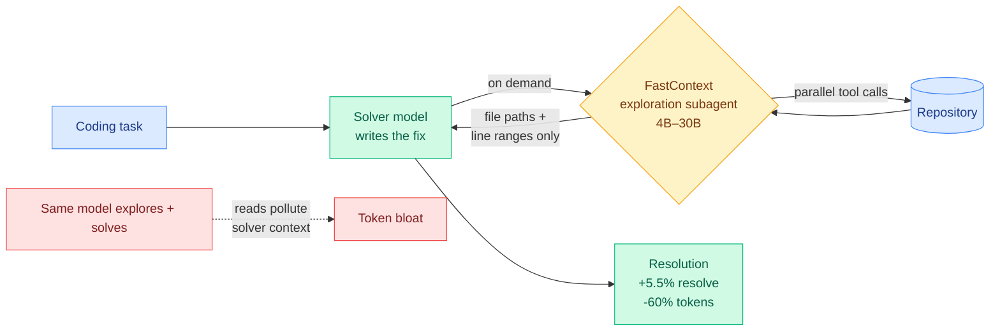

# FastContext: A Dedicated Exploration Subagent for Coding Agents

**TL;DR.** Coding agents waste most of their token budget *finding* the relevant code, and the exploratory reads pollute the solver's context. FastContext (arxiv 2606.14066, Microsoft) splits exploration off into a dedicated subagent powered by small specialized models (4B–30B): invoked on demand, it fires parallel tool calls and returns only concise file paths and line ranges. Dropped into Mini-SWE-Agent across SWE-bench Multilingual, SWE-bench Pro, and SWE-QA, it lifts end-to-end resolution up to 5.5% while cutting coding-agent token consumption up to 60%.

## What it is

In most coding agents the *same* model explores the repo and solves the task, so exploratory reads and searches stay in the solver's history, burning tokens and crowding out the signal. FastContext separates the two concerns. It is a dedicated exploration subagent, invoked on demand, that issues parallel tool calls and returns concise file paths and line ranges as focused context — nothing else. The exploration models (4B–30B) are bootstrapped from strong reference-model trajectories and refined with task-grounded rewards for three skills: broad first-turn search, multi-turn evidence gathering, and precise citation generation. Across SWE-bench Multilingual, SWE-bench Pro, and SWE-QA, integrating FastContext into Mini-SWE-Agent improves resolution up to 5.5% while cutting coding-agent token consumption up to 60%, with marginal overhead. Code: https://github.com/microsoft/fastcontext.

## How it relates to prior wiki knowledge

FastContext is a **role-specialized router** in disguise, and it lands squarely in two converging wiki threads.

First, it is the latest instance of **separating exploration from solving to save tokens**, which the wiki saw just yesterday from a different angle: [LLM Agents Can See Code Repositories](2026-06-15-llm-agents-can-see-code-repositories.md) (06-15) cut input tokens up to 26% by handing the agent a rendered structure graph instead of letting it re-read files. FastContext attacks the same waste (token-hungry repo navigation) with a different mechanism — a separate model, not a separate modality. Both confirm that *repository exploration is a distinct subtask with its own optimal interface*.

Second, it extends the [routing](../ai-routing/llm-routing.md) page's "use a small model for the cheap part" line. It is the coding-agent cousin of [S2L-PO](../llms-foundation-models/2026-06-15-s2l-po-small-models-explorers-grpo.md) (06-15, a small model is the cheapest *diverse explorer* for RL rollouts): there the small model explores the *policy* space; here it explores the *repository*. Both say a cheap specialist beats the expensive generalist at exploration. It also pairs with the day's workflow-level routing finding ([Kilo plan-strong/implement-cheap](../ai-routing/2026-06-16-kilo-plan-implement-model-split.md)) — split the agent loop by phase and assign each phase its right-sized model.

Within the harness-as-frontier story ([HarnessX](2026-06-15-harnessx-composable-agent-harness-foundry.md) 06-15, [HarnessBridge](2026-06-14-harnessbridge-learnable-harness-controller.md) 06-14), FastContext is concrete evidence that capability lives in the scaffold: a *trained small exploration model wired in as a tool* lifts a fixed solver, no change to the solver's weights.

## Gaps

"Up to 5.5%" resolution and "up to 60%" token cut are ceilings, not averages; the realistic mean gain is unstated. The exploration subagent must itself be trained per ecosystem (the reward design targets first-turn search, evidence gathering, citation) — transfer to repos or languages outside the SWE-bench distribution is the open question. The "marginal overhead" claim hides a real second-model inference cost that only nets out because the solver shrinks.

## Industrial implication

Coding-agent products on metered token billing should treat retrieval/exploration as a separate, cheaper model call rather than something the frontier solver does inline. FastContext makes that a trained component, not a prompt trick. Expect agent frameworks to ship a pluggable "explorer" slot the way they ship pluggable memory, and expect the explorer to be a small open model fine-tuned for the codebase.

**Source:** HuggingFace Daily Papers · [Paper](https://arxiv.org/abs/2606.14066) · [Raw](../../raw/huggingface/2026-06-16-fastcontext-training-efficient-repository-explorer-for-codin.md)
