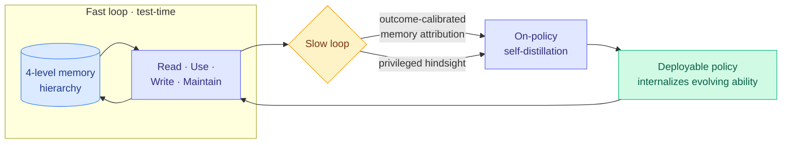

# OPD-Evolver: distilling the *ability to evolve* into an agent, not just its memories

**TL;DR.** Memory is now a standard substrate for self-evolving agents, but storing trajectories is not the same as learning how to *use* them. OPD-Evolver is a slow-fast co-evolution framework that distills the holistic competence to select useful experience, act on it, write reusable knowledge, and maintain a growing repository, into the deployable policy itself. In the fast loop the agent reads/uses/writes/maintains a four-level memory hierarchy for test-time evolution; in the slow loop, outcome-calibrated memory attribution and privileged hindsight distill those four abilities into the policy via on-policy self-distillation. It beats memory systems like ReasoningBank by up to 11.5% and training methods like Skill0 by ~5.8%, and a 9B variant challenges far larger models (Qwen3.5-397B-A17B, Step-3.5-Flash).

## What it is

A framework that turns "experience" from a retrieval store into a learned skill. Most self-evolving agents bolt a memory module onto a frozen policy: they accumulate trajectories, retrieve reflections, or stack skills, but the policy never learns to *manage* that memory well. OPD-Evolver has two loops. The **fast loop** is test-time evolution: the agent reads, uses, writes, and maintains a four-level memory hierarchy as it works. The **slow loop** distills those four abilities into the deployable policy using on-policy self-distillation, with **outcome-calibrated memory attribution** (credit which memory operations actually helped) and **privileged hindsight** (the teacher sees the outcome the student didn't). The result is an agent that has internalized *how to evolve*, not just *what it remembered*.

## Key findings

- Beats memory systems (ReasoningBank) by up to 11.5% and training-based methods (Skill0) by ~5.8% across multi-domain benchmarks.
- OPD-Evolver-9B challenges giant models (Qwen3.5-397B-A17B, Step-3.5-Flash) — the small model's edge is internalized memory management, not raw scale.
- Four memory abilities (select, act, write, maintain) are distilled jointly, not bolted on.

## How it relates to prior wiki knowledge

- This is **on-policy self-distillation applied to agent memory** — a fusion of two heavy wiki lines. The OPD machinery (privileged-information teacher, on-policy rollouts) is the same family as [PBSD](../llms-foundation-models/2026-06-09-pbsd-bayesian-self-distillation.md) (privileged answer-conditioned teacher for turn-level credit), [SDPG](../inference-efficiency/2026-06-04-sdpg-self-distilled-policy-gradient.md), and the [knowledge-distillation](../inference-efficiency/knowledge-distillation.md) "privileged hindsight" device. "Outcome-calibrated memory attribution" is PBSD's sparse-reward-to-turn-level-credit move applied to memory operations.
- On the memory side it extends the agent-memory line ([Delta-Mem](../inference-efficiency/2026-05-13-delta-mem-online-memory.md) online memory, [Echo-Infinity](../inference-efficiency/2026-06-04-echo-infinity-evolving-memory-video.md) evolving memory, [Latent Memory](../inference-efficiency/2026-06-10-latent-memory-one-token-evidence.md)). The novel claim: don't just build a better memory store, train the policy to operate any store well.
- The "small model + learned scaffold beats a giant" result is the same thread as [FastContext](2026-06-16-fastcontext-exploration-subagent.md) (06-16) and HarnessX (06-15): capability is migrating into the harness and the learned operating procedure, not only the base weights.

## Gaps

"Outcome-calibrated attribution" and "privileged hindsight" are the load-bearing pieces and the easiest to overfit to the benchmark's reward structure; no failure-attribution analysis when the distilled memory policy makes a bad write that poisons future retrieval. The 9B-beats-397B headline is on specific multi-domain benchmarks; whether the internalized memory skill transfers to genuinely novel task distributions (the point of "evolving") is the open question every self-evolving-agent paper hits.

## Research angle

If the *ability to manage memory* is distillable into weights, the next question is whether it is composable: can you distill memory-management ability from one domain and have it transfer, or does each domain need its own slow-loop run? That maps onto the unresolved OPD "joint formulation" gap the knowledge-distillation page keeps flagging. Also worth watching: OPD-Evolver makes the policy depend on a specific four-level memory schema — a more schema-agnostic distillation target would be the more durable contribution.

**Source:** [arXiv 2606.17628](https://arxiv.org/abs/2606.17628) · [HuggingFace](https://huggingface.co/papers/2606.17628) · raw: `raw/huggingface/2026-06-17-opd-evolver-cultivating-holistic-agent-evolver-via-on-policy.md`
