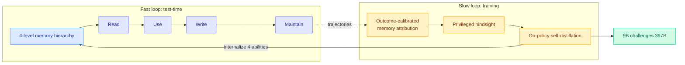

# OPD-Evolver: Cultivating Holistic Agent Evolver via On-Policy Distillation

**TL;DR.** Memory has become the standard substrate for self-evolving agents, but storing experience is not the same as learning *how to evolve through it*. Existing memory agents can store trajectories, retrieve reflections, or accumulate skills, but lack the holistic competence to select useful experience, act on it, write reusable knowledge, and maintain a growing repository. OPD-Evolver is a slow-fast co-evolution framework that distills those four abilities into the deployable policy via on-policy self-distillation. In the **fast loop**, the agent interacts with a four-level memory hierarchy to read, use, write, and maintain experience for rapid test-time evolution. In the **slow loop**, outcome-calibrated memory attribution and privileged hindsight distill those four abilities back into the policy. It beats memory systems like ReasoningBank by up to 11.5% and training-based methods like Skill0 by ~5.8%, and OPD-Evolver-9B challenges giant counterparts like Qwen3.5-397B-A17B and Step-3.5-Flash.

**Source:** HuggingFace · [arxiv 2606.17628](https://arxiv.org/abs/2606.17628)

## Key findings

- **Four memory abilities as the unit of evolution:** select useful experience, act on it, write reusable knowledge, maintain the repository — distilled into the policy rather than left as external scaffolding.
- **Slow-fast co-evolution:** fast loop evolves at test time against a four-level memory hierarchy; slow loop distills the resulting competence back into the deployable weights via on-policy self-distillation.
- **Outcome-calibrated memory attribution + privileged hindsight** are the slow-loop mechanisms that decide which experience was actually valuable before distilling it.
- **9B challenges 397B:** OPD-Evolver-9B competes with Qwen3.5-397B-A17B and Step-3.5-Flash; beats ReasoningBank by up to 11.5% and Skill0 by ~5.8%.

## Relation to prior wiki

- OPD-Evolver internalizes what most of the agent-memory line keeps external. It directly contrasts ReasoningBank and the [EvoMem / EvoArena](2026-06-14-evoarena-evomem-memory-evolution.md) (06-14) and [MemForest](2026-05-26-memforest-hierarchical-temporal-agent-memory.md) (05-26, hierarchical temporal memory) work: those build better external memory; OPD-Evolver argues the memory-*management policy* itself should be trained into the model. This is the same "capability belongs in the weights, not the harness" vs "in the harness, not the weights" tension the wiki has tracked.
- It is the agentic application of on-policy self-distillation, joining [SDAR](2026-05-15-sdar-self-distilled-agentic-rl.md) (05-15, self-distilled agentic RL) and [PANDO](2026-05-30-pando-online-skill-distillation.md) (05-30, online skill distillation). The "distill the test-time evolution back into the policy" move is the agentic version of the [d-OPSD self-future distillation](../inference-efficiency/2026-06-17-d-opsd-diffusion-self-future-distillation.md) idea also published 06-17.
- Updated in [self-evolving-agents](self-evolving-agents.md).

## Gaps

"Challenges" giant models is not "beats" — the headline 9B-vs-397B claim needs the actual win/loss split per benchmark to interpret. Whether the four distilled abilities transfer to unseen task domains (the real test of an evolver) versus the training distribution is the key unshown result.

Raw: `raw/huggingface/2026-06-17-opd-evolver-cultivating-holistic-agent-evolver-via-on-policy.md`
