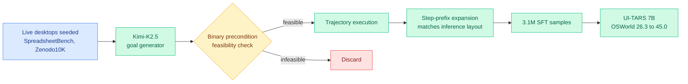

# ProCUA-SFT Technical Report

**TL;DR.** Computer-use agents (CUAs) — models that drive a desktop through screenshots and keyboard/mouse actions — need large, diverse trajectory data. The largest public set, AgentNet (22.5K human trajectories), is so mismatched that fine-tuning UI-TARS 7B on it *drops* OSWorld success from 26.3% to 8–10% (negative transfer). ProCUA-SFT is a 3.1M-step-level SFT dataset distilled from 93K synthetic trajectories across 2,484 application combinations, produced by a fully automated pipeline: it synthesizes grounded tasks on live desktops seeded with real content (912 SpreadsheetBench spreadsheets, ~10K permissively-licensed Zenodo10K presentations, multi-app OSWorld configs), then verifies each task's feasibility with binary precondition checking before rollout. A single VLM (Kimi-K2.5) acts as goal generator, precondition judge, and executor, eliminating planner-actor capability gaps. One epoch of fine-tuning lifts UI-TARS 7B to **45.0% on OSWorld** — +18.7 points over the base model and 35%+ above AgentNet-trained counterparts. A subset fed into Nemotron 3 Nano Omni's computer-use training.

**Source:** HuggingFace · [arxiv 2606.17321](https://arxiv.org/abs/2606.17321)

## Key findings

- **Negative transfer is real:** human-collected AgentNet *hurts* UI-TARS 7B (26.3%→8–10% on OSWorld), so more human data is not the answer.
- **Synthetic beats human here:** 3.1M synthetic step-level samples lift the same model to 45.0% OSWorld, +18.7 points and 35%+ over AgentNet.
- **Feasibility verification before rollout:** binary precondition checking discards impossible synthetic tasks, the key quality gate.
- **Single-VLM pipeline** (Kimi-K2.5 as generator/judge/executor) removes planner-actor capability gaps that plague multi-model data synthesis.
- **Step-prefix expansion** reproduces the exact context layout seen at inference — a data-side echo of the prompt-cache discipline the wiki tracked in [TokenPilot](../inference-efficiency/2026-06-16-tokenpilot-cache-efficient-agent-context.md) (06-16).

## Relation to prior wiki

- Slots into the [gui-agents](gui-agents.md) line; the negative-transfer result is a concrete counterexample to "scale the human trajectory dataset," reframing CUA progress as a *data-synthesis-and-verification* problem.
- The feasibility-checked synthetic pipeline rhymes with the self-evolving / self-generated-data thread ([EvoEnv](2026-05-15-evoenv-self-evolving-rl-via-environment-synthesis.md), 05-15, synthesize RL environments) — both generate their own training distribution and gate it by an automatic check.

## Gaps

OSWorld only; no cross-benchmark generalization (WindowsAgentArena, AndroidWorld) reported. A single VLM as generator-judge-executor risks the dataset inheriting that one model's blind spots. The 45% ceiling is still far from reliable desktop automation.

Raw: `raw/huggingface/2026-06-17-procua-sft-technical-report.md`
