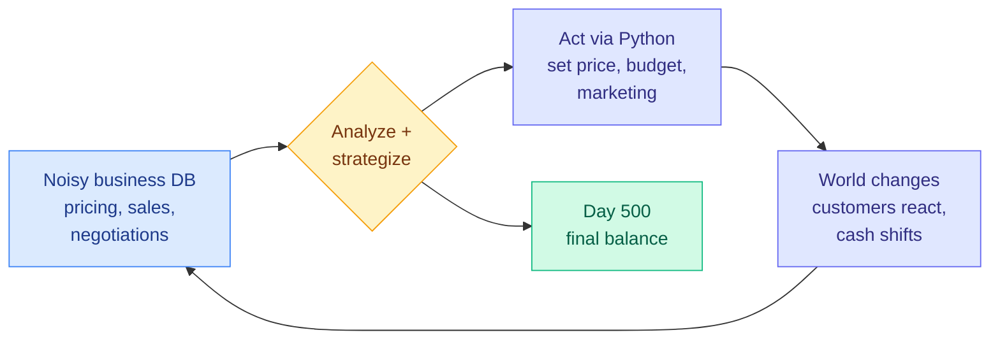

# CEO-Bench: Can Agents Play the Long Game?

**Source:** HuggingFace Daily Papers
**Links:** [Paper](https://arxiv.org/abs/2606.18543) · [Raw](../../../raw/huggingface/2026-06-18-ceo-bench-can-agents-play-the-long-game.md)

## TL;DR

CEO-Bench asks an LLM agent to run a fictional startup for 500 simulated days. The agent manages pricing, marketing, and budgeting through a programmable Python interface, working from noisy, interconnected business databases. It bundles four skills that short-horizon benchmarks never test together: surviving long horizons under uncertainty, pulling signal out of noisy data, adapting as the world changes, and keeping many decisions pointed at one coherent goal. Most state-of-the-art models fail. Only Claude Opus 4.8 and GPT-5.5 finish above the $1M starting balance, and neither consistently turns a profit. The best agents write code that simulates customer cohorts to forecast cash and mines negotiation history to surface hidden customer preferences.

## The 500-day loop

Each simulated day the agent observes a noisy, interconnected business database, translates the signals into a strategy, acts through Python code, and the world responds. The cycle repeats for 500 days. Compounding matters: a wrong pricing call early bleeds cash for hundreds of days.

## Key findings

- **Only two models stay solvent.** Claude Opus 4.8 and GPT-5.5 are the only models that finish above the $1M starting balance. Every other state-of-the-art model ends underwater.
- **Solvent is not the same as profitable.** Even the two survivors do not consistently turn a profit across runs.
- **Coding ability is the differentiator.** The strongest agents write code that simulates customer cohorts to forecast future cash, and mines negotiation history to uncover hidden customer preferences. Business intuition without code execution is not enough.
- **The four skills must combine.** Long-horizon endurance, information acquisition in noise, adaptation to a changing world, and orchestration toward one goal are each tested elsewhere in isolation. CEO-Bench is hard because it requires all four at once over a long horizon.

## Relation to prior wiki

CEO-Bench continues this page's running thread that **short-horizon accuracy does not predict long-horizon robustness**. PhysicianBench (2026-05-05, where the best closed model reached only 46% pass@1 across roughly 27 tool calls per task) and GTA-2 (2026-04-20, top models at 14.39% on long-horizon workflows versus near-50% on atomic tool calls) both showed the gap between single-step competence and sustained multi-step work. CEO-Bench pushes the horizon further than either, to 500 sequential days where errors compound.

It pairs naturally with **RNG-Bench (also 2026-06-18)**, a non-Markov memory benchmark on which frontier multimodal LLMs stay far from saturated even at 128K context. The two same-day benchmarks make the same point from different angles. RNG-Bench shows frontier models fail at **stateful** tasks (remembering and using history that is not visible in the current observation), and CEO-Bench shows they fail at **sustained** tasks (driving coherent progress over a long horizon). Stateful and sustained are the two axes short-horizon evals miss, and frontier models are weak on both.

CEO-Bench also echoes the **compute-quality decoupling** finding from AcademiClaw (2026-05-05, where computational resource consumption did not predict output quality across 80 tasks): raw model strength is not the lever here. What separates the two survivors is whether the agent writes simulation code to reason about the future, not how big the model is.

## Research angle

The headline result that the best agents win by writing cohort-simulation code raises a sharp question: is CEO-Bench measuring business reasoning, or is it measuring the ability to bootstrap a quantitative simulator inside an agent loop? These may be the same skill at this horizon. The deeper open problem is **credit assignment over 500 days**. An agent that fails has no clean signal for which of hundreds of decisions sank it. This is the long-horizon credit-assignment problem that OmniAgent (2026-06-18) attacks with turn-level entropy on a much shorter horizon. CEO-Bench is the natural stress test for whether any such credit-assignment scheme survives at 500 turns.

## Gaps in the study

- **Single simulated company.** Results come from one fictional startup environment. Whether the rankings hold across different industries, market conditions, or starting balances is untested.
- **May reward coding over business reasoning.** Because the winning strategy is to write simulation code, the benchmark may conflate quantitative-programming skill with strategic judgment. An ablation that hands the agent a pre-built simulator would separate the two.
- **Reproducibility of the simulation.** A 500-day stochastic business simulator is sensitive to seeds and hidden dynamics. The variance across runs and the stability of the leaderboard under reseeding are not reported here.

## Related pages

- [Agent Evaluation & Benchmarks](agent-benchmarks.md)
- [OmniAgent (2026-06-18)](2026-06-18-omniagent-active-perception-video.md)
