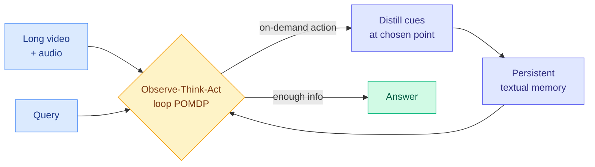

# OmniAgent: Native Active Perception as Reasoning for Omni-Modal Understanding

**Source:** HuggingFace Daily Papers
**Links:** [Paper](https://arxiv.org/abs/2606.19341) · [Raw](../../../raw/huggingface/2026-06-18-native-active-perception-as-reasoning-for-omni-modal-underst.md)

## TL;DR

Long-video models usually "watch it all": they process every frame at uniform cost, so compute grows with video length even when the question is easy. OmniAgent flips this to **active perception**. It treats video understanding as a POMDP (a partially observable Markov decision process, where the agent never sees the whole state and must take actions to gather the information it needs). The agent runs an iterative observe-think-act loop, taking on-demand actions to pull only the audio-visual cues it needs into a persistent textual memory. That decouples reasoning cost from raw video duration. Two training stages make it work: agentic supervised fine-tuning to bootstrap the behavior, and agentic reinforcement learning with a turn-aware advantage that steers credit toward the turns where real discovery happens. The payoff for an efficiency reader: OmniAgent shows **positive test-time scaling**, where adding reasoning turns keeps improving the answer, and a 7B agent beats the 10x larger Qwen2.5-VL-72B on LVBench (50.5% vs 47.3%).

## Architecture

The agent never ingests the whole video. Each turn it decides where to look or listen, distills that slice into text, writes it to memory, and checks whether it can answer. Compute is tied to the number of reasoning turns the query needs, not to how long the video is.

## Key findings

- **Compute decoupled from input length.** Because cues are distilled on demand into a persistent textual memory, reasoning complexity scales with query difficulty, not with raw video duration. This is the efficiency core of the paper.
- **Positive test-time scaling.** Performance improves as the number of reasoning turns increases. More turns means more gathered information, not just more re-refinement of the same view.
- **Small model beats much larger one.** On LVBench the 7B OmniAgent beats Qwen2.5-VL-72B, a model roughly 10x its size, 50.5% to 47.3%.
- **State-of-the-art among open-source models** across ten benchmarks including VideoMME and LVBench.
- **TAURA targets the turns that matter.** Turn-aware adaptive uncertainty rescaled advantage uses turn-level entropy to push reinforcement-learning credit toward the pivotal discovery turns, instead of spreading it evenly. Agentic supervised fine-tuning first bootstraps the behavior via best-of-N trajectory synthesis with dual-stage quality control.

## Relation to prior wiki

OmniAgent is the **active-perception counterpart** to yesterday's LoopCoder-v2 finding (2026-06-17, that latent-loop test-time compute saturates: stacking more internal refinement iterations stops helping past a point). OmniAgent does the opposite. Here more reasoning turns **keep** helping, because each turn gathers new information from the video rather than re-refining the same fixed representation. The contrast is the lesson: test-time compute pays off when each step adds information, and saturates when each step only reworks what the model already has. This is a clean dividing line between two kinds of test-time scaling.

It also extends the **small-model-beats-large** pattern from OPD-Evolver (2026-06-17, a 9B agent that challenged models roughly 40x its size by leaning on an evolving scaffold rather than raw scale). OmniAgent's 7B-beats-72B result on LVBench is the same shape: the agent loop and active-perception policy carry capability that parameter count alone does not.

The persistent textual memory connects to the wiki's [agent memory](agent-memory.md) thread, and the on-demand distillation of audio-visual cues into text is a structured-memory design choice worth tracking against other memory-evolution work like EvoMem (2026-06-14).

## Research angle

The open question is whether positive test-time scaling continues or eventually saturates the way latent-loop compute does in LoopCoder-v2. Active perception should scale further than internal refinement, because new turns can keep surfacing genuinely new evidence. But there must be a ceiling once the relevant cues are all in memory and further turns only re-read it. Finding that crossover point, the turn count at which OmniAgent stops gaining, would tell us how much of the gain is information acquisition versus diminishing re-refinement. The TAURA credit-assignment idea (entropy-weighted advantage toward pivotal turns) is also a candidate to export to other long-horizon agents where most turns are filler and a few are decisive, including the 500-day setting of CEO-Bench (2026-06-18).

## Gaps in the study

- **Open-source SOTA only.** The headline comparisons are against open-source models. Performance versus closed frontier video models (the strongest available) is not established, so the absolute ceiling is unclear.
- **Textual-memory bottleneck.** Distilling audio-visual cues into text may discard fine-grained visual detail that a query later needs. Tasks requiring precise spatial or pixel-level grounding could expose this lossy compression.
- **Turn-count cost accounting.** Positive test-time scaling means strong answers may require many turns. The paper frames compute as decoupled from duration, but the wall-clock and token cost of long reasoning chains on hard queries deserves its own budget analysis.

## Related pages

- [Agent Evaluation & Benchmarks](agent-benchmarks.md)
- [Agent Memory](agent-memory.md)
- [CEO-Bench (2026-06-18)](2026-06-18-ceo-bench-long-horizon-agents.md)
