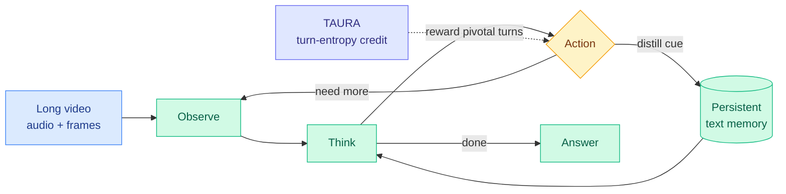

# OmniAgent: Native Active Perception as Reasoning for Omni-Modal Understanding

**TL;DR.** Long-video understanding usually runs on a "watch-it-all" paradigm: the model ingests frames uniformly regardless of the question, so cost grows with video length. OmniAgent reframes video understanding as an agentic loop instead. It is a native omni-modal agent that treats the task as a POMDP (a partially-observed decision process where the agent acts to reveal hidden information) and runs an iterative Observation-Thought-Action cycle: it issues on-demand actions to selectively pull audio-visual cues into a persistent **textual memory**, which decouples reasoning cost from raw video duration. Two training pieces make it work: Agentic Supervised Fine-Tuning bootstraps the active-perception behavior from best-of-N synthesized trajectories with dual-stage quality control, and Agentic RL with **TAURA** (Turn-aware Adaptive Uncertainty Rescaled Advantage) uses per-turn entropy to push credit toward the pivotal discovery turns. The standout result: a 7B OmniAgent beats the 10x larger Qwen2.5-VL-72B on LVBench (50.5% vs 47.3%), and performance *improves* as the agent is allowed more reasoning turns (positive test-time scaling).

**Source:** HuggingFace · [arxiv 2606.19341](https://arxiv.org/abs/2606.19341) · arxiv-dated 2026-06-18

## What it is

An omni-modal (text + audio + visual) agent for long-video understanding that replaces uniform frame processing with selective, query-driven perception. The agent loops: observe a slice of the video, think about what it still needs, take an action that distills the relevant audio-visual cue into a running textual memory, and repeat until it can answer. Because the accumulated state is compact text rather than the full frame stack, the reasoning context does not grow with video length, the central efficiency claim.

Training has two stages. **Agentic SFT** synthesizes good trajectories via best-of-N sampling with a two-stage quality filter, giving the model an initial active-perception policy. **Agentic RL with TAURA** then refines it: TAURA rescales the advantage using turn-level entropy so that the turns where the agent actually discovers decision-relevant information get more credit than routine turns, addressing the credit-assignment problem of multi-turn perception.

## Key findings

- 7B OmniAgent beats Qwen2.5-VL-72B on LVBench (50.5% vs 47.3%), a 10x parameter advantage overcome by active perception plus agentic training.
- State-of-the-art among open-source models across ten benchmarks (VideoMME, LVBench, others).
- **Positive test-time scaling**: accuracy rises as the agent takes more reasoning turns, validating that the active-perception loop is doing real work, not just adding latency.
- TAURA's turn-entropy credit assignment is the mechanism that makes the multi-turn RL trainable.

## Relation to prior wiki

- This is the **video instance of routing-as-compute-allocation**: instead of spending uniform compute per frame, the agent spends perception actions only where the query needs them, the same "more compute is not monotonically better, spend it where it pays" principle the routing page has tracked from [CLEAR](../inference-efficiency/2026-06-05-clear-shadow-price-reasoning-budget.md) (06-05, ration the reasoning-token budget across a batch by one shadow price) to the [Kilo audit](../ai-routing/2026-06-07-kilo-code-model-task-routing-audit.md) (06-07). Decoupling reasoning cost from video duration is the long-context analogue of CLEAR's per-query budgeting.
- The 7B-beats-72B result through agentic scaffolding rather than scale is the same "capability migrating into the harness, not the base model" pattern as [OPD-Evolver](2026-06-17-opd-evolver-agent-evolver-on-policy-distillation.md) (06-17, 9B internalized memory management beats 397B) and FastContext (06-16, trained exploration subagent).
- The persistent-textual-memory device connects to [agent-memory](agent-memory.md): like OPD-Evolver's four-level memory, OmniAgent treats accumulated experience as a compact written store the policy reads and updates, not a frozen context window.
- TAURA joins the 2026 cluster of GRPO-advantage rebuilds for specific structures (Orchestra-o1's DA-GRPO 06-15, S2L-PO, AdaSR's HRPO), here keying the advantage to per-turn entropy rather than final-answer correctness.

## Research angle

Positive test-time scaling on a perception loop is the interesting claim, because most agentic video methods saturate or regress past a few turns. If the gain genuinely tracks turn count rather than topping out, the open question is what bounds it, the same two-loop-saturation question [LoopCoder-v2](../inference-efficiency/2026-06-17-loopcoder-v2-parallel-loop-transformer.md) (06-17) raised for latent depth: does active perception keep paying off because each turn reveals genuinely new information, or does it plateau once the textual memory has captured the decision-relevant cues? An ablation of accuracy vs turn budget against a fixed-frame baseline at matched compute would separate "the loop helps" from "more frames help."

## Gaps

Open-source-SOTA is the framing, so no comparison against the strongest closed omni-modal systems. The textual-memory compression is lossy by construction; what gets dropped on questions needing fine visual detail (counting, OCR-in-video) is not characterized. TAURA's turn-entropy reward could be gamed by an agent that manufactures artificial uncertainty to farm credit, untested. Latency per query under the multi-turn loop vs a single-pass model is not reported.

Raw: `raw/huggingface/2026-06-18-native-active-perception-as-reasoning-for-omni-modal-underst.md`
