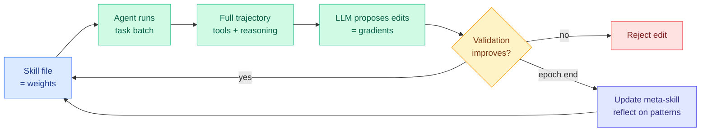

# SkillOpt: Treating Agent Skills as Trainable Artifacts (Microsoft)

**TL;DR.** AI agents depend on more than the base model. They depend on "skills", text documents that define the rules, tool calls, and strategies an agent must follow. Today those skill files are usually written once by prompting a model or edited by hand, never rigorously optimized the way model weights are. Microsoft's SkillOpt treats the skill file as a trainable artifact and iteratively optimizes it from execution traces, without touching a single model weight. The reported gains are large: across six benchmarks spanning direct chat, Codex, and Claude Code environments it improves consistently, and on SpreadsheetBench it lifts GPT-5.5 from 41.8% to 80.7% accuracy. Surfaced via the AI Papers Academy newsletter (Gmail), not HuggingFace.

**Source:** AI Papers Academy newsletter (Gmail) · [Full review](https://aipapersacademy.com/skillopt/) · [Video](https://www.youtube.com/watch?v=iSPwNmsa7kA) · ingested 2026-06-18

## What it is

A method that optimizes an agent's skill file the way gradient descent optimizes weights, but in text space. The core loop:

- The agent attempts a batch of tasks using the current skill file.
- An LLM analyzes the full execution trajectory (tool use, reasoning steps, final output) and proposes edits to the skill: add new rules, remove outdated ones, refine instructions.
- Each update is ranked and filtered, functioning like a learning-rate control on how many edits are allowed per iteration.
- Crucially, edits are not accepted blindly. Only changes that improve performance on a validation set are kept.
- After each epoch, the system reflects on broader patterns (what edits work, what is still unsolved) and updates a **meta-skill** for the next epoch.

The authors draw the analogy explicitly: the skill file is the weights, proposed edits are the gradients, the edit budget per iteration is the learning rate, and validation is the safeguard that keeps updates from regressing.

## Key findings

- Consistent improvement across six benchmarks spanning direct chat, Codex, and Claude Code environments.
- SpreadsheetBench: GPT-5.5 from 41.8% to 80.7% accuracy, an outsized jump from skill optimization alone.
- The whole gain comes without modifying model weights, only the text skill artifact changes.
- Validation-gated acceptance is what prevents the iterative edits from drifting into regressions.

## Relation to prior wiki

- SkillOpt is the cleanest instance yet of the wiki's strongest 2026 meta-pattern: **capability is increasingly migrating into the harness, not the base model.** It is the explicit-optimization version of the disentangled self-evolution result ([Disentangling Agent Self-Evolution](../ai-routing/2026-06-08-disentangling-agent-self-evolution.md) 06-08, harness-updating is flat across model tiers while harness-benefit is non-monotonic) and joins OPD-Evolver (06-17, distill memory-management skill into weights), FastContext (06-16), and HarnessX (06-15). The contrast with OPD-Evolver is instructive: OPD-Evolver internalizes the skill *into weights*; SkillOpt keeps it *in the text artifact* and optimizes that instead. Two opposite homes for the same capability.
- The "validation-gated text edits as gradient descent" framing is the agent-skill cousin of the prompt-channel teaching in [ZPPO](../inference-efficiency/2026-06-17-zppo-teacher-in-prompts-not-gradients.md) (06-17, put the teacher in the prompt, not the gradient): both move optimization out of weight space into text space, with a validation/graduation gate keeping it stable.
- It also connects to [self-evolving-agents](self-evolving-agents.md) and [tool-calling](tool-calling.md): a skill file is the procedural memory an agent consults, and making it trainable closes the loop between deployment traces and skill quality.

## Research angle

The interesting claim is that a large fraction of agent capability is recoverable by optimizing text instructions alone, no fine-tuning. If the SpreadsheetBench jump (41.8 to 80.7) generalizes, it implies current agents are badly under-specified rather than under-capable, and the binding constraint on production reliability is skill quality, not model quality, exactly the routing-page lesson that "most of what an agent does does not need a frontier model" pushed from the model axis. The open question: does skill optimization compose with weight-space distillation (SkillOpt the skill, then OPD-Evolver it into weights), or do they capture the same gain twice?

## Gaps

This is a newsletter summary, not the primary paper, so numbers are second-hand and the benchmark protocols are not independently checked. The validation set is the load-bearing component, an optimized skill could overfit the validation tasks (the text-space analogue of benchmark gaming), and the newsletter does not report held-out generalization. The compute cost of the iterative edit-and-validate loop is not netted against the accuracy gain.

Raw: Gmail starred `raw/gmail/2026-06-18-starred.md` (item 8, AI Papers Academy)
