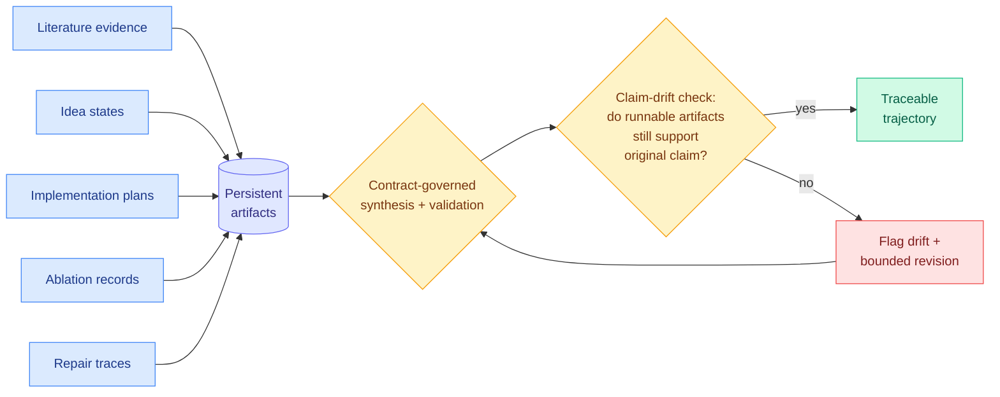

# Xcientist: Externalizing Research Synthesis and Validation in AI Scientists

**Source:** HuggingFace Daily Papers
**Links:** [Paper](https://arxiv.org/abs/2606.18874) · [Raw](../../../raw/huggingface/2026-06-18-externalizing-research-synthesis-and-validation-in-ai-scient.md)

## TL;DR

When an AI scientist automates a research workflow, the reasoning that links prior evidence to a new idea, to an experiment, to a final claim usually stays trapped inside model inference. You see the output but not the chain. Xcientist is a research harness that pulls that reasoning **out into inspectable artifacts**. It stores literature evidence, idea states, implementation plans, ablation records, and repair traces as persistent records, and governs how they connect with explicit contracts, so a generated mechanism can be grounded, executed, tested, and revised without losing the evidence it rests on. The paper names a specific failure mode it is built to catch: **claim drift**, where the runnable code no longer supports the mechanism the system originally claimed. Across three domains, training-free memory systems, graph-structured traffic forecasting, and multi-scale physics-informed neural networks, Xcientist keeps a traceable trajectory from problem to mechanism to validation to bounded revision. The argument: judge AI scientists not only by their final artifact, but by whether their synthesis and validation stay attributable, inspectable, and accountable.

## Architecture

The five artifact streams feed one persistent store. Contract-governed synthesis and validation operate on that store, and a claim-drift check asks whether the executable artifacts still back the original claim. If they have drifted, the system flags it and does a bounded revision rather than silently shipping a result that its own code no longer supports.

## Key findings

- **Claim drift named as a failure mode.** The paper's core contribution is identifying and naming claim drift: the runnable artifacts no longer support the mechanism originally claimed. This is the AI-scientist analogue of a paper whose code does not actually implement its method.
- **Artifacts stay attributable across three domains.** Tested on training-free memory systems, graph-structured traffic forecasting, and multi-scale physics-informed neural networks, Xcientist preserves a traceable trajectory from problem formulation through mechanism design, validation, and bounded revision.
- **Evaluation reframed toward process.** The thesis is that AI scientists should be judged on whether their synthesis and validation processes remain inspectable and accountable, not only on the final artifact they produce.
- **Externalization is the mechanism.** Pulling reasoning out of opaque model inference into contract-governed, persistent records is what makes claim drift catchable in the first place. You cannot audit a chain you cannot see.

## Relation to prior wiki

Xcientist is a **constructive response** to the Kurate cs.AI weekly leaderboard #7 paper, "AI scientists produce results without reasoning scientifically" (ai_rating 8.5, a critique arguing that current AI-scientist systems reach results without sound underlying scientific reasoning). That paper diagnosed the problem from the outside: the reasoning is missing or unsound. Xcientist attacks the same gap from the inside by making the synthesis and validation **inspectable**, so the unsound step, claim drift, becomes a thing you can detect and revise rather than a hidden defect in the final artifact. The two papers are a clean diagnosis-and-treatment pair on the same problem.

It also extends the wiki's **"the scaffold carries the capability"** thread. OPD-Evolver (2026-06-17, a 9B agent that punched far above its weight by leaning on an evolving harness) and the broader harness work showed that the structure around the model often determines outcomes more than the model itself. Xcientist applies the same insight to scientific accountability: the harness, not the base model, is what keeps a claim grounded in its evidence.

Finally it sits next to ForeSci (2026-06-07, which found an evidence-decision decoupling in AI research judgment: agents cite the right evidence yet forecast the wrong research object). ForeSci showed good citations do not imply a correct decision. Xcientist's claim drift is the downstream version of the same disease: even after a decision is made, the executable artifact can quietly stop matching the claim. Both target the gap between a healthy-looking process signal and a wrong outcome.

## Research angle

The most useful next step is to turn claim drift into a **measurable rate**. Right now it is named and demonstrated, not quantified. A claim-drift rate, the fraction of runs where the final runnable artifact fails to support the original claim, measured with and without the Xcientist harness, would make the contribution falsifiable and let it become a leaderboard metric for AI scientists the way Lucky Pass became one for SWE-bench (AgentLens, 2026-05-14, found 10.7% of passing SWE-bench trajectories were lucky passes). The contract-governed artifact store is also a candidate substrate for cross-system auditing: if different AI scientists exported the same artifact contracts, their claims could be checked against each other.

## Gaps in the study

- **Only three domains.** Training-free memory, traffic forecasting, and physics-informed neural networks are a narrow slice. Whether the harness generalizes to wet-lab-style or more open-ended research is untested.
- **No quantitative claim-drift rate versus baselines.** The paper names and illustrates claim drift but does not report how often it occurs with and without Xcientist, so the size of the benefit is not yet measured.
- **Contract overhead.** Governing synthesis with explicit contracts adds engineering and compute cost. The price of externalization, and whether it slows the research loop enough to matter, is not characterized.

## Related pages

- [Agent Evaluation & Benchmarks](agent-benchmarks.md)
- [Self-Evolving Agents](self-evolving-agents.md)
