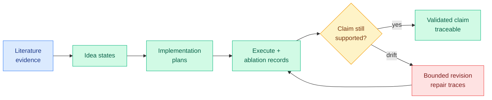

# Xcientist: Externalizing Research Synthesis and Validation in AI Scientists

**TL;DR.** AI systems that automate scientific workflows usually keep the chain that links prior evidence, generated ideas, experiments, and final claims *implicit inside model inference*, so you cannot inspect whether the claim a system reports is actually supported by the artifact it produced. Xcientist is a research harness that externalizes synthesis and validation into inspectable, contract-governed processes: it stores literature evidence, idea states, implementation plans, ablation records, and repair traces as persistent research artifacts, so a generated mechanism stays grounded, executable, testable, and revisable without losing its evidential basis. It names a specific failure mode, **claim drift**, where the runnable artifact no longer supports the mechanism originally claimed. Across three domains (training-free memory systems, graph-structured traffic forecasting, multi-scale physics-informed neural networks) Xcientist keeps traceable trajectories from problem formulation through validation and bounded revision. The argument: AI scientists should be judged not only by their final artifacts but by whether their synthesis and validation processes stay attributable and accountable.

**Source:** HuggingFace · [arxiv 2606.18874](https://arxiv.org/abs/2606.18874) · arxiv-dated 2026-06-18

## What it is

A harness that makes the AI-scientist pipeline auditable by turning its intermediate reasoning into persistent, contract-governed artifacts rather than transient model context. Each stage (evidence collection, idea, plan, ablation, repair) is recorded as an inspectable object with a contract linking it to the next, so the system can show *why* a final claim is supported and *which* experiment supports it.

The central named concept is **claim drift**: as an automated researcher iterates code and experiments, the runnable artifact gradually stops supporting the mechanism that was originally claimed, the gap between what the system *says* it discovered and what its code *actually does*. Xcientist's contracts are designed to detect and bound that drift, triggering bounded revision (repair traces) when validation no longer supports the claim.

## Key findings

- Demonstrated across three distinct research domains, preserving traceable problem-to-claim trajectories in each.
- Introduces and operationalizes claim drift as a measurable failure mode of automated research, not just a qualitative worry.
- Reframes evaluation of AI scientists toward process accountability (is the synthesis attributable and inspectable) rather than artifact-only scoring.

## Relation to prior wiki

- Xcientist sits directly above the agent-benchmarks page's research-judgment finding in [ForeSci](agent-benchmarks.md) (06-07, an *evidence-decision decoupling*: agents cite relevant evidence yet forecast the wrong research object). ForeSci diagnosed that good citations do not become good decisions; **claim drift is the execution-side version of the same decoupling**, where good experiments do not stay attached to the right claim. Together they bracket the autonomous-researcher stack: judgment drifts from evidence (ForeSci), and execution drifts from claim (Xcientist).
- It is the accountability-layer complement to the self-evolving-research cluster ([self-evolving-agents](self-evolving-agents.md)): where those systems optimize *for better artifacts*, Xcientist instruments *whether the artifacts still mean what the system says*, the same surface-signal-vs-real-capability skepticism the wiki has tracked from AgentLens "lucky passes" (05-14) onward.
- The persistent-artifact design rhymes with the broader 2026 move to externalize agent state into inspectable stores (OPD-Evolver's memory hierarchy 06-17, Cursor/AWS context-as-knowledge-graph) rather than hold it implicitly in context.

## Research angle

The valuable primitive here is a *contract* that binds a claim to the artifact that supports it, plus a drift detector. That is exactly the missing piece for using AI scientists in any high-stakes loop, and it connects to the Kurate-surfaced caution this week that "[AI scientists produce results without reasoning scientifically](../../raw/kurate/2026-06-18-cs-ai.md)" (cs.AI #7, ai_rating 8.5). The open question: can claim-drift detection be made adversarially robust, so an automated researcher cannot satisfy the contract while still over-claiming, the research-integrity analogue of reward hacking? Whether the contracts generalize beyond the three demonstrated domains to open-ended discovery is the scaling test.

## Gaps

Three domains, all with checkable artifacts (code that runs, forecasts that score); whether the contract approach works where validation is itself subjective (theory, qualitative science) is open. No quantitative claim-drift rate is reported against an uninstrumented baseline, so the size of the problem it solves is asserted more than measured. The harness adds overhead that the paper does not net against the value of the audit trail.

Raw: `raw/huggingface/2026-06-18-externalizing-research-synthesis-and-validation-in-ai-scient.md`
