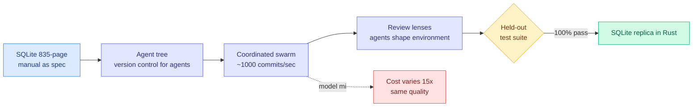

# Cursor: Agent Swarms and the New Model Economics

**TL;DR.** Cursor returned to a task their earlier agent swarm failed at: build SQLite from scratch, in Rust, from nothing but its 835-page documentation. A coordinated swarm of agents produced a replica that **passed 100% of a held-out test suite**. The headline economic finding: the *same task at similar quality* cost up to **15x more or less** depending purely on which mix of models the swarm used. Better coordination — not a better single model — delivered similar quality at a fraction of the cost.

## What it is

A Cursor research post on scaling multi-agent coordination. After an earlier proof-of-concept (a swarm building a web browser) that worked but produced unpolished software, Cursor set out to engineer the swarm *deliberately*. Key mechanisms: a **tree structure** that acts as agent memory and as a version-control system for agents; handling failure modes at ~1000 commits/second; **review lenses**; and letting agents **shape their own environment**. The SQLite-in-Rust rebuild is the test case.

## Core novelty (as an industry signal)

Two things matter for Amit. First, the **15x cost variance from model mix alone** at constant quality is a direct, production-scale confirmation of the routing thesis the wiki has been building: *which* model does *which* sub-task dominates the bill, not raw capability. Second, the swarm succeeds because coordination infrastructure (the tree, review lenses, self-shaped environment) does the work — the same "instrumentation beats bigger models" meta-pattern the July digests keep hitting.

## How it relates to prior wiki knowledge

- **Empirical, production-scale validation of the routing-as-economics argument** from [IBM's Model Routing Is Simple. Until It Isn't. (2026-07-15)](../ai-routing/2026-07-15-model-routing-system-optimization-ibm.md), which showed cache economics can flip which model is cheaper by 2x across 417 tasks. Cursor extends the range to 15x at the swarm level. See [llm-routing.md](../ai-routing/llm-routing.md) and [multi-agent-systems.md](multi-agent-systems.md).
- **The held-out test suite as ground-truth verifier** is the sharp contrast with the same-day [Environment-free Synthetic Data paper](2026-07-21-environment-free-synthetic-data-api-agents.md): Cursor's swarm works precisely *because* a real executable verifier (the test suite) grounds it, whereas the synthetic-data paper argues the environment can be simulated away.
- **Swarm coordination** continues the [multi-agent / self-evolving thread](self-evolving-agents.md).

## Gaps

A single case study (SQLite, a well-specified target with an existing reference implementation and a clean test suite). Whether the 15x cost lever and the coordination structure generalize to fuzzy, spec-less product work is exactly what Cursor's own earlier browser attempt suggests is still hard. "Similar quality at a fraction of the cost" is measured against Cursor's own prior swarm, not an external baseline.

**Raw source:** [Twitter morning 2026-07-21](../../../raw/twitter/2026-07-21-morning.md) (@cursor_ai) · [Cursor blog: Agent swarms and the new model economics](https://cursor.com/blog/agent-swarm-model-economics)
