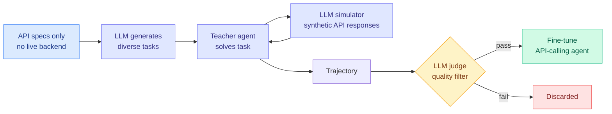

# Environment-free Synthetic Data Generation for API-Calling Agents

**TL;DR.** Training an LLM to call APIs well needs huge numbers of realistic interaction trajectories. Collecting them normally requires standing up fully executable environments with working APIs and pre-populated backend databases — a heavy bottleneck. This paper skips the environment entirely: given only **API specifications**, an LLM acts as an on-the-fly world model, simulating coherent API responses so a teacher agent can generate trajectories against a stateful "environment" that never actually exists.

## What it is

A synthetic-data pipeline for tool/API agents. Pipeline: (1) an LLM generates diverse tasks solvable with the provided APIs; (2) a teacher agent iteratively solves each task; (3) an **LLM simulator** produces coherent synthetic API responses conditioned on the task context and the simulation history so far (giving the illusion of a stateful backend); (4) an **LLM judge** filters trajectories for quality. Fine-tuning on the result improves agents without any executable environment.

## Core novelty

Using an LLM as a **stateful digital world model** driven purely by API specs — the simulator maintains coherence across a multi-step trajectory (including state-changing calls), which is the hard part that naive "fake the API output" approaches miss. It turns environment construction, historically the scaling bottleneck, into a prompting problem.

## Key results

- On **AppWorld** and **OfficeBench** (both include information-retrieval *and* state-changing tasks), fine-tuning on the synthetic data yields significant gains.
- Establishes LLM-based API simulation as a **scalable** alternative to building executable environments across diverse API ecosystems.

## How it relates to prior wiki knowledge

- **Extends the agent-training-data thread**: complements [TRex LLM-finetuning automation (2026-04-16)](2026-04-16-trex-llm-finetuning-automation.md) and the tool-use benchmarks [GTA-2 (2026-04-20)](2026-04-20-gta-2-tool-agent-benchmark.md). See [tool-calling.md](tool-calling.md).
- **Sits inside a live tension.** The same-week [Cursor agent-swarm economics post](2026-07-21-cursor-agent-swarms-economics.md) rebuilt SQLite in a *real* executable, self-verifying environment (a held-out test suite is the ground truth). This paper argues the environment can be simulated. Whether a simulated backend produces agents that transfer to real APIs, or bakes in the simulator's own blind spots, is the open question — an environment is also a *verifier*, and simulation removes the verifier.
- **Reward-hacking caution applies**: the LLM judge that filters trajectories is exactly the kind of self-scoring the wiki has flagged as gameable ([Reward Hacking in Rubric-Based RL, 2026-05-13](../inference-efficiency/2026-05-13-reward-hacking-rubric-based-rl.md)).

## Gaps

No sim-to-real transfer test on live production APIs with genuine backend quirks (rate limits, auth edge cases, inconsistent error formats). The simulator can only invent responses consistent with the spec, so agents may never learn to handle spec-violating real-world behavior. Quality rests on the LLM judge, whose failure modes are not adversarially probed.

**Raw source:** [HuggingFace Daily Papers 2026-07-21](../../../raw/huggingface/2026-07-21.md) · [arXiv 2607.16900](https://arxiv.org/abs/2607.16900)
