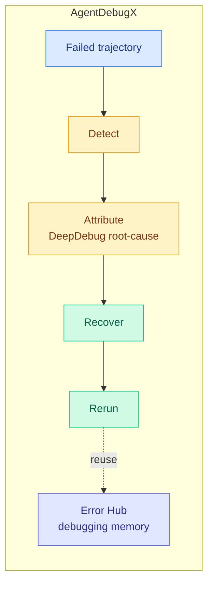

# Agent Tooling Day: AgentDebugX and DataFlow-Harness

**Source:** HuggingFace Daily Papers (2026-07-22) · AgentDebugX [arXiv 2607.18754](https://arxiv.org/abs/2607.18754) ([raw](../../raw/huggingface/2026-07-22-agentdebugx-an-open-source-toolkit-for-failure-observability.md)) · DataFlow-Harness [arXiv 2607.16617](https://arxiv.org/abs/2607.16617) ([raw](../../raw/huggingface/2026-07-22-dataflow-harness-a-grounded-code-agent-platform-for-construc.md))

## TL;DR

Two same-day papers treat the agent *harness*, not the model, as the object to engineer. **AgentDebugX** organizes agent debugging as a closed loop (Detect, Attribute, Recover, Rerun) and attacks the hardest part, root-cause attribution, because the step where an error surfaces is usually not the step that caused it. **DataFlow-Harness** attacks the "NL2Pipeline gap": coding agents emit throwaway scripts, not persistent editable artifacts, so it forces the agent to build platform-native DAGs through typed incremental mutations instead of free-form code.

## Key points

**AgentDebugX**
- DeepDebug does multi-turn root-cause diagnosis via global trajectory understanding, structure-guided investigation, and cross-examination, rather than single-pass trace replay.
- On the "Who and When" attribution benchmark it hits the best strict (exact agent-and-step) accuracy: 28.8% on qwen3.5-9b vs 21.7% for the strongest single-pass baseline.
- On GAIA it repairs 13 of 73 failed tasks in one rerun (vs 4–6 for decoupled self-correction baselines), lifting overall accuracy 55.8% → 63.6%.
- Ships as a Python library, CLI, web console, and installable agentic skill, plus an opt-in Error Hub that shares scrubbed failure-diagnosis-repair bundles as reusable debugging memory.

**DataFlow-Harness**
- Guides the agent to construct DAGs through typed incremental mutations; combines DataFlow-Skills (procedural guidance), an MCP layer exposing the live operator registry and pipeline state, and a WebUI syncing chat authoring with a visual DAG editor.
- 93.3% end-to-end pass on a 12-task data-engineering benchmark; vs Vanilla Claude Code, 72.5% lower cost and 49.9% lower latency; within 0.9 pts of Context-Aware Claude Code at 42.8% lower cost.
- Skills help most when construction depends on implicit procedural knowledge.

## How this relates to prior wiki knowledge

AgentDebugX is a direct **continuation** of the agent-failure-attribution thread the [agent-benchmarks](agent-benchmarks.md) page and the [2026-07-20 digest](../daily-digest/2026-07/2026-07-20.md) opened with OAT (success-flow deviation) and Failure-as-a-Process. Where OAT located *where* a trajectory deviated, AgentDebugX closes the loop to *repair*, and its Error Hub turns diagnoses into shared memory, echoing the self-evolving-agents "experience internalization" line. Its "the failing step is not the causing step" premise is the agent analogue of the credit-assignment problem RLVR faces on [rl-for-llms](../llms-foundation-models/rl-for-llms.md).

Both papers extend the **harness-as-first-class-artifact** theme that dominated mid-July (07-16 Harness Handbook, the week's top paper; 07-11 "harness is the highest-leverage component"). DataFlow-Harness's grounded-DAG approach is the data-engineering instance of that thesis: constrain the agent to a typed, live-grounded action space and you get cheaper, more reliable, *editable* output than free-form scripting.

## Gaps

AgentDebugX's attribution ceiling is still low in absolute terms (28.8% exact), and results are on two open-weight backbones; whether the closed-loop repair gain holds on frontier models is untested. DataFlow-Harness is a 12-task benchmark in one domain (data engineering) with "observed" pass rates, and the grounding approach may not transfer to domains without a clean operator registry to expose via MCP.

## Research angle

The shared move is constraining or instrumenting the agent's action space, AgentDebugX by making failures attributable and reusable, DataFlow-Harness by making outputs typed and grounded. The open question is whether these compose: an Error-Hub-style debugging memory over a typed, grounded pipeline space would give both attributable failures and a small enough action space that attribution is tractable, which is the combination the low absolute attribution numbers suggest is still missing.
