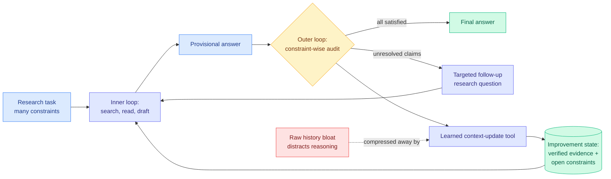

# AREX: Verification as the Control Signal for a Self-Improving Research Agent

**TL;DR.** AREX (Beijing Academy of Artificial Intelligence) is a deep-research agent built around one observation: finding an answer that satisfies many constraints at once is expensive, but *checking* a candidate answer decomposes into cheap constraint-by-constraint tests. AREX exploits that asymmetry by running two nested loops. The inner loop gathers evidence and drafts a provisional answer. The outer loop audits that answer one constraint at a time, marks which claims are still unresolved, and launches targeted follow-up research only on those. To keep the loop alive over long horizons it learns its own **context-update tool** that compresses the growing interaction history into a compact improvement state holding verified evidence plus open constraints, with no external summarizer model. It ships as a dense 4B and a 122B-A10B mixture-of-experts model, and beats comparable-scale baselines on BrowseComp, WideSearch, DeepSearchQA, and Humanity's Last Exam while staying competitive with models running far more activated parameters.

## What it is about

Deep research means answering a question whose correct answer must jointly satisfy several coupled constraints. "Find the paper that introduced X, was published before date Y, cited by author Z, and reported a result above threshold W" is the shape. The standard response has been to search longer: more reasoning tokens, more tool calls, more context. AREX argues that just extends a single trajectory, which carries three failure modes the authors name directly. Early errors persist because nothing forces a re-examination. Exhausted directions get re-explored because nothing records that they were exhausted. And partially valid answers get accepted early because nothing decomposes "is this right?" into checkable pieces.

## What is actually new

Two things, and the second is the one that makes the first survive.

**Verification as a round boundary, not a final filter.** Prior work uses verification either to rank finished candidate trajectories (best-of-N) or as a local critic inside an ongoing trajectory. AREX makes the audit the transition between research rounds. The output of an audit is not a score, it is a *partially verified state*: this claim holds, this one does not, this one is unchecked. That state is what defines the next round's research question, so verification becomes a control signal rather than a scoring function.

**A learned context-update tool.** Recursive self-improvement over long horizons produces enormous interaction histories, and the usual fixes are a fixed truncation heuristic or a generic summarizer model called from outside. AREX learns the compression as an agent-callable tool trained inside the loop, so what survives compression is what the agent's own subsequent reasoning needs: verified evidence and unresolved constraints. This is the piece that lets the loop run long without either blowing the context window or forgetting what it already established.

Training is two-stage: agentic mid-training on verified synthetic tasks and high-quality trajectories, then long-horizon reinforcement learning. Because the final reward on a long research task is extremely sparse, they emphasize the key steps where decisive evidence arrives or a wrong direction gets corrected, which is credit assignment on the moments that actually moved the trajectory.

## Key takeaways

- Two nested loops (inner research, outer constraint-wise audit) turn deep research from "search longer" into "verify, diagnose, then search *narrower*."
- The context-update tool is learned in-loop rather than being a fixed heuristic or an external summarizer, which is the durability mechanism for long-horizon runs.
- Two instantiations, a dense 4B and a 122B-A10B MoE (mixture-of-experts, where each token is routed through a small subset of specialist sub-networks so only ~10B parameters activate per token).
- Substantially beats comparable-scale baselines on BrowseComp, WideSearch, DeepSearchQA, and Humanity's Last Exam, and stays competitive with models that activate far more parameters per token.
- Long-horizon RL with key-step emphasis, to survive the sparse-final-reward problem.

## Relation to prior wiki

**Confirms and sharpens the [self-evolving agents](self-evolving-agents.md) thread's central open problem.** That page's "compounding vs collapse" question asked whether a self-improvement loop actually accumulates or just drifts, and noted that none of the June papers ran the loop long enough to tell. AREX's answer is structural rather than empirical: the loop compounds *because* the state carried between rounds is a verification ledger, not a summary. A summary can drift; a list of "these constraints are confirmed, these are open" cannot drift in the same way, because each entry is re-checkable.

**Extends the discovery-versus-verification asymmetry the wiki keeps meeting from different angles.** [Self-Revising Discovery Systems (06-08)](2026-06-08-self-revising-discovery-systems.md) gated accepted revisions by description length and accepted only 6.4% of proposals, which is the same move at a different layer: cheap acceptance test, expensive generation. AREX makes the asymmetry the architecture rather than a filter bolted on the end.

**Contradicts nothing, but tempers [Disentangling Agent Self-Evolution (06-08)](2026-06-08-disentangling-agent-self-evolution.md)**, which found that harness-*updating* quality is flat across model tiers, so you should put a cheap model on the evolver. AREX's outer loop is not writing harness edits, it is running constraint audits, and audit quality plausibly does scale with model strength. Whether the cheap-evolver recipe survives when the "evolution" step is verification rather than scaffolding is an open question this paper does not test.

**Connects to [agent memory](agent-memory.md).** The learned context-update tool is an agent-memory mechanism that was trained rather than designed, and its compression target (verified evidence plus open constraints) is a much more structured memory schema than the running-summary approach most agent frameworks ship.

## Gaps

There are no ablations reported in the abstract separating the contribution of the outer audit loop from the contribution of the learned context-update tool, and those are the paper's two claims. The benchmarks are all retrieval-and-constraint-satisfaction shaped (BrowseComp, WideSearch, DeepSearchQA), which is precisely the setting where constraint-wise verification is cheapest; it is not obvious the asymmetry holds for open-ended research where "did I answer this well?" does not decompose. And there is no wall-clock or token-cost accounting, so the trade between "search longer on one trajectory" and "audit, then search narrower" is argued but not priced.

## Industrial implication

Every production deep-research product currently scales by giving the agent a bigger budget. AREX says the better lever is a cheap structured audit between rounds, which is implementable on top of any existing agent without retraining: decompose the task into constraints up front, check them individually after each round, and re-plan on the unresolved set. The learned-compression piece needs training, but the audit loop does not, and it is the part with the clearer immediate payoff.

## Sources

- Paper: [arXiv 2607.21461](https://arxiv.org/abs/2607.21461) — AREX Team, Beijing Academy of Artificial Intelligence (Shuqi Lu, Chaofan Li, Kun Luo, Zhang Zhang, Hui Wang, Hongwang Xiao, Zheng Liu)
- HuggingFace Daily Papers, top-ranked 2026-07-24 at 122 upvotes
- Raw: `raw/huggingface/2026-07-24-arex-towards-a-recursively-self-improving-agent-for-deep-res.md`
- Related: [self-evolving-agents](self-evolving-agents.md) · [agent-memory](agent-memory.md) · [agent-benchmarks](agent-benchmarks.md)
